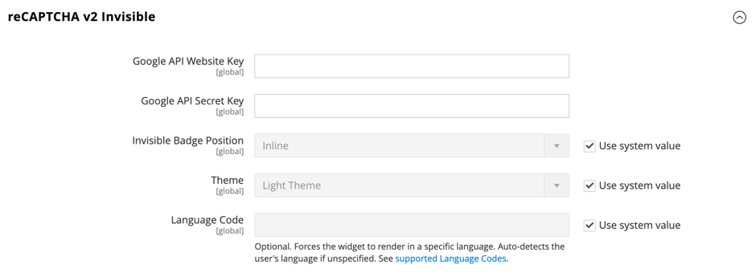

# [!UICONTROL Security] > [!UICONTROL Google reCAPTCHA Admin Panel]

>[!IMPORTANT]
>
>在配置Google reCAPTCHA之前，必须确保您的`PHP.ini`文件包含以下设置：`allow_url_fopen = 1`。 这可能需要开发人员的帮助。 请参阅&#x200B;_安装指南_&#x200B;中的[必需的PHP设置](https://experienceleague.adobe.com/docs/commerce-operations/installation-guide/prerequisites/php-settings.html)。

{{config}}

有关更改这些设置的详细信息，请参阅&#x200B;_管理员系统指南_&#x200B;中的[Google reCAPTCHA](../../systems/security-google-recaptcha.md)。

## [!UICONTROL reCAPTCHA v2 ("I am not a robot")]

<!-- zoom -->

| 字段 | [作用域](../../getting-started/websites-stores-views.md#scope-settings) | 描述 |
|--|--|--|
| [!UICONTROL Google API Website Key] | 全局 | 注册Google reCAPTCHA帐户时创建的网站密钥。 |
| [!UICONTROL Google API Secret Key] | 全局 | 与您的Google reCAPTCHA帐户关联的密钥。 |
| [!UICONTROL Size] | 全局 | 登录期间显示的Google reCAPTCHA框的大小。 选项： `Normal` （默认） / `Compact` |
| [!UICONTROL Theme] | 全局 | 确定Google reCAPTCHA框的样式。 选项： `Light Theme` （默认） / `Dark Theme` |
| [!UICONTROL Language Code] | 全局 | [双字符代码](https://developers.google.com/recaptcha/docs/language)，它指定用于Google reCAPTCHA文本和消息传递的语言。 |

{style="table-layout:auto"}

## [!UICONTROL reCAPTCHA v2 Invisible]

<!-- zoom -->

| 字段 | [作用域](../../getting-started/websites-stores-views.md#scope-settings) | 描述 |
|--|--|--|
| [!UICONTROL Google API Website Key] | 全局 | 注册Google reCAPTCHA帐户时创建的网站密钥。 |
| [!UICONTROL Google API Secret Key] | 全局 | 与您的Google reCAPTCHA帐户关联的密钥。 |
| [!UICONTROL Invisible Badge Position] | 全局 | 每个页面上不可见reCAPTCHA徽章的位置。 选项： `Inline` / `Bottom Right` / `Bottom Left` |
| [!UICONTROL Theme] | 全局 | 确定Google reCAPTCHA框的样式。 选项： `Light Theme` （默认） / `Dark Theme` |
| [!UICONTROL Language Code] | 全局 | [双字符代码](https://developers.google.com/recaptcha/docs/language)，它指定用于Google reCAPTCHA文本和消息传递的语言。 |

{style="table-layout:auto"}

## [!UICONTROL reCAPTCHA v3 Invisible]

<!-- zoom -->

| 字段 | [作用域](../../getting-started/websites-stores-views.md#scope-settings) | 描述 |
|--|--|--|
| [!UICONTROL Google API Website Key] | 全局 | 注册Google reCAPTCHA帐户时创建的网站密钥。 |
| [!UICONTROL Google API Secret Key] | 全局 | 与您的Google reCAPTCHA帐户关联的密钥。 |
| [!UICONTROL Minimum Score Threshold] | 全局 | 将用户交互识别为潜在风险的最小分数，其中1.0表示典型的用户交互，0.0表示可能是机器人。 默认： `0.5` |
| [!UICONTROL Invisible Badge Position] | 全局 | 每个页面上不可见reCAPTCHA徽章的位置。 选项： `Inline` / `Bottom Right` / `Bottom Left` |
| [!UICONTROL Theme] | 全局 | 确定Google reCAPTCHA框的样式。 选项： `Light Theme` （默认） / `Dark Theme` |
| [!UICONTROL Language Code] | 全局 | [双字符代码](https://developers.google.com/recaptcha/docs/language)，它指定用于Google reCAPTCHA文本和消息传递的语言。 |

{style="table-layout:auto"}

## [!UICONTROL reCAPTCHA Failure Messages]

<!-- zoom -->

| 字段 | [作用域](../../getting-started/websites-stores-views.md#scope-settings) | 描述 |
|--|--|--|
| [!UICONTROL reCAPTCHA Validation Failure Message] | 全局 | 验证失败时显示在管理员中的消息。 默认文本： `reCAPTCHA verification failed.` |
| [!UICONTROL reCAPTCHA Technical Failure Message] | 全局 | 如果reCAPTCHA无法返回验证结果，则会在管理员中显示的消息。 默认文本： `Something went wrong with reCAPTCHA. Please contact the store owner.` |

{style="table-layout:auto"}

## [!UICONTROL Admin Panel]

<!-- zoom -->

>[!NOTE]
>
>您选择的reCAPTCHA类型必须与与Google reCAPTCHA帐户中的API密钥关联的类型匹配。

>[!WARNING]
>
>使用reCAPTCHA版本3时，得分较低的正版用户无法继续。 对于版本2，得分较低的真实用户会收到挑战。 仔细考虑得分较低的真实用户是否有机会解决难题（版本2）或遭到阻止（版本3）。

| 字段 | [作用域](../../getting-started/websites-stores-views.md#scope-settings) | 描述 |
|--|--|--|
| [!UICONTROL Enable for Login] | 全局 | 确定为[管理员登录](https://experienceleague.adobe.com/docs/commerce-admin/start/admin/admin-signin.html)启用的reCAPTCHA类型。 选项： **`No`**- （默认）不验证管理员登录。 **`reCAPTCHA v2 ("I am not a robot")`**  — 要求用户选中&#x200B;_我不是自动机_&#x200B;复选框。 **`Invisible reCAPTCHA v2`**— 在后台验证用户行为，无需根据分数进行交互。 **`Invisible reCAPTCHA v3`**  — （推荐）根据交互得分在后台验证用户行为。 |
| [!UICONTROL Enable for Forgot Password] | 全局 | 确定启用以请求[管理员密码重置](https://experienceleague.adobe.com/docs/commerce-admin/start/admin/admin-signin.html#reset-your-password)的reCAPTCHA类型。 选项：  **`No`**- （默认）不验证密码重置请求。 **`reCAPTCHA v2 ("I am not a robot")`**  — 要求用户选中&#x200B;_我不是自动机_&#x200B;复选框。 **`Invisible reCAPTCHA v2`**— 在后台验证用户行为，无需根据分数进行交互。 **`Invisible reCaptcha v3`**  — （推荐）根据交互得分在后台验证用户行为。 |

{style="table-layout:auto"}
