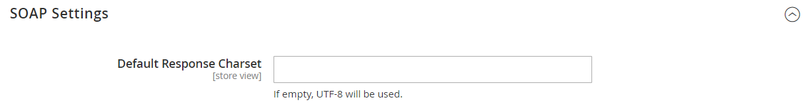

# [!UICONTROL Services] > [!UICONTROL Magento Web API]

{{config}}

<!-- [X-ref](../systems/integrations.md) -->

## [!UICONTROL SOAP Settings]

<!-- zoom -->

| 字段 | [作用域](../../getting-started/websites-stores-views.md#scope-settings) | 描述 |
|--- |--- |--- |
| [!UICONTROL Default Response Charset] | 商店视图 | 确定默认字符集。 如果为空，则使用UTF-8。 |

{style="table-layout:auto"}

## [!UICONTROL GraphQl Input Limits]

<!-- zoom -->

| 字段 | [作用域](../../getting-started/websites-stores-views.md#scope-settings) | 描述 |
|--- |--- |--- |
| [!UICONTROL Enable Input Limits] | 商店视图 | 确定是否为GraphQL调用启用输入限制。 默认值： `No`。 |
| [!UICONTROL Maximum Page Size] | 商店视图 | 设置GraphQL响应中分页搜索结果允许的最大项目数。 当&#x200B;_启用输入限制_ = `No`时，此选项不可用。 |

{style="table-layout:auto"}

## [!UICONTROL Web Api Input Limits]

<!-- zoom -->

| 字段 | [作用域](../../getting-started/websites-stores-views.md#scope-settings) | 描述 |
|--- |--- |--- |
| [!UICONTROL Enable Input Limits] | 商店视图 | 确定是否为Web API调用启用输入限制。 默认值： `No`。 |
| 输入列表限制 | 商店视图 | 在Web API请求中设置实体数组属性中允许的最大项数。 当&#x200B;_启用输入限制_ = `No`时，此选项不可用。 |
| [!UICONTROL Maximum Page Size] | 商店视图 | 设置Web API响应的分页搜索结果中允许的最大项目数。 当&#x200B;_启用输入限制_ = `No`时，此选项不可用。 |
| [!UICONTROL Default Page Size] | 商店视图 | 在Web API响应中设置分页搜索结果中的默认项目数。 |

{style="table-layout:auto"}

## [!UICONTROL Web API Security]

<!-- zoom -->

| 字段 | [作用域](../../getting-started/websites-stores-views.md#scope-settings) | 描述 |
|--- |--- |--- |
| [!UICONTROL Allow Anonymous Guest Access] | 全局 | 确定访客是否可以从SOAP和REST API匿名访问CMS、目录和存储资源。 默认情况下，不允许匿名访客访问。 选项： `Yes` / `No` |

{style="table-layout:auto"}

## [!UICONTROL JWT Authentication]

<!-- zoom -->

| 字段 | [作用域](../../getting-started/websites-stores-views.md#scope-settings) | 描述 |
|--- |--- |--- |
| [!UICONTROL Algorithm to sign/encrypt JWTs used for authentication] | 全局 | 指定用于JWT （JSON Web令牌）加密的JWS或JWE算法的类型 |
| [!UICONTROL Content encryption algorithm for JWEs] | 全局 | 指定在选择了JWE算法时用于JWT加密的内容加密算法类型。 对于JWS算法，此选项被忽略。 |
| [!UICONTROL Customer JWT Expires In] | 全局 | 设置客户JWT持有者令牌过期之前的时长（以分钟为单位）。 如果此字段为空或其为负值，则客户JWT持有者令牌将在30分钟后过期。 默认值： `60` |
| [!UICONTROL Admin User JWT Expires In] | 全局 | 设置管理员JWT持有者令牌过期之前的时长（以分钟为单位）。 如果此字段为空或其为负值，则管理员JWT持有者令牌将在30分钟后过期。 默认值： `60` |

{style="table-layout:auto"}
