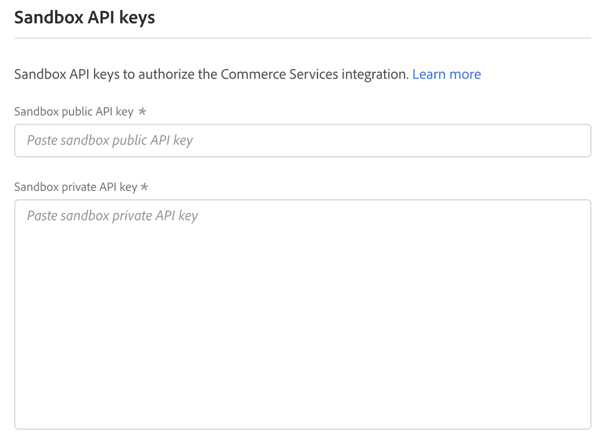

# [!UICONTROL Services] > [!UICONTROL Commerce Services Connector]

若要了解如何将您的商店连接到Adobe Commerce服务，请参阅[Commerce服务](https://experienceleague.adobe.com/docs/commerce/user-guides/integration-services/saas.html)。

{{config}}

## [!UICONTROL Sandbox API Keys]

<!-- zoom -->

| 字段 | [作用域](../../getting-started/websites-stores-views.md#scope-settings) | 描述 |
|--- |--- |--- |
| [!UICONTROL Sandbox public API key] | 全局 | 标识作者及其权利的API密钥（如果有）。 |
| [!UICONTROL Sandbox private API key] | 全局 | 与API密钥关联的私钥。 |

{style="table-layout:auto"}

## [!UICONTROL Production Keys]

<!-- zoom -->

| 字段 | [作用域](../../getting-started/websites-stores-views.md#scope-settings) | 描述 |
|--- |--- |--- |
| [!UICONTROL Production public API key] | 全局 | 标识作者及其权利的API密钥（如果有）。 |
| [!UICONTROL Production private API key] | 全局 | 与API密钥关联的私钥。 |

{style="table-layout:auto"}

## [!UICONTROL SaaS Identifier]

<!-- zoom -->

| 字段 | [作用域](../../getting-started/websites-stores-views.md#scope-settings) | 描述 |
|--- |--- |--- |
| [!UICONTROL Project] | 全局 | 对所有SaaS数据空间进行分组的SaaS项目的名称。 如果不存在SaaS项目，则会显示&#x200B;_创建项目_&#x200B;按钮。 |
| [!UICONTROL Data Space] | 全局 | 列出指定SaaS项目中的SaaS数据空间。 SaaS数据空间的数量取决于您的[Commerce许可证](https://experienceleague.adobe.com/docs/commerce/user-guides/integration-services/saas.html)： Adobe Commerce — 一个生产数据空间；两个测试数据空间； Magento Open Source — 一个生产数据空间；无测试数据空间 |

{style="table-layout:auto"}

## [!UICONTROL IMS Organization]

<!-- zoom -->

| 字段 | 描述 |
|--- |--- |
| [!UICONTROL Sign in using Adobe ID] | 您的Adobe ID通常是您在启动会员资格或购买Adobe应用程序或服务时首次使用的电子邮件地址。 您的Adobe ID是访问Adobe帐户所需的密钥。 |

{style="table-layout:auto"}
