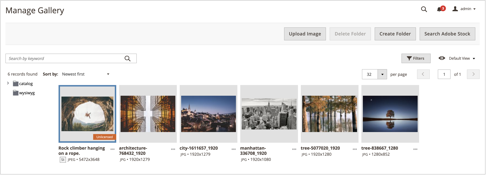
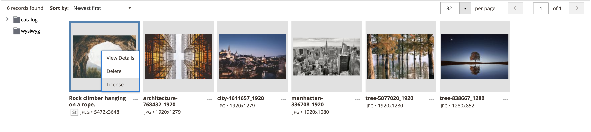
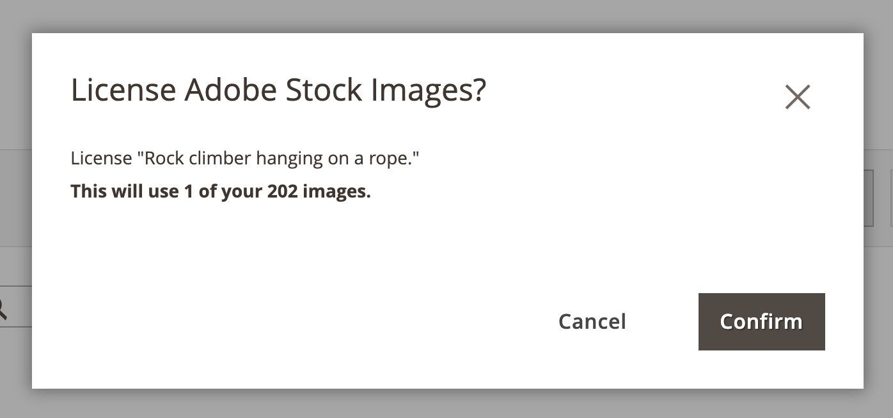

# 许可Adobe Stock图像

您要用于生产Adobe Commerce和Magento Open Source商店的Adobe Stock资源应当获得许可。 此许可确保您具有对图像的合法访问权限，并消除所有[图像预览](./adobe-stock-save-preview.md)上存在的Adobe Stock水印。 要许可图像或保存已获得许可的图像，您必须登录到您的Adobe帐户。

新[[!DNL Media Gallery]](media-gallery.md)提供了与Adobe Stock的直接集成，从而能够轻松地直接从图片库页面许可您的图像。

>[!BEGINSHADEBOX]

**先决条件**

Adobe Stock授权功能仅在安装和配置[Adobe Stock集成](./adobe-stock.md)时可用。 许可[Adobe Stock](https://stock.adobe.com)图像需要付费Adobe Stock计划和[Adobe帐户](https://helpx.adobe.com/manage-account/using/access-adobe-id-account.html)。

>[!ENDSHADEBOX]

## 从新[!DNL Media Gallery]许可图像

1. 在&#x200B;_管理员_&#x200B;侧边栏上，转到&#x200B;**[!UICONTROL Content]** > _[!UICONTROL Media]_>**[!UICONTROL Media Gallery]**。

1. 按照[使用Adobe Stock图像](./adobe-stock-manage.md)中的步骤登录并将预览图像保存到[媒体存储空间](./media-storage.md)。

   {width="600" zoomable="yes"}

1. 单击图像下方的三个圆点（{width="10" zoomable="no"}），然后单击&#x200B;**[!UICONTROL License]**。

   {width="600" zoomable="yes"}

   >[!NOTE]
   >
   >如果您未登录，则会显示登录表单。 有关登录的详细信息，请参阅[使用Adobe Stock图像](./adobe-stock-manage.md)。

1. 在许可确认对话框中，单击&#x200B;**[!UICONTROL Confirm]**&#x200B;以许可图像。

   {width="350" zoomable="yes"}

   >[!NOTE]
   >
   >您的帐户中必须具有[Adobe Stock积分](https://helpx.adobe.com/stock/help/credit-packs.html)才能许可该图像。

## 从标准媒体存储中许可图像

1. [访问Adobe Stock搜索网格][adobe-stock-manage.md]。

1. 要[查看图像详细信息][adobe-stock-manage.md#view-image-details]，请按顺序单击搜索网格中的图像。

1. 根据映像的当前许可状态，执行以下操作之一：

   - 如果图像已获得许可，请单击&#x200B;**[!UICONTROL Save]**。

   - 如果映像&#x200B;_未获得许可_，请单击&#x200B;**[!UICONTROL License and Save]**。

     >[!NOTE]
     >
     >您的帐户中必须具有[Adobe Stock积分](https://helpx.adobe.com/stock/help/credit-packs.html)才能许可该图像。

   此操作会显示一个提示，提示您指定用于将图像保存到[媒体存储区](./media-storage.md)的文件名。 提供了默认的文件名，但可以根据您的首选项自定义名称。

   {width="550" zoomable="yes"}

1. 单击&#x200B;**[!UICONTROL Confirm]**。

   页面将重定向到媒体存储，并且会显示您保存的预览。
