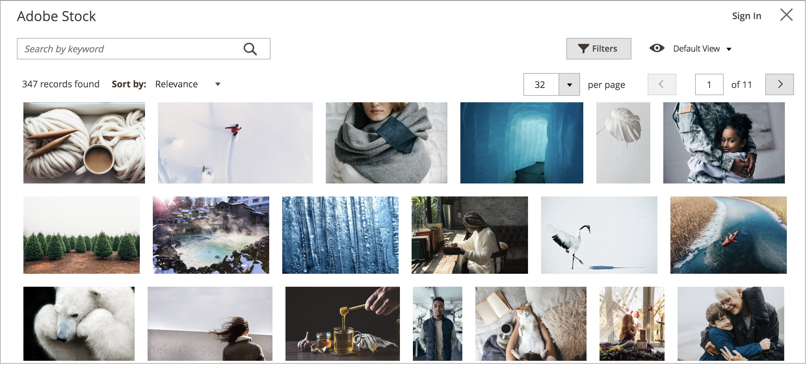
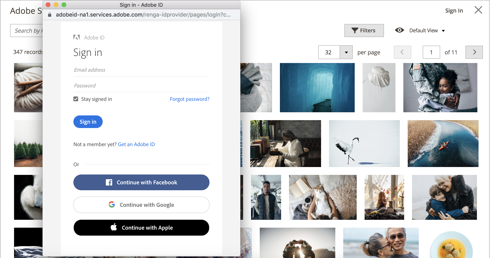

# 使用Adobe Stock图像

可以使用[Adobe Stock](https://stock.adobe.com)图像代替上传您自己的图像内容。 一个常见用例是在创建页面时上传并放置图像内容。

[[!DNL Media Gallery]](media-gallery.md)提供了与Adobe Stock的直接集成，因此可以直接从图片库页面许可您的图像。

## 访问Adobe Stock搜索网格

当您[添加或编辑页面](page-add.md)、[创建或编辑类别](../catalog/category-create.md)或者通过内容编辑器[插入图像](editor-insert-image.md)时，可以访问Adobe Stock搜索面板。

**_要搜索Adobe Stock资源并向页面添加库存图像，请执行以下操作：_**

1. 在&#x200B;_管理员_&#x200B;侧边栏上，转到&#x200B;**[!UICONTROL Content]** > _[!UICONTROL Elements]_>**[!UICONTROL Pages]**。

1. 单击&#x200B;**[!UICONTROL Add a New Page]**。

   如果要编辑现有页面，可以使用&#x200B;_[!UICONTROL Action]_列单击&#x200B;**[!UICONTROL Select]**并选择&#x200B;**[!UICONTROL Edit]**。

1. 展开&#x200B;**[!UICONTROL Content]**&#x200B;部分中的并执行以下操作：

   - 如果您启用了[WYSIWYG编辑器](editor.md)，请单击&#x200B;**[!UICONTROL Show/Hide Editor]**，然后单击&#x200B;**[!UICONTROL Insert Image]**。

   - 如果您启用了[页面生成器](../page-builder/setup.md)，请展开&#x200B;**[!UICONTROL Media]**&#x200B;面板并将&#x200B;**[!UICONTROL Image]**&#x200B;占位符拖到目标容器中。 然后单击&#x200B;**[!UICONTROL Select from Gallery]**。

     {width="600" zoomable="yes"}

1. 单击&#x200B;**[!UICONTROL Search Adobe Stock]**。

**_要搜索Adobe Stock资源并将库存图像添加到类别，请执行以下操作：_**

1. 在&#x200B;_管理员_&#x200B;侧边栏上，转到&#x200B;**[!UICONTROL Catalog]** > **[!UICONTROL Categories]**。

1. 单击&#x200B;**[!UICONTROL Add Root Category]**&#x200B;或&#x200B;**[!UICONTROL Add Subcategory]**。

   如果要将图像添加到现有类别，请单击左侧列表中的类别名称。

1. 展开&#x200B;**[!UICONTROL Content]**&#x200B;部分，在&#x200B;_[!UICONTROL Category Image]_下单击&#x200B;**[!UICONTROL Select from Gallery]**。

1. 单击&#x200B;**[!UICONTROL Search Adobe Stock]**。

要搜索Adobe Stock资源并从WYSIWYG编辑器添加库存图像，请执行以下操作：

1. 单击&#x200B;**[!UICONTROL Show/Hide Editor]**。

1. 单击&#x200B;**[!UICONTROL Insert Image]**。

1. 单击&#x200B;**[!UICONTROL Search Adobe Stock]**。

   {width="600" zoomable="yes"}

## 筛选和搜索Adobe Stock资源

[Adobe Stock搜索网格](#access-the-adobe-stock-search-grid)提供了查询和筛选功能，可帮助您为[!DNL Commerce]商店找到完美的图像。

默认情况下，显示的搜索结果来自Adobe Stock策划的包含数百个结果的图库。 当您应用自己的关键词搜索时，您将搜索通过Adobe Stock提供的数百万个资源。

### 按关键字搜索Adobe Stock资源

1. [访问Adobe Stock搜索网格](#access-the-adobe-stock-search-grid)。

1. 在左上角的&#x200B;**[!UICONTROL Search by keyword]**&#x200B;输入字段中输入关键字搜索，然后单击放大镜或按&#x200B;**Enter**。

   “芒果”关键字的{width="600" zoomable="yes"}

### 筛选Adobe Stock资源

1. [运行Adobe Stock资源的关键字搜索](#search-for-adobe-stock-assets-by-keywords)。

1. 单击&#x200B;**[!UICONTROL Filters]**。

   有几个过滤器可用于优化您的搜索结果：

   | 筛选 | 描述 |
   |---|---|
   | [!UICONTROL Subcategory] | 筛选&#x200B;**照片**&#x200B;或&#x200B;**插图**&#x200B;的图像 |
   | [!UICONTROL Orientation] | 按大小、形状和外观筛选图像 |
   | [!UICONTROL Color] | 使用调色板按颜色过滤图像 |
   | [!UICONTROL Price] | 根据图像的成本筛选图像 |
   | [!UICONTROL Safe search] | 启用或禁用安全搜索 |
   | [!UICONTROL Isolated Assets] | 将显示限制为仅&#x200B;_个独立资产_，这些资产的主体单独显示在纯色背景中 |

   {style="table-layout:auto"}

   {width="600" zoomable="yes"}

1. 单击&#x200B;**[!UICONTROL Apply Filters]**。

   搜索结果网格将更新为您的优化搜索。

## 查看图像详细信息

每个图像都包含可供查看的详细信息。 其他特定于映像的操作，如[保存映像预览](adobe-stock-save-preview.md)或[保存（和可选授权）映像](adobe-stock-license-image.md)，可通过此详细视图使用。

1. [访问Adobe Stock搜索网格](#access-the-adobe-stock-search-grid)。

1. 单击搜索结果中的图像。

   将显示其他图像详细信息，例如：

   - 图像的较大版本
   - 图像元数据，如&#x200B;_[!UICONTROL Dimensions]_、_[!UICONTROL File type]_、_[!UICONTROL Category]_、_[!UICONTROL File]_&#x200B;和&#x200B;_关键字_
   - 相关图像，例如来自相同&#x200B;_系列_&#x200B;或&#x200B;_模型_&#x200B;的图像
   - 操作按钮，如[[!UICONTROL Save Preview]](adobe-stock-save-preview.md)和[[!UICONTROL Save (and optionally license) Image]](adobe-stock-license-image.md)

     {width="600" zoomable="yes"}

## 登录到您的Adobe帐户

若要获得对图像的完全访问权并消除Adobe Stock水印，您必须[使用Adobe帐户登录](https://helpx.adobe.com/manage-account/using/access-adobe-id-account.html)并购买积分以授予使用图像的许可权。

1. [访问Adobe Stock搜索网格](#access-the-adobe-stock-search-grid)。

1. 单击右上方的&#x200B;**[!UICONTROL Sign In]**。

   新的浏览器窗口将引导您完成[Adobe登录流程](https://helpx.adobe.com/manage-account/using/access-adobe-id-account.html)。

   完成登录过程后，图像的许可状态将作为标签显示在搜索结果中。

   {width="600" zoomable="yes"}

### 查看搜索结果的许可状态

[登录到您的Adobe帐户](#log-in-to-your-adobe-account)。

与您的Adobe帐户关联的所有已许可图像上都显示有标签，以明确表示您许可了哪些图像。

{width="600" zoomable="yes"}

### 将图像保存到媒体存储

使用Adobe Stock集成搜索的图像可以保存到[!DNL Commerce] [媒体存储](media-storage.md)，以便在[!DNL Commerce]存储区中轻松重用。

您可以保存两种类型的图像： [图像预览](adobe-stock-save-preview.md)或[许可图像](adobe-stock-license-image.md)。

#### 保存图像预览

图像预览是Adobe Stock资源的带水印版本。 图像预览是免费的，是一种很好的方式，可在您决定购买特定图像的许可证并在生产商店中使用它们之前尝试不同的图像。

1. [访问Adobe Stock搜索网格](#access-the-adobe-stock-search-grid)。

1. 要[查看图像详细信息](#view-image-details)，请单击搜索网格中的图像。

1. 单击&#x200B;**[!UICONTROL Save Preview]**。

   此操作会显示一个提示，提示您指定用于将映像保存到介质存储的文件名。 提供了默认的文件名，但可以根据您的首选项自定义名称。

   {width="500" zoomable="yes"}

1. 单击&#x200B;**[!UICONTROL Confirm]**。

   页面将重定向到媒体存储，并且会显示您保存的预览。

#### 保存许可图像

您要用于生产[!DNL Commerce]存储区的Adobe Stock资源应获得许可。 授权功能可确保您对图像拥有合法访问权限，并消除所有[图像预览](adobe-stock-save-preview.md)上存在的Adobe Stock水印。 要许可图像或保存已获得许可的图像，您必须登录到您的Adobe帐户。

1. [登录到您的Adobe帐户](#log-in-to-your-adobe-account)。

1. 要[查看图像详细信息](#view-image-details)，请单击搜索网格中的图像。

1. 根据映像的当前许可状态，执行以下操作之一：

   - 如果图像已获得许可，请单击&#x200B;**[!UICONTROL Save]**。

   - 如果映像&#x200B;_未获得许可_，请单击&#x200B;**[!UICONTROL License and Save]**。

     >[!NOTE]
     >
     >您的帐户中必须具有[Adobe Stock积分](https://helpx.adobe.com/stock/help/credit-packs.html)才能许可该图像。

   此操作会显示一个提示，提示您指定用于将图像保存到[媒体存储区](media-storage.md)的文件名。 提供了默认的文件名，但可以根据您的首选项自定义名称。

1. 单击&#x200B;**[!UICONTROL Confirm]**。

   页面将重定向到媒体存储，并且会显示您保存的预览。
