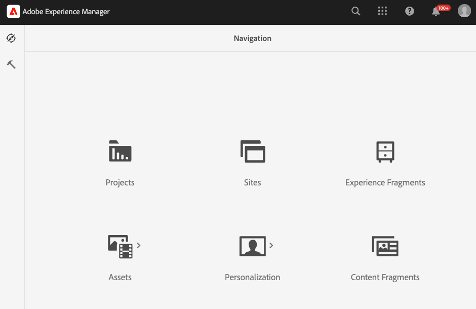

# 配置Experience Manager Assets

{{$include /help/_includes/aem-assets-integration-beta-note.md}}

要使用Commerce的AEM Assets集成管理您商店的媒体资源，您的AEM Assets项目需要添加某些元数据，以确保您可以轻松搜索和管理Commerce资源。 此元数据还有助于Adobe Commerce和Experience Manager Assets之间的资源同步。 定义元数据字段后，在首次与Experience Manager Assets共享Commerce资源时，将自动进行这些字段的初始映射。

对于集成，您可以配置两种类型的元数据：

- **[元数据配置文件](https://experienceleague.adobe.com/en/docs/experience-manager-cloud-service/content/assets/manage/metadata-profiles)**&#x200B;允许您将默认元数据应用到文件夹中的资源。 文件夹中的所有资产将继承配置文件中配置的默认元数据。

- **[元数据架构](https://experienceleague.adobe.com/en/docs/experience-manager-cloud-service/content/assets/manage/metadata-schemas)**&#x200B;定义属性页面的布局以及可在AEM资源上用作元数据属性的字段集。

## 配置元数据

对于初始载入，将以下Commerce元数据添加到AEM Assets元数据配置文件和元数据架构。

| 字段类型 | 标签 | 属性 | 默认值 |
|------ | ------- | ---------- | ------------- |
| 文本 | **它存在于Adobe Commerce中吗？** | `./jcr:content/metadata/commerce:isCommerce` | 是 |
| 多值文本 | **个SKU** | `./jcr:content/metadata/commerce:skus` | 无 |
| 多值文本 | **职位** | `./jcr:content/metadata/commerce:positions` | 无 |
| 多值文本 | **角色** | `./jcr:content/metadata/commerce:roles` | 无 |

### 将Commerce字段添加到元数据配置文件

1. 在Adobe Experience Manager工作区中，单击Adobe Experience Manager图标以转到为AEM Assets创作内容管理工作区。

   {width="600" zoomable="yes"}

1. 通过选择锤子图标打开管理员工具。

   {width="600" zoomable="yes"}

1. 通过单击&#x200B;**[!UICONTROL Metadata Profiles]**&#x200B;打开配置文件配置页面。

1. **[!UICONTROL Create]** Commerce集成的元数据配置文件。

   {width="600" zoomable="yes"}

1. 为Commerce元数据添加选项卡。

   1. 单击左侧的&#x200B;**[!UICONTROL Settings]**。

   1. 在选项卡部分中单击&#x200B;**[!UICONTROL +]**，然后指定&#x200B;**[!UICONTROL Tab Name]**、`Commerce`。

1. 将[元数据字段](#configure-metadata)添加到表单。

   {width="600" zoomable="yes"}

1. 保存更新。

1. 将`Commerce integration`元数据配置文件应用到存储Commerce资源的文件夹。

   1. 从[!UICONTROL  Metadata Profiles]页面中，选择Commerce集成配置文件。

   1. 从操作菜单中选择&#x200B;**[!UICONTROL Apply Metadata Profiles to Folder(s)]**。

   1. 选择包含Commerce资源的文件夹。

      创建不存在的Commerce文件夹。

   1. 单击&#x200B;**[!UICONTROL Apply]**。

### 将Commerce字段添加到元数据架构表单

1. 从Assets的AEM创作内容管理面板中，打开&#x200B;**[!UICONTROL Metadata Schemas]** ([!UICONTROL Manage metadata schema forms])。

   {width="600" zoomable="yes"}

1. **[!UICONTROL Create]**&#x200B;用于Commerce的元数据架构。

   {width="600" zoomable="yes"}

1. 在[!UICONTROL Metadata Schema Form]上，创建`Does Commerce exist?`和`Commerce mappings`字段并映射属性。

1. 单击&#x200B;**[!UICONTROL Save]**。

## Publish资产

为Commerce资源配置AEM元数据和架构配置文件后，创建第一个Commerce资源以映射Commerce元数据字段。

1. 在Experience Manager中，转到[!UICONTROL Assets > Files]选择&#x200B;**Commerce**&#x200B;文件夹。

1. 通过将文件拖到文件夹或单击&#x200B;**[!UICONTROL Add Assets]**&#x200B;来上传Commerce项目的图像。

1. 验证元数据配置：**isCommerce**&#x200B;是否设置为`true`，以及`commerce:skus`属性是否设置为与图像关联的Commerce产品的SKU。

1. 批准资产。

## 将资源添加到Commerce文件夹

在AEM Assets Commerce文件夹中至少创建一个已分配Commerce元数据属性的资源。

在您的Commerce实例与AEM Assets之间设置同步时需要此资源。

## 映射资源的元数据

元数据在首次发布Commerce资源时映射。  从Commerce买的。 在将资源首次发送到Experience Manager Assets时，具有内置或自定义字段的媒体资源会自动映射到指定的字段。

在开始资源映射之前，请完成以下任务：

- [安装和配置适用于Commerce的AEM Assets集成](aem-assets-configure-commerce.md)
- [启用资源同步以在Adobe Commerce项目环境和AEM Assets项目环境之间传输资源](aem-assets-setup-synchronization.md)
