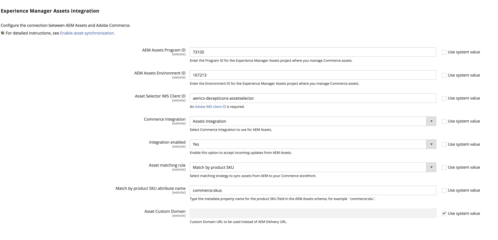

# 配置集成

通过将Commerce连接到AEM Assets实例并选择资源同步的匹配策略来配置集成。

识别AEM Assets项目后，选择用于在Adobe Commerce和AEM Assets之间同步资产的匹配规则。

- **[!UICONTROL Match by product SKU]** — 将资源元数据中的SKU与[Commerce产品SKU](https://experienceleague.adobe.com/en/docs/commerce-operations/implementation-playbook/glossary#sku)匹配的默认规则，以确保资源与正确的产品关联。

- **[!UICONTROL Custom match]** — 匹配规则，用于需要自定义匹配逻辑的更复杂方案或特定业务要求。 实施自定义匹配需要在Adobe Developer App Builder中开发自定义代码以定义资源与产品的匹配方式。 更多详细信息即将推出……

对于初始设置，使用默认的&#x200B;*按产品SKU匹配*&#x200B;规则。

## 先决条件

- [安装AEM Assets包](aem-assets-configure-aem.md)

- [安装Adobe Commerce包](aem-assets-configure-commerce.md)以添加该扩展并生成使用该扩展所需的凭据和连接。

- 创建支持工单以请求启用AEM Assets以进行Commerce集成。 在票证中，包含要连接到Commerce的AEM Assets创作环境的&#x200B;**[!UICONTROL Program ID]**、**[!UICONTROL Environment ID]**&#x200B;和&#x200B;**[!UICONTROL IMS Org ID]**。

- 提供&#x200B;**[!UICONTROL Asset Selector IMS Client ID]**。 请参阅&#x200B;*AEM Assets选择器*&#x200B;文档中的[ImsAuthProps](https://experienceleague.adobe.com/zh-hans/docs/experience-manager-cloud-service/content/assets/manage/asset-selector/asset-selector-integration/integrate-asset-selector-adobe-app)。

## 配置连接

1. 获取[AEM Assets创作环境](https://experienceleague.adobe.com/zh-hans/docs/experience-manager-cloud-service/content/sites/authoring/quick-start)项目和环境ID。

   1. 打开AEM Sites控制台并选择&#x200B;**[!UICONTROL Assets]**。

   1. 从URL  `https://author-p[Program ID]-e[EnvironmentID].adobeaemcloud.com/`复制并保存项目和环境ID
1. 从Commerce管理员中，打开AEM Assets集成配置。

   1. 转到&#x200B;**[!UICONTROL Store]** >配置> **[!UICONTROL ADOBE SERVICES]** > **[!UICONTROL AEM Assets Integration]**。

      {width="600" zoomable="yes"}

1. 进入AEM Assets环境&#x200B;**[!UICONTROL Program ID]**&#x200B;和&#x200B;**[!UICONTROL Environment ID]**。

   通过从&#x200B;*[!UICONTROL Use system value]*&#x200B;中删除所选内容来编辑配置值。

1. 输入&#x200B;**[!UICONTROL Asset Selector IMS Client ID]**。

   [!UICONTROL Assets Selector]需要[资源选择器IMS客户端ID](https://experienceleague.adobe.com/zh-hans/docs/experience-manager-cloud-service/content/assets/manage/asset-selector/asset-selector-integration/integrate-asset-selector-adobe-app#ims-auth-props)，这是一项AEM Assets功能，它允许用户将可视化资源直接嵌入到Commerce产品页面中。

1. 选择[[!UICONTROL Commerce integration]](aem-assets-configure-commerce.md#add-the-integration-to-the-commerce-environment)以在Commerce和资源匹配服务之间验证请求。

1. 将&#x200B;**[!UICONTROL Integration enabled]**&#x200B;设置为`Yes`以允许Commerce接受来自AEM Assets的传入更新。

   启用集成后，可以使用其他配置选项来指定资源匹配条件。

1. 为资产同步定义匹配规则。

   1. 选择&#x200B;**[!UICONTROL Match by product SKU]**&#x200B;或&#x200B;**[!UICONTROL Custom match (Requires App Builder)]**。

   1. 添加在&#x200B;**[!UICONTROL Match by product SKU attribute name]**&#x200B;字段`commerce:skus`中为AEM Assets产品SKU定义的[Commerce元数据字段名称](aem-assets-configure-aem.md#configure-metadata)。

1. 选择&#x200B;**[!UICONTROL Save Config]**&#x200B;以应用更新并启动资产同步。

   配置更新会触发初始同步过程，从而允许Commerce接受来自AEM Assets的传入更新。 同步所需的时间取决于资产量和特定配置。 该集成利用自动化流程来最大限度地减少同步所需的时间。

### 配置自定义域URL

如果商家在其AEM功能板中设置了[自定义域名](https://experienceleague.adobe.com/zh-hans/docs/experience-manager-cloud-service/content/implementing/using-cloud-manager/custom-domain-names/add-custom-domain-name){target=_blank}，则需要在Commerce中添加此&#x200B;**自定义域URL**，以便AEM Assets集成可以使用该名称。

1. 导航到&#x200B;**[!UICONTROL Store]** >配置> **[!UICONTROL ADOBE SERVICES]** > **[!UICONTROL AEM Assets Integration]**。

   {width="600" zoomable="yes"}

1. 将&#x200B;**自定义域URL**&#x200B;添加到&#x200B;**[!UICONTROL Asset Custom Domain]**&#x200B;字段。

1. 单击&#x200B;**[!UICONTROL Save Config]**&#x200B;以应用更新并启动资产同步。

## 下一步

[将AEM Assets与Commerce一起使用](aem-assets-manage.md)
