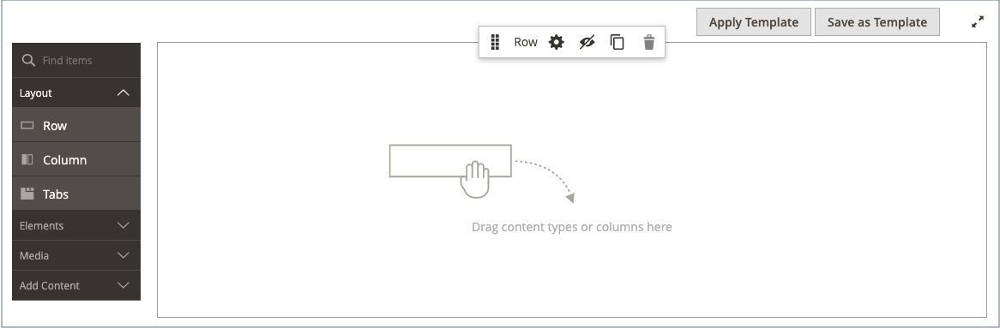

# 添加内容块

可以创建自定义的内容块，然后将其添加到任何页面、页面组，甚至添加到另一个块。 例如，您可以将图像滑块放置在块中，然后将该块放置在主页上。 块工作区使用相同的 [基本控件](pages-workspace.md) 作为 _页面_ 工作区，帮助您找到可用的块并执行日常维护。 块完成后，您可以使用 [构件](widget-static-block.md) 工具，可将其放置在商店中的特定页面上。

{width="700" zoomable="yes"}

## 创建块

1. 在 _管理员_ 侧栏，转到 **[!UICONTROL Content]** > _[!UICONTROL Elements]_>**[!UICONTROL Blocks]**.

1. 在右上角，单击 **添加新块**.

   {width="500" zoomable="yes"}

1. 如果要更改新块的默认启用状态，请设置 **启用块** 到 `No`.

1. 分配 **块标题** 以供内部参考。

1. 分配唯一 **标识符** 为区块买单。

   使用带下划线的所有小写字符而不是空格。

1. 选择每个 **[!UICONTROL Store View]** 您希望块可用的位置。

1. 使用显示的内容工具集添加块的内容：

   - 如果 [页面生成器](../page-builder/introduction.md) 已启用，请选择 **[!UICONTROL Edit with Page Builder]** 在内容中使用页面生成器工具 [工作区](../page-builder/workspace.md).

     {width="500" zoomable="yes"}

     >[!NOTE]
     >
     >有关使用页面生成器添加块的信息，请参阅 [教程2：块](../page-builder/2-blocks.md).

   - 使用 [编辑者](editor.md) 设置文本格式、创建链接以及添加表格、图像、视频和音频。

     如果您希望使用HTML代码，请单击 **显示/隐藏编辑器**.

     {width="500" zoomable="yes"}

1. 完成后，单击 **[!UICONTROL Save]** 箭头并选择 **[!UICONTROL Save & Close]**.

   新块将显示在“块”网格的列表底部。

1. 使用 [构件](widget-static-block.md) 用于将完成的块放置在商店中的特定页面上的工具。

## 删除块

有两种方法可删除自定义块。 您可以将其从 _个块_ 网格中，或从“编辑块”页中。

### 方法1：从块网格中删除块

1. 在 _管理员_ 侧栏，转到 **[!UICONTROL Content]** > _[!UICONTROL Elements]_>**[!UICONTROL Blocks]**.
1. 使用网格上方的筛选器找到块，并选中要删除的一个或多个块的复选框。
1. 在列表的左上角，设置 **[!UICONTROL Actions]** 到 `Delete`.
1. 要确认操作，请单击 **[!UICONTROL OK]**.

### 方法2：从编辑页面中删除块

1. 在 _管理员_ 侧栏，转到 **[!UICONTROL Content]** > _[!UICONTROL Elements]_>**[!UICONTROL Blocks]**.
1. 查找要删除的块。
1. 在 _操作_ 的列，单击 **[!UICONTROL Select]** 并选择 **[!UICONTROL Edit]**.
1. 在菜单栏中，单击 **[!UICONTROL Delete Block]**.
1. 要确认操作，请单击 **[!UICONTROL OK]**.

## 保存菜单

| 命令 | 描述 |
|----------|----------- |
| [!UICONTROL Save] | 保存当前块并继续工作。 |
| [!UICONTROL Save & Duplicate] | 保存并关闭当前块，然后打开新的重复副本。 |
| [!UICONTROL Save & Close] | 保存并关闭当前块，然后返回到块网格。 |

{style="table-layout:auto"}

## 添加灯箱或滑块

- 添加操作很简单 [滑块](../page-builder/slider.md) 到您的商店，使用 [[!DNL Page Builder]](../page-builder/introduction.md). 可以将滑块设置为自动播放，或使用导航按钮手动控制。

  {width="600" zoomable="yes"}

  此外，上还提供了各种基于jQuery的图像灯箱 [[!DNL Commerce Marketplace]][1]，其中一些是免费的。

- 您还可以从下载扩展 [!DNL Commerce Marketplace]. 有关其他帮助，请参阅扩展开发人员提供的文档。

[1]: https://marketplace.magento.com/extensions.html?q=lightbox
