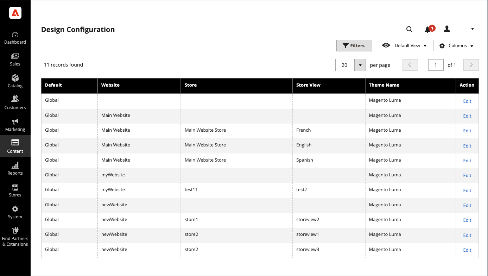
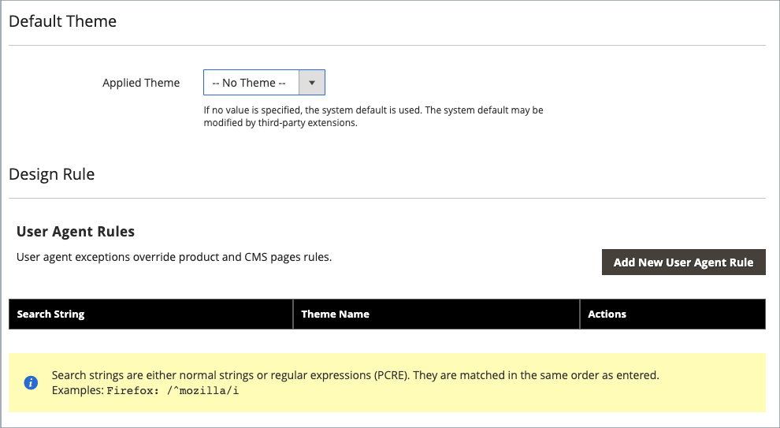
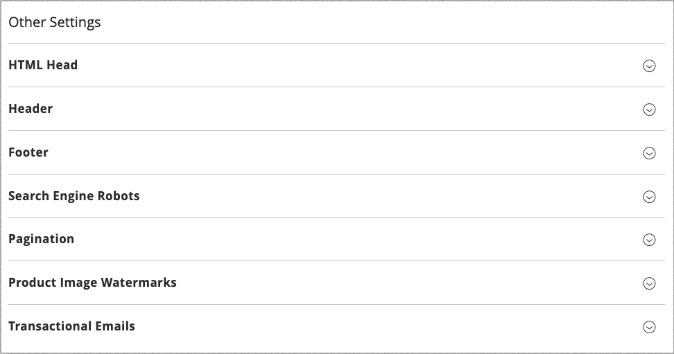

# 设计配置

设计配置可通过在单个页面上显示设置来轻松编辑与设计相关的规则和配置设置。

{width="700" zoomable="yes"}

## 更改设计配置

1. 在&#x200B;_管理员_&#x200B;侧边栏上，转到&#x200B;**[!UICONTROL Content]** > _[!UICONTROL Design]_>**[!UICONTROL Configuration]**。

1. 查找要配置的商店视图，然后单击&#x200B;_[!UICONTROL Action]_列中的&#x200B;**[!UICONTROL Edit]**。

   页面将显示商店视图的当前设计设置。

1. 要更改默认主题，请将&#x200B;**[!UICONTROL Applied Theme]**&#x200B;设置为要应用于视图的主题。

   如果未指定主题，则使用系统默认主题。 某些第三方扩展会修改系统默认主题。

1. 如果主题仅用于特定设备，请设置&#x200B;**[!UICONTROL User Agent Rules]**。

   {width="400" zoomable="yes"}

   对于要指定主题的每种设备类型：

   - 单击&#x200B;**[!UICONTROL Add New User Agent Rule]**。

   - 对于&#x200B;**[!UICONTROL Search String]**，输入特定设备的浏览器ID。

     搜索字符串可以是标准表达式，也可以是Perl兼容的正则表达式(PCRE)（有关详细信息，请参阅[用户代理](https://en.wikipedia.org/wiki/User_agent)）。 以下搜索字符串标识Firefox：

         /^mozilla/i
     
   - 对于&#x200B;**[!UICONTROL Theme Name]**，选择要用于指定设备的主题。

   >[!NOTE]
   >
   >您可以为要指定的设备添加任意数量的规则。 搜索字符串按输入顺序进行匹配。

1. 在&#x200B;_[!UICONTROL Other Settings]_下，展开每个部分并按照链接的主题中的说明根据需要编辑设置。

   - [[!UICONTROL Pagination]](../catalog/navigation-product-listings.md#pagination-controls)
   - [[!UICONTROL HTML Head]](page-setup.md#html-head)
   - [[!UICONTROL Header]](page-setup.md#header)
   - [[!UICONTROL Footer]](page-setup.md#footer)
   - [[!UICONTROL Search Engine Robots]](../merchandising-promotions/seo-overview.md#search-engine-robots)
   - [[!UICONTROL Product Image Watermarks]](../catalog/product-image.md#watermarks)
   - [[!UICONTROL Transactional Emails]](../systems/email-templates.md#configure-email-templates)

   {width="500" zoomable="yes"}

1. 完成后，单击&#x200B;**[!UICONTROL Save Configuration]**。
