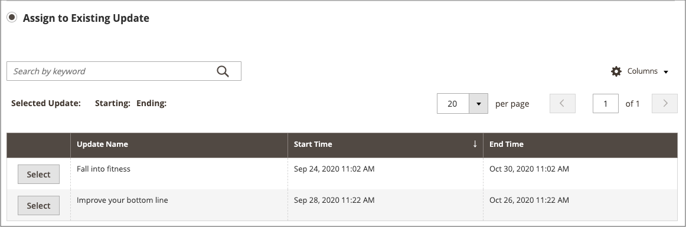
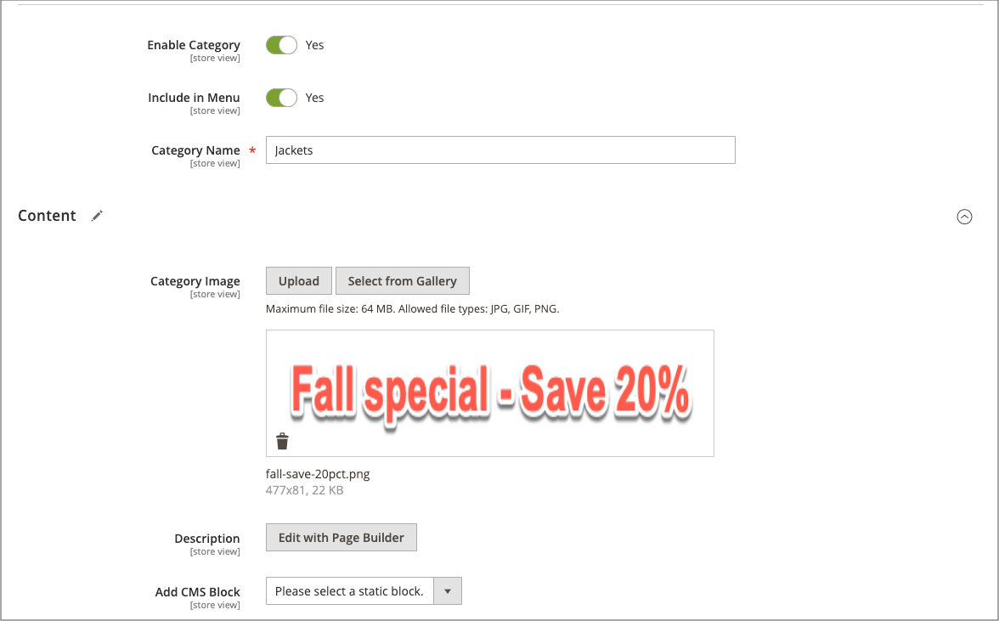

# 向营销活动添加项目

{{ee-feature}}

以下示例在营销活动期间将促销图像添加到类别页面。 您还可以对产品页面或CMS页面执行相同操作。

## 为类别添加营销活动项目

1. 在&#x200B;_管理员_&#x200B;侧边栏上，转到&#x200B;**[!UICONTROL Catalog]** > **[!UICONTROL Categories]**。

1. 找到要在营销策划中使用的类别，并在编辑模式下打开该类别。

1. 单击&#x200B;**[!UICONTROL Schedule New Update]**。

1. 选择&#x200B;**[!UICONTROL Assign to Existing Campaign]**。

1. 在列表中，选择要修改的营销策划。

   {width="600" zoomable="yes"}

1. 展开 **[!UICONTROL Content]**。

1. 对于&#x200B;**[!UICONTROL Category Image]**，单击&#x200B;**[!UICONTROL Upload]**&#x200B;并选择要在营销活动期间显示在类别页面上的图像。

   {width="600" zoomable="yes"}

1. 完成后，单击&#x200B;**[!UICONTROL Save]**。

## 验证项目

1. 在&#x200B;_管理员_&#x200B;侧边栏上，转到&#x200B;**[!UICONTROL Content]** > _[!UICONTROL Content Staging]_>**[!UICONTROL Dashboard]**。

1. 在显示的列表或时间轴中查找营销活动，并打开它以访问详细信息：

   - 要显示列表，请单击&#x200B;**[!UICONTROL Select]**，然后单击&#x200B;_[!UICONTROL Action]_&#x200B;列中的&#x200B;**[!UICONTROL View/Edit]**。
   - 对于时间轴显示，单击一次以显示摘要，然后单击&#x200B;**[!UICONTROL View/Edit]**。

   {width="600" zoomable="yes"}

1. 展开 **[!UICONTROL Categories]**&#x200B;以查看已分配类别的列表。

1. 要在营销活动处于活动状态时查看该类别的页面，请返回到仪表板，再次单击营销活动，然后单击&#x200B;**[!UICONTROL Preview]**。
