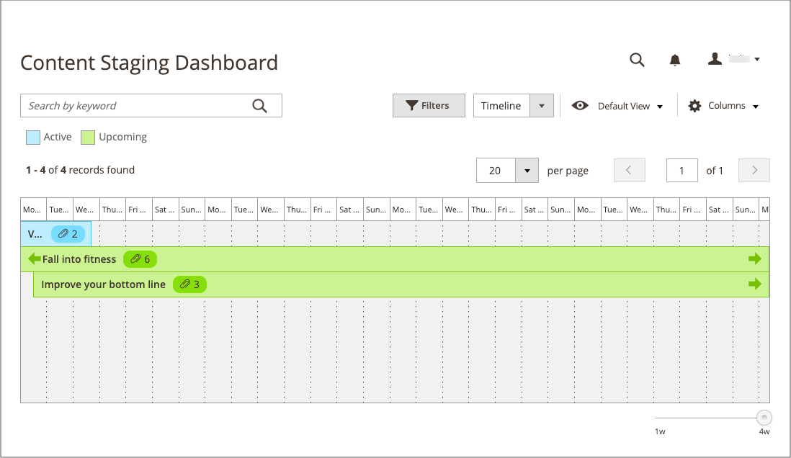

# 内容暂存仪表板

{{ee-feature}}

[!UICONTROL Content Staging]仪表板提供所有活动和即将发生的营销活动的概览。 操控板的格式可以从网格更改为时间轴。 您还可以使用过滤器查找营销活动、自定义列布局以及保存网格的不同视图。 有关工作区控件的详细信息，请参阅[管理员工作区](../getting-started/admin-workspace.md)。

{width="600" zoomable="yes"}

## 查看暂存仪表板

1. 在&#x200B;_管理员_&#x200B;侧边栏上，转到&#x200B;**[!UICONTROL Content]** > _[!UICONTROL Content Staging]_>**[!UICONTROL Dashboard]**。

1. 要更改仪表板的格式，请将&#x200B;**[!UICONTROL View As]**&#x200B;控件设置为`list`、`Grid`或`Timeline`。

   {width="600" zoomable="yes"}

   显示时间轴时，可使用右下角的滑块将视图从1周调整为4周。 每一列代表一天。

1. 如果显示时间轴，请将滑块拖动到最右侧的`4w`位置以查看更长的时间范围。

   {width="600" zoomable="yes"}

1. 要显示有关营销策划的一般信息，请单击页面上的任意项目。

   - 要打开营销活动，请单击&#x200B;**[!UICONTROL View/Edit]**。

   - 要查看促销活动当天商店中客户的显示方式，请单击&#x200B;**[!UICONTROL Preview]**。

   {width="600" zoomable="yes"}

## 暂存仪表板列说明

| 列 | 描述 |
|--- |--- |
| [!UICONTROL Status] | 营销活动的状态。 `Active`或`Upcoming`。 |
| [!UICONTROL Update Name] | 营销活动的名称。 |
| [!UICONTROL Includes] | 定义营销活动中包含的对象数。 |
| [!UICONTROL Start Time] | 营销活动开始的日期。 |
| [!UICONTROL End Time] | 营销活动结束的日期。 |
| [!UICONTROL Description] | 每个营销活动的其他描述。 |
| [!UICONTROL Action] | 可应用于单个记录的操作包括：  **[!UICONTROL View/Edit]**— 在编辑模式下打开营销活动。 **[!UICONTROL Preview]** — 在预览模式下显示营销活动。 |

{style="table-layout:auto"}

## 编辑营销活动

可以从暂存功能板中编辑现有促销活动对象，但是没有结束日期的价格规则促销活动除外。

>[!NOTE]
>
>如果活动营销活动最初创建时没有结束日期，则以后无法编辑活动以包含结束日期。 在这种情况下，需要创建一个重复的市场活动并输入所需的结束日期。

{width="600" zoomable="yes"}

此示例中的促销活动包括两个类别和三个单独的产品。

按照以下步骤编辑此营销活动中的任何对象。

1. 在&#x200B;_管理员_&#x200B;侧边栏上，转到&#x200B;**[!UICONTROL Content]** > _[!UICONTROL Content Staging]_>**[!UICONTROL Dashboard]**。

1. 在显示的列表或时间轴中查找营销活动，并打开它以访问详细信息：

   - 要显示列表，请单击&#x200B;**[!UICONTROL Select]**，然后单击&#x200B;_[!UICONTROL Action]_列中的&#x200B;**[!UICONTROL View/Edit]**。
   - 对于时间轴显示，单击一次以显示摘要，然后单击&#x200B;**[!UICONTROL View/Edit]**。

1. 根据需要更新&#x200B;_[!UICONTROL General]_部分中的任何设置。

1. 展开包含要编辑的项的任何部分。

   {width="600" zoomable="yes"}

1. 单击&#x200B;**[!UICONTROL Save]**。
