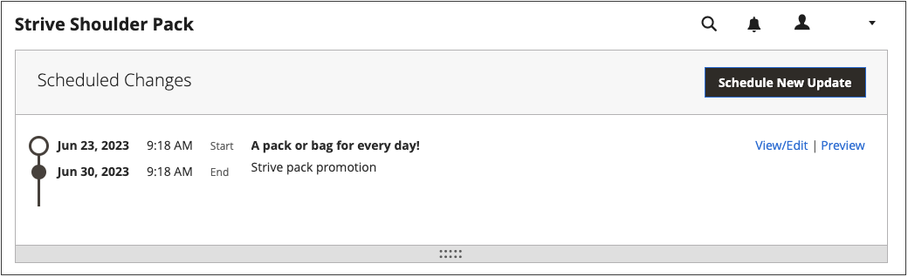

# 计划内容更新

{{ee-feature}}

以下示例说明如何计划产品的临时价格更改。 其中包括计划和预览更改，以及查看日历中的计划更新。 尽管此示例只包括一项更改，但营销策划可能包括对产品、价格规则、CMS页面和其他计划同时发生的实体的多项更改。 按照类似的方法指定[!UICONTROL Set Product As New]属性的起始/截止日期。

>[!NOTE]
>您必须创建计划的更新以指定[!UICONTROL Set Product As New]的开始（和结束）日期。 对于[!UICONTROL Special Price]和[!UICONTROL Design Change]，从Adobe Commerce中删除了起始/截止日期字段，这些字段仅在Magento Open Source中可用。
>
>所有计划的更新都连续应用，这意味着任何实体一次只能有一个计划的更新。 任何计划的更新将应用于其时间范围内的所有存储视图。 因此，一个实体不能同时对不同存储视图进行不同的计划更新。 所有存储视图中的所有实体属性值（不受当前计划更新影响）均从默认值获取，而不是从上次计划更新获取。

## 计划产品更新

1. 从&#x200B;_[!UICONTROL Products]_&#x200B;网格中，以编辑模式打开产品。

1. 在页面顶部的&#x200B;_[!UICONTROL Scheduled Changes]_&#x200B;框中，单击&#x200B;**[!UICONTROL Schedule New Update]**。

   {width="600" zoomable="yes"}

1. 选择&#x200B;**[!UICONTROL Save as a New Update]**&#x200B;选项后，设置更新的基本参数：

   - 为&#x200B;**[!UICONTROL Update Name]**&#x200B;输入新内容暂存营销活动的名称。

   - 输入更新的简短&#x200B;**[!UICONTROL Description]**&#x200B;及其使用方式。

   - 使用日历（）工具为促销活动选择&#x200B;**开始日期**&#x200B;和&#x200B;**结束日期**。

     要创建开放营销活动，请勿指定结束日期（留空）。 在本例中，营销活动计划于新年的午夜(太平洋标准时间2021年1月1日凌晨12:00开始。

     对于创建时没有结束日期的价格规则市场活动，以后将无法添加结束日期。 在这种情况下，需要创建一个营销策划，并将开始日期设置为希望旧营销策划结束的日期和希望新营销策划开始的日期。 在该开始日期，旧营销活动结束，新营销活动开始（按定义）。

     {width="600" zoomable="yes"}

     >[!NOTE]
     >
     >营销活动开始日期和结束日期必须使用&#x200B;**_default_**&#x200B;管理时区来定义，该时区从每个网站的本地时区进行转换。 例如，如果您有多个网站位于不同时区，但希望根据美国（默认）时区启动促销活动，则必须为每个本地时区计划单独的更新。 在这种情况下，将&#x200B;**[!UICONTROL Start Date]**&#x200B;和&#x200B;**[!UICONTROL End Date]**&#x200B;设置为从每个本地网站时区转换为默认管理时区。

1. 向下滚动到&#x200B;_[!UICONTROL Price]_&#x200B;并单击&#x200B;**[!UICONTROL Advanced Pricing]**。

1. 在计划的营销活动期间输入产品的&#x200B;**[!UICONTROL Special Price]**，然后单击&#x200B;**[!UICONTROL Done]**。

1. 完成后，单击&#x200B;**[!UICONTROL Save]**。

   计划的更改将出现在产品页面的顶部，其中包含营销活动的开始和结束日期。

   {width="600" zoomable="yes"}

## 编辑计划的更改

1. 在页面顶部的&#x200B;_计划更改_&#x200B;框中，单击&#x200B;**[!UICONTROL View/Edit]**。

1. 对计划更新进行任何必要的更改。

1. 单击&#x200B;**[!UICONTROL Save]**。

## 预览计划的更改

在页面顶部的&#x200B;_计划更改_&#x200B;框中，单击&#x200B;**[!UICONTROL Preview]**。

预览会打开一个新的浏览器选项卡，并显示产品在计划的营销活动期间的显示方式。

>[!NOTE]
>
>计划更新的暂存预览始终从&#x200B;**默认**&#x200B;存储视图开始，该视图模拟客户在暂存更新营销活动中导航的体验。

有关使用预览内容工具更改预览日期和范围的更多信息，请参阅[预览促销活动](content-staging-preview.md)。 您还可以与同事共享指向商店预览的链接。
