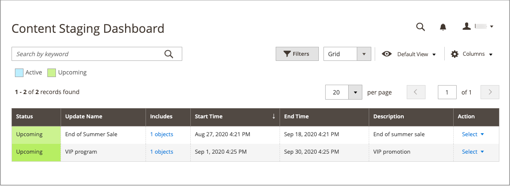

# 内容暂存

{{ee-feature}}

内容暂存使您的业务团队能够直接从&#x200B;_管理员_&#x200B;为您的商店轻松创建、预览和计划各种内容更新。 例如，不要考虑静态页面，而应将页面视为不同元素的集合，这些元素可以根据计划打开&#x200B;_或_&#x200B;关&#x200B;_。_&#x200B;您可以使用内容暂存创建一个页面，该页面会在一年中按计划自动更改。

术语&#x200B;_营销活动_&#x200B;是指计划更改的记录，或者是指从暂存仪表板管理的更改集合。 可以在日历或时间轴上查看更改。 术语&#x200B;_计划更改_&#x200B;和&#x200B;_计划更新_&#x200B;可互换，并指单个更改。

当您计划在特定时间段内进行内容更改时，当计划的更改过期时，内容将恢复到以前的版本。 您可以创建同一基线内容的多个版本以用于未来的更新。 您还可以回溯时间线以查看内容的早期版本。 要保存草稿版本，只需在时间轴上指定一个日期，该日期距离未来很远，并且绝不会投入生产。

>[!NOTE]
>
>与“开始日期”和“结束日期”相关的字段已在 Adobe Commerce中删除，不能直接在购物车价格规则、目录价格规则、产品、类别和CMS页面上修改。 您必须为这些激活创建计划的更新。

## 内容暂存对象和营销活动

为以下任何对象创建新的计划更新时，将创建相应的营销活动作为占位符，并在页面顶部显示&#x200B;_[!UICONTROL Scheduled Changes]_框。 占位符营销活动具有开始日期，但没有结束日期。 您可以将内容更新安排为营销活动的一部分，然后按日期、时间或商店视图预览和共享更改。 为一个对象创建新营销活动后，可将其指定为其他对象的计划更新。

- [产品](../catalog/product-scheduled-changes.md)
- [类别](../catalog/category-scheduled-changes.md)
- [目录价格规则](../merchandising-promotions/price-rule-catalog-scheduled-changes.md)
- [购物车价格规则](../merchandising-promotions/price-rule-cart-scheduled-changes.md)
- [CMS页面](pages-workspace.md#scheduled-changes)
- [CMS块](blocks.md)

## 内容暂存工作流

1. **创建基线内容**

   基线是没有营销活动的资产内容，包含在页面顶部&#x200B;_[!UICONTROL Scheduled Changes]_部分下的所有内容。 将始终使用基线内容，除非存在在时间轴上针对该位置计划了更改的活动营销活动。

1. **创建第一个营销活动**

   根据需要使用开始和结束日期创建您的第一个营销活动。 要使营销活动处于开放状态，请将结束日期留空。 第一个营销活动结束时，将恢复原始基线内容。

   >[!NOTE]
   >
   >营销活动开始日期和结束日期必须使用&#x200B;**_default_**&#x200B;管理时区定义，该时区从每个网站的本地时区进行转换。 请考虑以下示例：您有多个位于不同时区的网站，但您希望基于美国时区启动营销活动。 在这种情况下，您必须为每个本地时区计划单独的更新，并将&#x200B;**[!UICONTROL Start Date]**&#x200B;和&#x200B;**[!UICONTROL End Date]**&#x200B;设置为从每个本地网站时区转换为默认管理时区。

1. **添加第二个营销活动**

   创建第二个营销活动，并根据需要提供开始和结束日期。 第二个营销活动可以分配给完全不同的时间段。 为同一资产创建多个营销活动时，营销活动不能重叠。 您可以根据需要创建任意数量的营销活动。

   >[!NOTE]
   >
   >所有计划的更新都连续应用，这意味着任何实体一次只能有一个计划的更新。 任何计划的更新将应用于其时间范围内的所有存储视图。 因此，一个实体不能同时对不同存储视图进行不同的计划更新。 所有存储视图中的所有实体属性值（不受当前计划更新影响）均从默认值获取，而不是从上次计划更新获取。

1. **还原基线内容**

   如果所有营销活动都有结束日期，则当所有活动的营销活动结束时，将恢复基线内容。

>[!NOTE]
>
>当实体的暂存更新处于活动状态时，编辑实体即编辑当前活动的暂存更新。 它不会影响基线内容，该内容在暂存更新结束时恢复。

## [!UICONTROL Content Staging]仪表板

[!UICONTROL Content Staging] [仪表板](content-staging-dashboard.md)提供了所有计划网站更改和更新的可见性。 可以预览营销活动的任何一天、日期范围或时间段，并与他人共享。

{width="600" zoomable="yes"}

## 内容暂存演示

要了解内容暂存，请观看此视频：

>[!VIDEO](https://video.tv.adobe.com/v/343784?quality=12)

## 资源疑难解答

有关排查内容暂存问题的帮助，请参阅以下[!DNL Commerce]支持知识库文章：

- [由于内容暂存问题，所有页面上出现404错误](https://experienceleague.adobe.com/docs/commerce-knowledge-base/kb/troubleshooting/site-down-or-unresponsive/error-404-on-all-pages-due-to-content-staging-issue.html)
- [计划内容暂存更新未显示过时的Fastly缓存](https://experienceleague.adobe.com/docs/commerce-knowledge-base/kb/troubleshooting/miscellaneous/scheduled-content-staging-updates-not-displayed-with-stale-fastly-cache.html)
- [我能否为共享目录中的价格安排内容暂存更新？](https://experienceleague.adobe.com/docs/commerce-knowledge-base/kb/faq/can-i-schedule-content-staging-updates-for-prices-in-a-shared-catalog.html)
