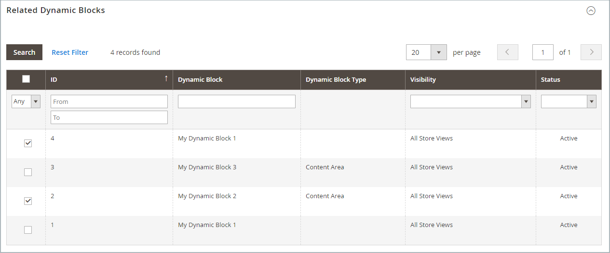

# 价格规则中的动态块

{{ee-feature}}

您创建的任何[动态块](dynamic-blocks.md)都可以与促销关联。 要建立关联，您必须先创建动态块和[目录价格规则](../merchandising-promotions/price-rules-catalog.md)或[购物车价格规则](../merchandising-promotions/price-rules-cart.md)。 关联可以在处理价格规则时或在处理动态块时建立。

>[!IMPORTANT]
>
>创建此关联后，在触发规则时动态块只显示&#x200B;**1&rbrace;。**&#x200B;如果促销活动定位到区段A，则该块将显示到区段A。如果促销活动未处于活动状态，则不会显示块。

## 将动态块与价格规则关联

1. 在&#x200B;_管理员_&#x200B;侧边栏上，转到&#x200B;**[!UICONTROL Marketing]** > _[!UICONTROL Promotions]_&#x200B;并选择以下选项之一：

   - **[!UICONTROL Catalog Price Rules]**
   - **[!UICONTROL Cart Price Rules]**

1. 在网格中，查找要与动态块关联的规则，并在编辑模式下打开。

1. 向下滚动并展开 **[!UICONTROL Related Dynamic Blocks]**。

1. 在第一列中，将筛选器设置为`Any`并单击&#x200B;**[!UICONTROL Reset Filter]**。

   网格现在会列出所有可用的动态块。

1. 选中要与规则关联的每个动态块的复选框。

   {width="600" zoomable="yes"}

1. 完成后，单击&#x200B;**[!UICONTROL Save]**。

## 将价格规则与动态块关联

1. 在&#x200B;_管理员_&#x200B;侧边栏上，转到&#x200B;**[!UICONTROL Content]** > _[!UICONTROL Elements]_>**[!UICONTROL Dynamic Blocks]**。

1. 在网格中查找动态块，并在编辑模式下打开。

1. 向下滚动并展开&#x200B;**[!UICONTROL Related Promotions]**。

   当前关联的所有价格规则都会显示在网格中。

1. 添加新的关联规则或删除当前关联。

   - 要关联购物车促销，请单击&#x200B;**[!UICONTROL Add Cart Price Rules]**。

   - 要关联与产品相关的促销，请单击&#x200B;**[!UICONTROL Add Catalog Price Rules]**。

1. 在网格中，选中要与动态块关联的每个规则的复选框。

1. 单击&#x200B;**[!UICONTROL Add Selected]**。

   {width="600" zoomable="yes"}

1. 完成后，单击&#x200B;**[!UICONTROL Save]**。
