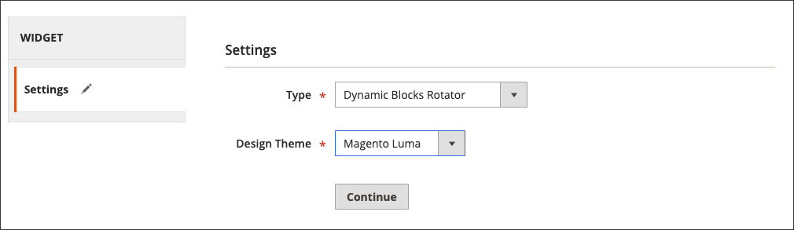

# 添加旋转动态块

{{ee-feature}}

若要演示交互式内容的幻灯片放映，可以将多个[动态块](dynamic-blocks.md)添加到旋转器。 [小组件](widgets.md)工具用于将旋转器放置在商店中单个页面或多个页面上的特定位置。

{width="700" zoomable="yes"}

## 步骤1：创建单个动态块

要[创建要放置在旋转器中的动态块](dynamic-blocks.md)，请按照以下说明操作：

## 步骤2：添加动态块旋转器小组件

1. 在&#x200B;_管理员_&#x200B;侧边栏上，转到&#x200B;**[!UICONTROL Content]** > _[!UICONTROL Elements]_>**[!UICONTROL Widgets]**。

1. 单击右上角的&#x200B;**[!UICONTROL Add Widget]**。

1. 在&#x200B;_设置_&#x200B;下，将&#x200B;**[!UICONTROL Type]**&#x200B;设置为`Dynamic Blocks Rotator`。

1. 选择商店的当前&#x200B;**[!UICONTROL Design Theme]**。

   此设置标识当前包或确定商店页面布局的[主题](themes.md)。

1. 单击&#x200B;**[!UICONTROL Continue]**。

   {width="600" zoomable="yes"}

## 第3步：完成这些选项

1. 在&#x200B;_店面属性_&#x200B;下，设置选项：

   - 为旋转器输入&#x200B;**[!UICONTROL Title]**。

   - 在&#x200B;**[!UICONTROL Assign to Store Views]**&#x200B;列表中，选择旋转器可用的[存储视图](../getting-started/websites-stores-views.md)。

   - （可选）输入&#x200B;**[!UICONTROL Sort Order]**&#x200B;数字以确定旋转器在目标容器中的位置。 此构件相对于可能分配到同一容器的其他构件。

   {width="600" zoomable="yes"}

1. 在&#x200B;_布局选项_&#x200B;下，单击&#x200B;**[!UICONTROL Add Layout Update]**&#x200B;并执行以下操作：

   - 将&#x200B;**[!UICONTROL Display on]**&#x200B;设置为要显示旋转器的页面或页面类型。

      - `Categories` — 在[锚点](../catalog/navigation-layered.md)或非锚点类别页面上显示旋转体。 选项：锚点类别/非锚点类别
      - `Products` — 在特定类型的产品页面或所有产品页面上显示旋转器。 选项：所有产品类型/ [简单产品](../catalog/product-create-simple.md) / [虚拟产品](../catalog/product-create-virtual.md) / [捆绑产品](../catalog/product-create-bundle.md) / [可下载的产品](../catalog/product-create-downloadable.md) / [礼品卡](../catalog/product-gift-card-create.md) / [可配置产品](../catalog/product-create-configurable.md) / [分组产品](../catalog/product-create-grouped.md)
      - `Generic Pages` — 在所有页面、特定页面上或仅在具有特定布局的页面上显示旋转器。 选项： `All Pages` / `Specified Page` / `Page Layouts`

     在此示例中，旋转器将放置在`Specified Page`上。

   - 选择要显示旋转器的特定&#x200B;**[!UICONTROL Page]**。

   - 将&#x200B;**[!UICONTROL Container]**&#x200B;设置为旋转器将显示在[页面布局](page-layout.md#standard-page-layouts)的部分。

     如果将其他构件分配到同一个容器，则它们会按照排序顺序依次显示。

   - 接受`Dynamic Block Template`作为默认&#x200B;**[!UICONTROL Template]**。

     该设置根据旋转体是独立还是位于现有文本内来确定用于设置旋转体格式的模板。

     {width="600" zoomable="yes"}

   - 单击&#x200B;**[!UICONTROL Save and Continue Edit]**。

1. 在左侧面板中，选择&#x200B;**[!UICONTROL Widget Options]**。

1. 对于&#x200B;**[!UICONTROL Dynamic Blocks to Display]**，接受`Specified Dynamic Blocks`。

   该设置确定旋转器中包含的动态块的类型。

   - `Specified Dynamic Blocks` — 仅包含特定动态块。
   - `Cart Price Rule Related` — 仅包含与购物车价格规则关联的动态块。
   - `Catalog Price Rule Related` — 仅包含与目录价格规则关联的动态块。

1. 选择可与小组件一起使用的&#x200B;**[!UICONTROL Restrict the Dynamic Block Types]**。`Content Area`

   此设置将横幅限制为页面布局的特定部分。

   - `Content Area` — 将动态块放置在页面的主内容区域中。
   - `Footer` — 将动态块放置在页脚中。
   - `Header` — 将动态块放置在页眉中。
   - `Left Column` — 将动态块放置在页面布局的左列（如果可用）。
   - `Right Column` — 将动态块放置在页面布局的右列（如果可用）。

1. 将&#x200B;**[!UICONTROL Rotation Mode]**&#x200B;设置为以下项之一：

   - `Display all instead of rotating` — 显示全部可见的动态块栈栈。
   - `One at a time, Random` — 以随机顺序显示指定的动态块。 刷新页面时，会出现另一个（随机）动态块。
   - `One at the time, Series` — 显示添加序列中指定的动态块。 刷新页面时，将显示序列中的下一个动态块。
   - `One at the time, Shuffle` — 按混流顺序每次显示一个动态块。 此选项与`One at a time, Random`选项类似，不同之处在于不会重复相同的动态块。

     {width="600" zoomable="yes"}

1. 在&#x200B;**[!UICONTROL Specify Dynamic Blocks]**&#x200B;网格中，选中要包含在旋转器中的每个动态块的复选框。

1. 完成后，单击&#x200B;**[!UICONTROL Save]**。
