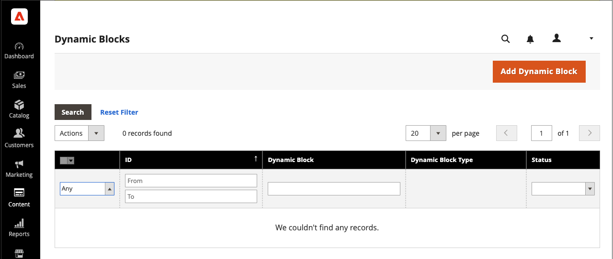

# 动态块

{{ee-feature}}

创建由[价格规则](../merchandising-promotions/introduction.md#price-rules)和[客户区段](../customers/customer-segments.md)中的逻辑驱动的丰富交互式内容。 现有[动态块](../page-builder/dynamic-block.md)可以直接添加到[!DNL Page Builder] [阶段](../page-builder/workspace.md)。 有关使用动态块的详细分步示例，请参阅[教程2：块](../page-builder/2-blocks.md)。

>[!NOTE]
>
>[[!UICONTROL Content]菜单](content-menu.md)中的&#x200B;_[!UICONTROL Banner]_&#x200B;选项在2.3.1中已弃用，在2.4.0中已移除。其功能已被动态块取代。

![[!DNL Page Builder] — 具有价格规则和客户区段的动态块](../page-builder/assets/pb-tutorial2-dynamic-block-storefront.png){width="600" zoomable="yes"}

## 步骤1：创建动态块

1. 在&#x200B;_管理员_&#x200B;侧边栏上，转到&#x200B;**[!UICONTROL Content]** > _[!UICONTROL Elements]_>**[!UICONTROL Dynamic Blocks]**。

   {width="600" zoomable="yes"}

1. 单击右上角的&#x200B;**[!UICONTROL Add Dynamic Block]**。

   {width="600" zoomable="yes"}

1. 如果适用，请将&#x200B;**[!UICONTROL Store View]**&#x200B;设置为要显示动态块的特定存储视图。

1. 要激活动态块，请将&#x200B;**[!UICONTROL Enable Dynamic Block]**&#x200B;设置为`Yes`。

1. 对于内部引用，请输入描述性&#x200B;**[!UICONTROL Dynamic Block Name]**。

1. 将&#x200B;**[!UICONTROL Dynamic Block Type]**&#x200B;设置为您希望显示动态块的页面区域，然后单击&#x200B;**[!UICONTROL Done]**。

   {width="500" zoomable="yes"}

1. 在&#x200B;**[!UICONTROL Customer Segment]**&#x200B;列表中，选中要查看动态块的每个区段的复选框，然后单击&#x200B;**[!UICONTROL Done]**&#x200B;保存设置。

   {width="500" zoomable="yes"}

   >[!NOTE]
   >
   >- 如果未创建区段，则该动态块对每个人都可见。
   >- 如果客户不属于任何区段，并且已为所有区段创建了动态块，则仍会显示动态块的内容。
   >- 如果删除了分配给某个动态块的所有客户区段，则其内容对所有人可见。

### 在动态块中使用Real-Time CDP受众

如果您[安装了](../customers/audience-activation.md#install-the-extension)并[配置了](../customers/audience-activation.md#configure-the-extension)扩展程序[!DNL Audience Activation]，则会看到名为&#x200B;**[!UICONTROL Audiences]**&#x200B;的部分。

{width="600" zoomable="yes"}

在&#x200B;**[!UICONTROL Real-Time CDP Audience]**&#x200B;列表中，选中要查看动态块的每个受众的复选框，然后单击&#x200B;**[!UICONTROL Done]**&#x200B;保存设置。

## 第2步：完成内容

使用[!DNL Page Builder] [工作区](../page-builder/workspace.md)完成内容。

![[!DNL Page Builder] — 动态块工作区](../page-builder/assets/pb-dynamic-block-workspace.png){width="600" zoomable="yes"}

## 步骤3：选择相关促销

1. 向下滚动并展开 **[!UICONTROL Related Promotions]**。

1. 单击要与动态块关联的促销活动类型：

   - **[!UICONTROL Add Cart Price Rules]** （请参阅[购物车价格规则](../merchandising-promotions/price-rules-cart.md)）

   - **[!UICONTROL Add Catalog Price Rules]** （请参阅[目录价格规则](../merchandising-promotions/price-rules-catalog.md)）

   >[!NOTE]
   >
   >Real-Time CDP受众不支持目录价格规则。

1. 在可用规则列表中，选中要使用的每个规则的复选框，然后单击&#x200B;**[!UICONTROL Add Selected]**。

1. 动态块完成后，单击&#x200B;**[!UICONTROL Save]**。

## 步骤4：将动态块添加到页面

1. 打开要在其中显示动态块的页面。

1. 使用[[!UICONTROL Add Dynamic Block]](../page-builder/dynamic-block.md)内容类型将动态块添加到阶段。

## 字段和工具描述

| 字段 | 描述 |
|--- |--- |
| [!UICONTROL Store View] | 指定动态块将可用的存储视图。 |
| [!UICONTROL Enable Dynamic Block] | 激活或停用动态块。 选项：是/否 |
| [!UICONTROL Dynamic Block Name] | 在管理员中标识动态块的描述性名称。 |
| [!UICONTROL Dynamic Block Type] | 标识在[标准页面布局](layout-updates.md)中放置动态块的位置。 选项：  **[!UICONTROL Content Area]**— 将动态块置于页面的主[内容区域](layout-updates.md)中。 **[!UICONTROL Footer]** — 将动态块放置在页面[页脚](page-setup.md#footer)中。  **[!UICONTROL Header]**— 将动态块放置在页面[标头](page-setup.md#header)中。 **[!UICONTROL Left Column]** — 将动态块置于两列或三列布局的[左侧边栏](page-layout.md#standard-page-layouts)中。  **[!UICONTROL Right Column]**— 将动态块置于两列或三列布局的[右侧边栏](page-layout.md#standard-page-layouts)中。 |
| 客户区段 | 将客户区段与动态块关联以确定哪些客户可以看到它。 |
| Real-Time CDP受众 | 将[Real-Time CDP受众](../customers/audience-activation.md)与动态块关联以确定哪些客户可以看到它。 |

{style="table-layout:auto"}

### 目录

| 字段 | 描述 |
|--- |--- |
| [!UICONTROL Layout] | 向舞台中添加行、列或选项卡。 |
| [!UICONTROL Elements] | 将文本、标题、按钮、分隔线和HTML代码添加到舞台上的任何布局容器中。 |
| [!UICONTROL Media] | 将图像、视频、横幅、滑块和Google映射添加到舞台上的任何现有布局容器。 |
| [!UICONTROL Add Content] | 将现有块、动态块和产品添加到暂存器。 |

{style="table-layout:auto"}

### 相关促销活动

| 字段 | 描述 |
|--- |--- |
| [!UICONTROL Related Cart Price Rule] | **[!UICONTROL Add Cart Price Rules]** — 将现有[购物车价格规则](../merchandising-promotions/price-rules-cart.md)与动态块关联为促销。 |
| [!UICONTROL Related Catalog Price Rule] | **[!UICONTROL Add Catalog Price Rules]** — 将现有[目录价格规则](../merchandising-promotions/price-rules-catalog.md)与动态块关联为促销。 |

{style="table-layout:auto"}
