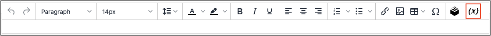

# 在编辑器中插入变量

您的存储区包括许多可以并入页面内容和其他通信中的预定义[变量](../systems/variables-predefined.md)。 此外，您还可以包含您自己的[自定义变量](../systems/variables-custom.md)，这些变量特定于您的需求。

1. 在编辑模式下打开页面、块或动态块。

1. 转到&#x200B;_[!UICONTROL Content]_部分并单击支持该编辑器的任何元素。

1. 将光标放在您希望变量出现的位置，然后单击&#x200B;_插入变量_&#x200B;图标。

   {width="700" zoomable="yes"}

   如果您未启用[!UICONTROL Page Builder]，但希望使用HTML代码，请单击&#x200B;**[!UICONTROL Show / Hide Editor]**。 将插入点放置在要显示变量的文本中。 然后，单击&#x200B;**[!UICONTROL Insert Variable]**。

1. 在可用变量列表中，选择所需的变量并单击&#x200B;**[!UICONTROL Insert Variable]**。

   {width="600" zoomable="yes"}

1. 完成内容编辑后，单击&#x200B;**[!UICONTROL Save]**。
