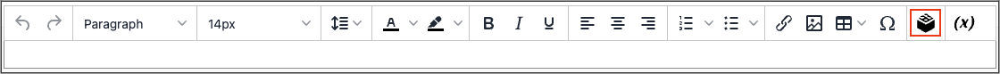

# 在编辑器中插入构件

此 [构件](widget-create.md) 工具可用于将各种内容元素添加到页面，包括到任何Commerce内容页面或节点、产品或类别的链接。 链接能够以块格式放置在页面上，或直接并入内容中。 您可以使用构件工具创建指向以下内容类型的链接：

- [内容页面](pages.md)
- [目录类别](../catalog/categories.md)
- [目录产品](../catalog/product-create.md)

默认情况下，链接会从主题的样式表中继承其样式。

{{$include /help/_includes/directives-caution.md}}

1. 在编辑模式下打开页面、块或动态块。

1. 转到 _[!UICONTROL Content]_部分，然后单击支持该编辑器的任何元素。

1. 将光标置于希望小组件出现的位置，然后单击 _插入构件_ 图标。

   {width="700" zoomable="yes"}

   如果未启用页面生成器，并且希望使用代码，请单击 **[!UICONTROL Show / Hide Editor]**. 将插入点放置在要显示小部件的文本中。 然后，单击 **[!UICONTROL Insert Widget]**.

1. 选择 **[!UICONTROL Widget Type]**.

   有关这些选项的详细信息，请参阅 [构件类型](widgets.md#widget-types). 以下步骤使用了一个示例来插入指向产品的链接。

1. 要使用产品名称，请保留 **[!UICONTROL Anchor Custom Text]** 字段为空。

1. 输入 **[!UICONTROL Anchor Custom Title]** 以获得最佳的SEO实践。

   此标题在页面上不可见。

1. 设置 **[!UICONTROL Template]** 更改为以下任一项：

   - 要将链接合并到文本中，请选择 `Product Link Inline Template`.

   - 要将链接放在单独的一行上，请选择 `Product Link Block Template`.

1. 单击 **[!UICONTROL Select Product]** 并执行以下操作：

   - 在树中，导航到所需的类别。

   - 在列表中，选择链接的产品。

1. 单击 **[!UICONTROL Insert Widget]** 以将链接放置到页面上。

   如果您使用的是HTML代码， [标记标记](../systems/markup-tags.md) 的链接，该链接显示在页面的顶部，用双大括号括起来。 如果需要，请使用 _剪切并粘贴_ 在代码中放置标记标记的位置，以便显示链接。

1. 完成内容编辑后，单击 **[!UICONTROL Save]**.
