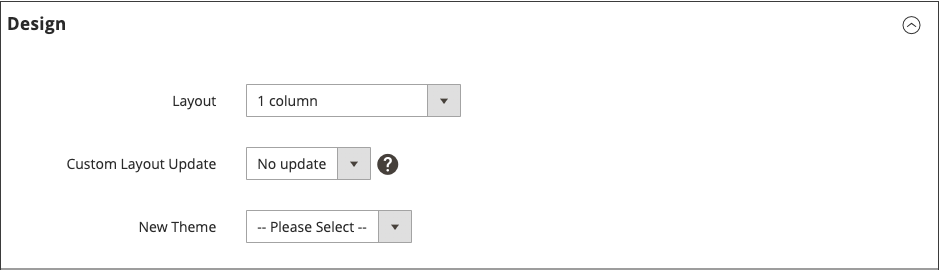

# 布局更新

在开始使用自定义布局更新之前，请务必了解商店页面的构造方式以及术语&#x200B;*布局*&#x200B;和&#x200B;*布局更新*&#x200B;之间的区别。 布局是指页面的视觉和结构组成。 布局更新是指一组特定的XML指令，这些指令可以覆盖或自定义页面的构建方式。

[!DNL Commerce]存储的XML布局是容器和块的分层结构。 某些元素显示在每个页面上，而其他元素仅显示在特定页面上。 要了解有关布局、容器和块的更多信息，请参阅&#x200B;_前端开发人员指南_&#x200B;中的[布局概述](https://developer.adobe.com/commerce/frontend-core/guide/layouts/)。

使用[小组件](widgets.md)工具可以轻松地将现有[内容块](blocks.md)添加到页面的默认布局。 要获得更高级的更新，您必须将XML布局更新代码保存在服务器上，然后作为自定义布局更新从管理员处引用该文件。 有关过程的概述，请参阅[使用布局更新](layout-updates.md#place-a-block-using-layout-updates)。

在下图中，引用容器的名称为黑色，块类型（或块类路径）为蓝色。

{width="500" zoomable="yes"}

| 块类型 | 描述 |
|--- |--- |
| `page/html` | 此块的名称为`root`，它是布局中少数几个根块之一。 您还可以创建自己的块，并将其命名为`root`，这是此类型块的标准名称。 每页只能有一个此类型的块。 |
| `page/html_head` | 块名称为`head`，是根块的子级。 每个页面只能有一个此类型的块，并且不得将其删除。 |
| `page/html_notices` | 块名称为`global_notices`，是根块的子级。 如果从布局中删除此块，则全局通知不会显示在页面上。 每页只能有一个此类型的块。 |
| `page/html_header` | 块名称为`header`，是根块的子级。 此块对应于页面顶部的可视标题，并包含多个标准块。 每个页面只能有一个此类型的块，并且不得将其删除。 |
| `page/html_wrapper` | 尽管此块包含在默认布局中，但它已被弃用，并且仅为了确保向后兼容性而包含在默认布局中。 请勿使用此类型的块。 |
| `page/html_breadcrumbs` | 此块的名称为`breadcrumbs`，它是标头块的子级。 此块显示当前页面的痕迹导航。 每页只能有一个此类型的块。 |
| `page/html_footer` | 块名称为`footer`，是根块的子级。 页脚块对应于页面底部的可视页脚，并包含多个标准块。 每个页面只能有一个此类型的块，并且不得将其删除。 |
| `page/template_links` | 标准布局中有两个此类型的块。 `top.links`块是标题块的子项，对应于顶部导航菜单。 `footer_links`块是页脚块的子项，对应于底部导航菜单。   **_注意：_**&#x200B;可以处理模板链接，如示例中所示。 |
| `page/switch` | 在标准布局中有两个此类型的块。 `store_language`块是标头块的子级，对应于顶级语言切换器。 `store_switcher`块是页脚块的子项，对应于底部存储切换器。 |
| 核心/消息 | 在标准布局中有两个此类型的块。 `global_messages`块显示全局消息。 `messages`块用于显示所有其他消息。 如果删除这些块，客户将看不到任何消息。 |
| `core/text_list` | 此类型的块在整个[!DNL Commerce]中广泛用作呈现子块的占位符。 |
| `core/profiler` | 每页只有一个此类块的实例。 它用于内部[!DNL Commerce]探查器，不应用于任何其他目的。 |

{style="table-layout:auto"}

## 使用布局更新放置块

[布局更新](layout-updates.md)可以自定义页面的布局。 布局更新比[构件](widgets.md)提供更大的灵活性，但需要访问服务器并了解XML的基本知识。

以下步骤显示如何使用版面更新在页面上放置块。 有关具体的示例和语法帮助，请参阅&#x200B;_前端开发人员指南_&#x200B;中的[常见布局自定义任务](https://developer.adobe.com/commerce/frontend-core/guide/layouts/)。

### 第1步：创建块

1. 创建要放置的[块](block-add.md)。

1. 记下`block_id`，因为它用在布局更新说明中。

### 步骤2：使用XML编写布局更新

1. 以XML格式撰写布局说明，以[引用CMS块](https://developer.adobe.com/commerce/frontend-core/guide/layouts/xml-manage/)。

1. 在服务器上将[布局说明](https://developer.adobe.com/commerce/frontend-core/guide/layouts/xml-instructions/)保存在为主题保存XML文件的布局文件夹中。

   例如：

   `<theme_dir>/<Namespace>_<Module>/layout`

   布局句柄是以`cms_page_view_selectable_`开头的文件名，后跟CMS页的URL键、布局更新选项和`xml`文件后缀。 在以下示例中，`customer-service`是页面的URL键，`ChatTool`是您选择用于将布局更新应用到页面的选项。

   `cms_page_view_selectable_`&lt;`customer-service`>`_`&lt;`ChatTool`>`.xml`

   | 元素 | 描述 |
   |--- |--- |
   | CMS页面标识符 | 带有任何正斜杠(`/`)的页面的URL键被下划线(`_`)替换。 |
   | 布局更新名称 | 为&#x200B;_自定义布局更新_&#x200B;显示的选项。 |

   {style="table-layout:auto"}

### 步骤3：从页面引用布局更新

1. 在&#x200B;_管理员_&#x200B;侧边栏上，转到&#x200B;**[!UICONTROL Content]** > _[!UICONTROL Elements]_>**[!UICONTROL Pages]**。

1. 查找要放置块的页面，并在编辑模式下打开该页面。

1. 向下滚动并展开&#x200B;**[!UICONTROL Design]**&#x200B;部分的。

1. 要显示与页面关联的所有可用布局更新，请单击&#x200B;**[!UICONTROL Custom Layout Update]**&#x200B;菜单。

   {width="400" zoomable="yes"}

1. 选择要应用于页面的布局更新。

### 步骤4：保存并刷新缓存

1. 完成后，单击&#x200B;**[!UICONTROL Save & Close]**。

1. 在工作区顶部的消息中，单击&#x200B;**[!UICONTROL Cache Management]**&#x200B;并刷新所有无效的缓存项目。
