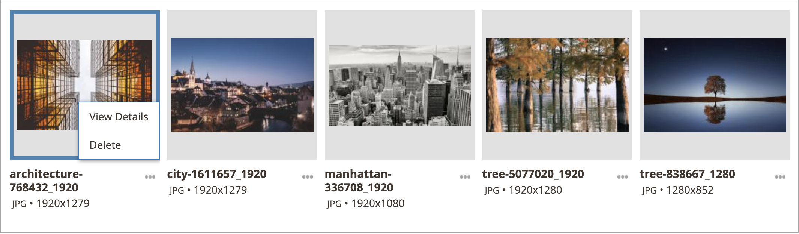
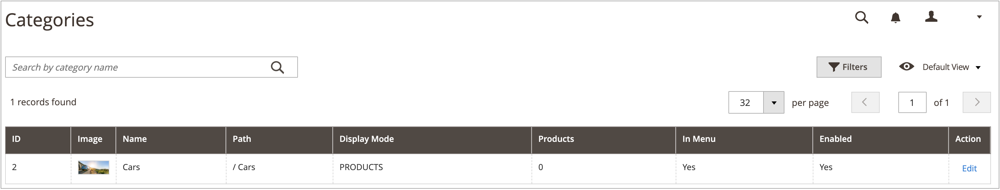
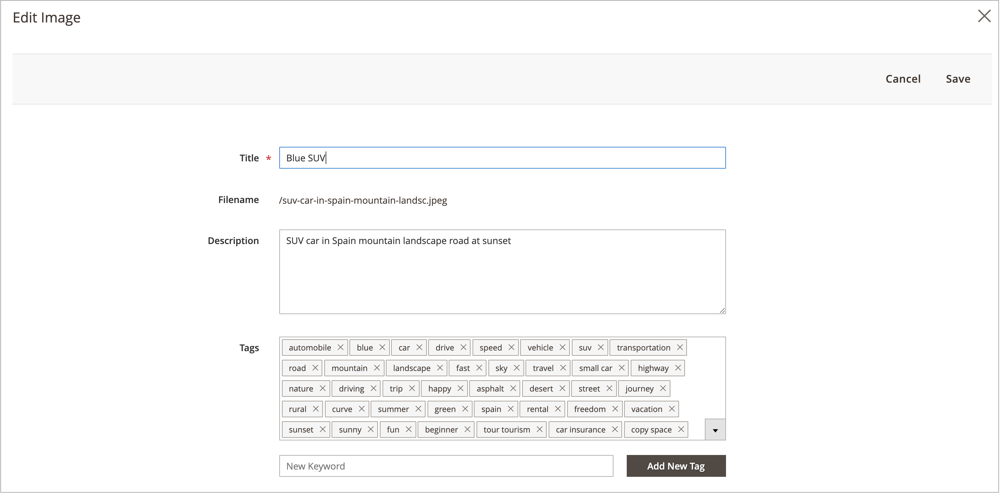
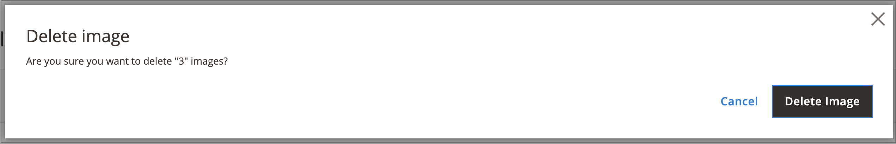
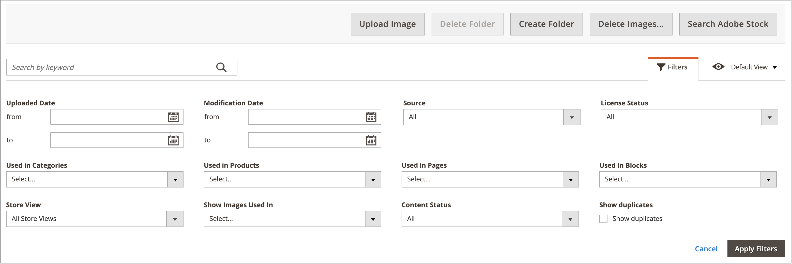

# 媒体集资产管理

新 [媒体集](media-gallery.md) 提供了用于管理已上传的媒体文件和您通过 [Adobe Stock集成](adobe-stock.md). 如果您已保存Adobe Stock [图像预览](adobe-stock-save-preview.md)，您还可以 [许可证](adobe-stock-license-image.md) 新媒体集中的图像。

## 上传资源

1. 在 _管理员_ 侧栏，转到 **[!UICONTROL Content]** > _[!UICONTROL Media]_>**[!UICONTROL Media Gallery]**.

1. 单击 **[!UICONTROL Upload Image]**.

1. 选择要上传的文件。

   所选资产会自动上传到所选文件夹（如果未选择文件夹，则上传到存储根目录）。

## 查看资源详细信息

1. 在 _管理员_ 侧栏，转到 **[!UICONTROL Content]** > _[!UICONTROL Media]_>**[!UICONTROL Media Gallery]**.

1. 单击资产下方的三个圆点({width="10" zoomable="no"})，然后单击 **[!UICONTROL View Details]**.

   {width="600" zoomable="yes"}

   资产详细信息会显示在幻灯片面板上。 其中包括正在使用资产的信息：

   - **[!UICONTROL Categories]**
   - **[!UICONTROL Products]**
   - **[!UICONTROL Pages]**
   - **[!UICONTROL Blocks]**

   {width="600" zoomable="yes"}

   要查看详细信息，请单击 **[!UICONTROL Used In]** 链接。 以下示例中的网格显示了使用特定资产的所有类别。

   {width="600" zoomable="yes"}

   也可以从以下位置删除资产： _查看详细信息_ 部分。

## 编辑资源

1. 在 _管理员_ 侧栏，转到 **[!UICONTROL Content]** > _[!UICONTROL Media]_>**[!UICONTROL Media Gallery]**.

1. 单击资产下方的三个圆点({width="10" zoomable="no"})，然后单击 **[!UICONTROL Edit]**.

   {width="600" zoomable="yes"}

1. 如果需要，请更改以下元数据值之一：

   - **[!UICONTROL Title]**
   - **[!UICONTROL Description]**
   - **[!UICONTROL Tags/Keywords]**

   此数据将保存到数据库以及文件元数据本身。 目前，支持XMP和IPTC格式。

   您可以下载包含更新后元数据的图像。

## 使用资源

可以在整个管理员中广泛使用资产，例如 [添加或编辑页面](page-add.md)， [创建或编辑类别](../catalog/category-create.md)，或 [从内容编辑器插入图像](editor-insert-image.md).

1. 从允许您使用媒体资产的区域访问新的媒体集。

1. 选择资源并单击 **[!UICONTROL Add Selected]**.

{{$include /help/_includes/image-optimization-animated-gif-note.md}}

## 删除资源

1. 在 _管理员_ 侧栏，转到 **[!UICONTROL Content]** > _[!UICONTROL Media]_>**[!UICONTROL Media Gallery]**.

1. 单击 **[!UICONTROL Delete Images...]** ，然后选中要删除的每个资产的复选框。

1. 在确认对话框中，单击 **[!UICONTROL Delete Image]**.

   {width="500" zoomable="yes"}

## 搜索资产

1. 在 _管理员_ 侧栏，转到 **[!UICONTROL Content]** > _[!UICONTROL Media]_>**[!UICONTROL Media Gallery]**.

1. 使用 **[!UICONTROL Search by keywords]** 输入以按关键字/标记执行图像搜索。

   以下示例中的搜索将查找包含特定标记(`mountain`)。

   {width="600" zoomable="yes"}

>[!NOTE]
>
>要了解如何更新图像标记，请参阅 _[编辑资源](#edit-an-asset)_ 部分。

## 筛选资产

>[!NOTE]
>
>此 _使用位置_ 功能要求 [!UICONTROL Media Gallery Image Optimization] 在中启用 [配置设置](media-gallery-image-optimization.md).

1. 在 _管理员_ 侧栏，转到 **[!UICONTROL Content]** > _[!UICONTROL Media]_>**[!UICONTROL Media Gallery]**.

1. 单击 **[!UICONTROL Filters]** 选项卡。

   {width="600" zoomable="yes"}

1. 设置筛选选项。

   您可以根据实体的使用情况筛选资源：

   - **[!UICONTROL Used in Categories]**
   - **[!UICONTROL Used in Products]**
   - **[!UICONTROL Used in Pages]**
   - **[!UICONTROL Used in Blocks]**

   您还可以按以下方式筛选资源 **[!UICONTROL Store View]**， **[!UICONTROL License Status]**、和 **[!UICONTROL Content Status]**. 设置日期范围 **[!UICONTROL Uploaded Date]** 和/或 **[!UICONTROL Modification Date]** 以根据文件日期筛选资源。

1. 单击 **[!UICONTROL Apply Filters]** 查看结果。

   以下示例中的筛选可查找在特定类别(`cars`)并启用。

   {width="600" zoomable="yes"}

## 查找图像重复项

1. 单击 **[!UICONTROL Filters]** 选项卡，然后选择 **[!UICONTROL Show duplicates]** 复选框。

1. 要查看结果，请单击 **[!UICONTROL Apply Filters]**.
