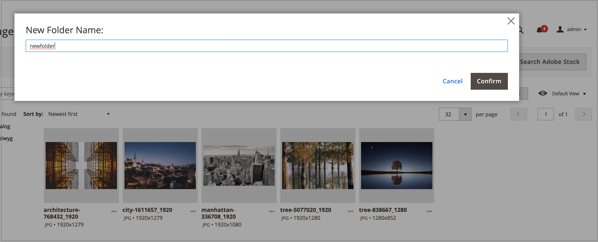

# 媒体集文件夹管理

使用文件夹组织新文档中的图像 [媒体集](media-gallery.md). 随着媒体资源数量的增加，使用文件夹更容易找到和管理媒体集中的现有资源。

## 创建文件夹

1. 在 _管理员_ 侧栏，转到 **[!UICONTROL Content]** > _[!UICONTROL Media]_>**[!UICONTROL Media Gallery]**.

1. 单击 **[!UICONTROL Create Folder]**.

   如果要创建子文件夹，请先选择父文件夹，然后单击 **[!UICONTROL Create Folder]**.

1. 输入新文件夹名称并单击 **[!UICONTROL Confirm]**.

   {width="600" zoomable="yes"}

## 删除文件夹

>[!WARNING]
>
>删除文件夹会导致删除该文件夹中的所有图像。

1. 在 _管理员_ 侧栏，转到 **[!UICONTROL Content]** > _[!UICONTROL Media]_>**[!UICONTROL Media Gallery]**.

1. 选择要删除的文件夹。

   {width="600" zoomable="yes"}

1. 单击 **[!UICONTROL Delete Folder]**.

1. 要确认删除文件夹，请单击 **[!UICONTROL OK]**.
