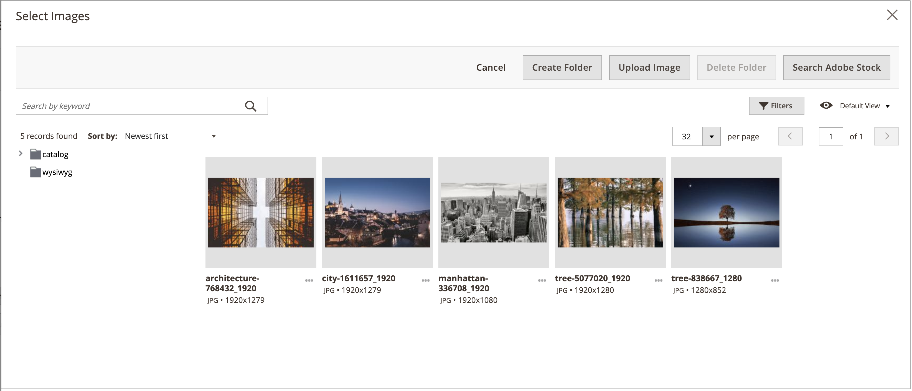
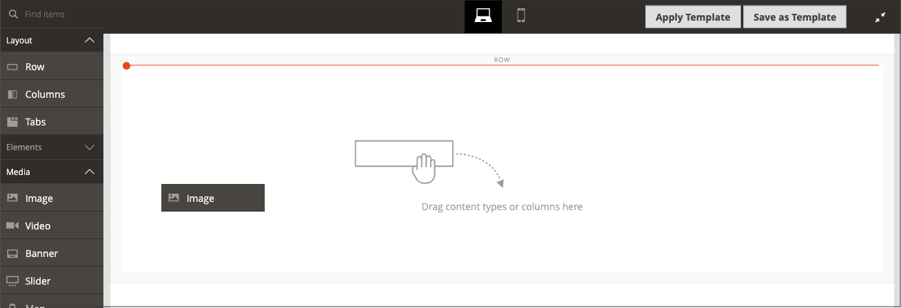

# [!DNL Media Gallery]

借助Adobe Commerce或Magento Open Source 2.4，商家可以使用新的&#x200B;_增强型_ [!DNL Media Gallery]来组织和管理服务器上的媒体文件。 此新[!DNL Media Gallery]包含与现有媒体存储相同的功能，但包含改进的用户界面以及与[Adobe Stock](https://stock.adobe.com)的更紧密集成。

媒体集网格中显示{width="700" zoomable="yes"}

>[!NOTE]
>
>添加到&#x200B;[_[!UICONTROL Images and Videos]_&#x200B;产品部分](../catalog/product-image.md#upload-an-image)的产品图像不由[!DNL Media Gallery]管理。 只有在&#x200B;_[!UICONTROL Content]_&#x200B;产品部分字段中使用的图像才会在新[!DNL Media Gallery]中显示和过滤。

## 启用新[!DNL Media Gallery]

1. 在&#x200B;_管理员_&#x200B;侧边栏上，转到&#x200B;**[!UICONTROL Stores]** > _[!UICONTROL Settings]_>**[!UICONTROL Configuration]**。

1. 在左侧面板中，展开&#x200B;**[!UICONTROL Advanced]**&#x200B;并选择&#x200B;**[!UICONTROL System]**。

1. 展开 **[!UICONTROL Media Gallery]**。

   ![高级配置 — [!DNL Media Gallery]](./assets/system-media-gallery.png){width="600" zoomable="yes"}

1. 将&#x200B;**[!UICONTROL Enable Old Media Gallery]**&#x200B;设置为`No`。

1. 单击&#x200B;**[!UICONTROL Save Config]**。

1. 出现提示时，单击系统消息中的&#x200B;**[!UICONTROL Cache Management]**&#x200B;链接并刷新无效缓存。

   [[!UICONTROL Content]菜单](/help/content-design/content-menu.md)现在显示新的&#x200B;_[!UICONTROL Media Gallery]_&#x200B;选项。

>[!NOTE]
>
>新[!DNL Media Gallery]的完整功能要求启动`media.gallery.synchronization`和`media.content.synchronization`队列使用者进行初始同步。 有关详细信息，请参阅&#x200B;_配置指南_&#x200B;中的[管理消息队列](https://experienceleague.adobe.com/docs/commerce-operations/configuration-guide/message-queues/manage-message-queues.html?lang=zh-Hans)。

## 访问新[!DNL Media Gallery]

可从“内容”菜单或当您[添加或编辑页面](/help/content-design/page-add.md)时访问新[!DNL Media Gallery]。 在[创建或编辑类别](/help/catalog/category-create.md)时，或者在使用内容编辑器[插入图像时](/help/content-design/editor-insert-image.md)，也可以访问该内容。

要通过[!UICONTROL Content]菜单访问新[!UICONTROL Media Gallery]：

- 在&#x200B;_管理员_&#x200B;侧边栏上，转到&#x200B;**[!UICONTROL Content]** > _[!UICONTROL Media]_>**[!UICONTROL Media Gallery]**。

要在添加或编辑页面时访问新的媒体集，请执行以下操作：

1. 在&#x200B;_管理员_&#x200B;侧边栏上，转到&#x200B;**[!UICONTROL Content]** > _[!UICONTROL Elements]_>**[!UICONTROL Pages]**。

1. 单击&#x200B;**[!UICONTROL Add a New Page]**。

   如果要编辑现有页面，可以使用&#x200B;_[!UICONTROL Action]_&#x200B;列单击&#x200B;**[!UICONTROL Select]**&#x200B;并选择&#x200B;**[!UICONTROL Edit]**。

1. 展开&#x200B;**[!UICONTROL Content]**&#x200B;部分中的并执行以下操作：

   - 如果您启用了[页面生成器](../page-builder/setup.md)，请展开&#x200B;**[!UICONTROL Media]**&#x200B;面板并将&#x200B;**[!UICONTROL Image]**&#x200B;占位符拖到目标容器中。 然后单击&#x200B;**[!UICONTROL Select from Gallery]**。

     {width="600" zoomable="yes"}

   - 如果您已启用[WYSIWYG编辑器](/help/content-design/editor.md)，请单击&#x200B;**[!UICONTROL Show/Hide Editor]**，然后单击&#x200B;**[!UICONTROL Insert Image]**。

## [!DNL Media Gallery]演示

要了解有关[!DNL Media Gallery]的更多信息，请观看此视频：

>[!VIDEO](https://video.tv.adobe.com/v/3411042?captions=chi_hans&quality=12&learn=on)
