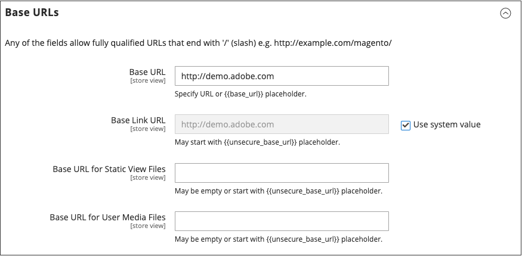
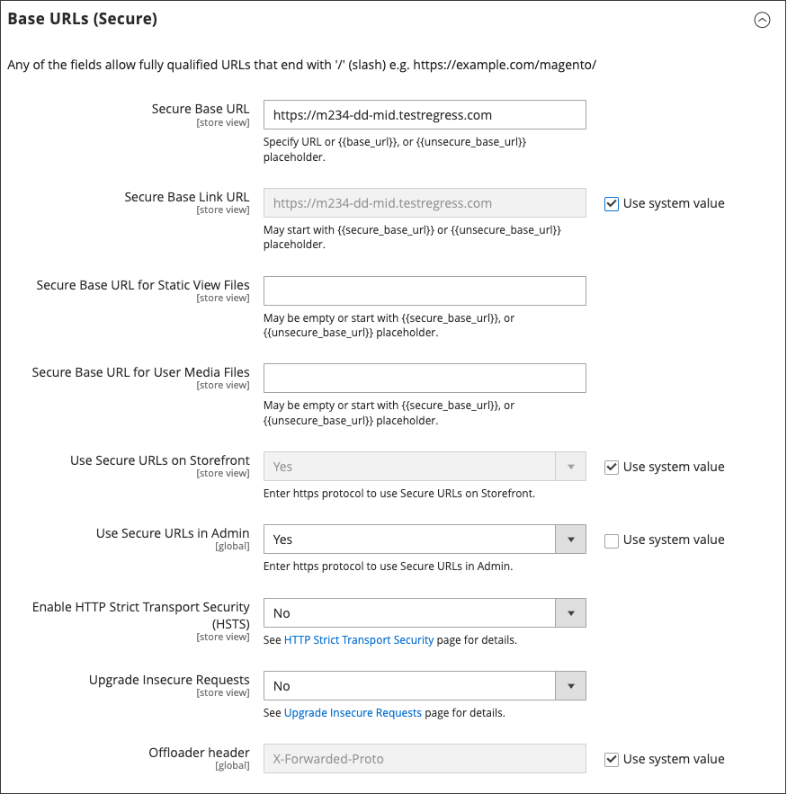

# 使用内容交付网络

内容交付网络(CDN)可用于存储媒体文件。 云基础架构上的Adobe Commerce包括Fastly CDN(请参阅&#x200B;_云基础架构上的Commerce指南_&#x200B;中的[Fastly](https://experienceleague.adobe.com/docs/commerce-cloud-service/user-guide/cdn/fastly.html?lang=zh-Hans))。 _内部部署_&#x200B;安装的Commerce实例不包含与任何特定CDN的集成，您可以使用您选择的CDN。

配置CDN后，必须从管理员处完成配置。 可以在全局或网站级别进行更改。 当CDN用于媒体存储时，Commerce存储页面上的所有媒体路径都将更改为配置中指定的CDN路径。

## CDN工作流

1. **浏览器请求媒体** — 商店中的页面会在客户的浏览器中打开，浏览器会请求HTML中指定的媒体。
1. **请求发送到CDN；找到并提供图像** — 请求首先发送到CDN。 如果CDN在存储中有图像，则会将媒体文件提供给客户的浏览器。
1. **找不到媒体，请求已发送到[!DNL Commerce] Web服务器** — 如果CDN没有媒体文件，则请求将发送到[!DNL Commerce] Web服务器。 如果在文件系统中找到媒体文件，则Web服务器会将它们发送到客户的浏览器。

>[!IMPORTANT]
>
>为安全起见，在使用CDN作为媒体存储时，如果CDN位于子域之外，则JavaScript可能无法正常运行。

## 配置内容交付网络

1. 在&#x200B;_管理员_&#x200B;侧边栏上，转到&#x200B;**[!UICONTROL Stores]** > _[!UICONTROL Settings]_>**[!UICONTROL Configuration]**。

1. 在左侧面板中的&#x200B;_[!UICONTROL General]_&#x200B;下，选择&#x200B;**[!UICONTROL Web]**。

1. 在左上角，根据需要设置&#x200B;**[!UICONTROL Store View]**。

1. 展开&#x200B;**[!UICONTROL Base URLs]**&#x200B;部分中的并执行以下操作：

   {width="600" zoomable="yes"}

   - 使用存储静态视图文件的CDN上位置的URL更新&#x200B;**[!UICONTROL Base URL for Static View Files]**。

   - 使用CDN上JavaScript文件的URL更新&#x200B;**[!UICONTROL Base URL for User Media Files]**。

     这两个字段都可以留空，或以占位符开头： `{{unsecure_base_url}}`

1. 展开&#x200B;**[!UICONTROL Base URLs (Secure)]**&#x200B;部分中的并执行以下操作：

   {width="600" zoomable="yes"}

   - 使用存储静态视图文件的CDN上位置的URL更新&#x200B;**[!UICONTROL Secure Base URL for Static View Files]**。

   - 使用CDN上JavaScript文件的URL更新&#x200B;**[!UICONTROL Secure Base URL for User Media Files]**。

     这两个字段都可以留空，或以占位符开头： `{{unsecure_base_url}}`

1. 完成后，单击&#x200B;**[!UICONTROL Save Config]**。
