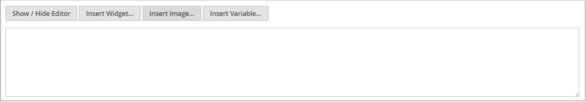

# 媒体存储

介质存储可帮助您组织和获取对存储在服务器上的介质文件的访问权限。 文件位置的路径由[基本URL](../stores-purchase/store-urls.md)配置决定。 处理页面和静态块时，可以从编辑器访问媒体存储中的文件。 通常，介质存储与[!DNL Commerce]程序文件驻留在同一服务器上的文件系统中。

或者，可以在[数据库](media-storage-database.md)中管理媒体文件，也可以在单独的服务器或[内容交付网络](media-storage-content-delivery-network.md)中管理媒体文件。 使用备用存储的优点在于，它最大限度地减少了同步介质所需的工作量。 当系统的多个实例部署在不同服务器上，而服务器需要访问相同的图像、CSS文件和其他媒体文件时，同步性能尤其受到影响。

可以将编辑器配置为对类别或产品描述中的目录内容使用静态或[动态媒体URL](../catalog/catalog-urls.md#configure-catalog-media-url-format)。

![[!DNL Commerce]媒体存储](./assets/media-storage.png){width="650" zoomable="yes"}

## 将文件添加到介质存储中

前两个步骤与插入图像时相同。

1. 在[编辑器](editor.md)工具栏上，单击&#x200B;_插入图像_&#x200B;图标。

   {width="700" zoomable="yes"}

   此操作打开&#x200B;_[!UICONTROL Insert/edit image]_&#x200B;对话框。

1. 在&#x200B;_[!UICONTROL Source]_&#x200B;之后，单击_&#x200B;搜索&#x200B;_图标（{width="10" zoomable="no"}）。

1. 在左侧的目录树中，执行以下操作之一：

   - 导航到要保存上传图像的文件夹。

   - 导航到要创建文件夹的位置，然后单击&#x200B;**创建文件夹**。

     若要添加文件夹，请输入文件夹名称并单击&#x200B;**[!UICONTROL OK]**。

1. 要将一个或多个文件添加到Media Storage，您可以从系统上传文件或使用[Adobe Stock集成](adobe-stock.md)：

   若要从系统上传文件，请单击&#x200B;**[!UICONTROL Choose Files]**&#x200B;并执行以下操作：

   - 在本地计算机的目录中，导航到映像的位置。

   - 选择要上传的每个图像。

   - 单击&#x200B;**[!UICONTROL Open]**。

   通过[集成](adobe-stock.md)使用Adobe Stock中的资源：

   - 单击&#x200B;**[!UICONTROL Search Adobe Stock]**。

   - 从Adobe Stock添加预览或许可图像(请参阅[使用Adobe Stock图像](adobe-stock-manage.md))。

图像将上载到服务器上的当前媒体存储文件夹中。

![[!DNL Commerce]媒体存储](./assets/media-storage.png){width="650" zoomable="yes"}

## 从媒体存储插入图像

打开要编辑的页面或块。 然后，使用以下方法之一从媒体存储中插入图像：

### 方法1：WYSIWYG模式

1. 在[编辑器](editor.md)工具栏上，单击&#x200B;_插入图像_&#x200B;图标。

1. 在&#x200B;_[!UICONTROL Source]_&#x200B;之后，单击_&#x200B;搜索&#x200B;_图标（{width="10" zoomable="no"}）。

   {width="250" zoomable="yes"}

1. 在左侧的目录树中，导航到存储图像的文件夹。

1. 选择图像的拼贴，然后单击&#x200B;**[!UICONTROL Add Selected]**。

### 方法2：HTML模式

1. 将光标放置在要插入``标记的代码中。

1. 单击&#x200B;**[!UICONTROL Insert Image]**。

   {width="600" zoomable="yes"}
