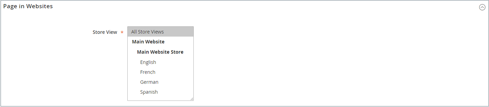
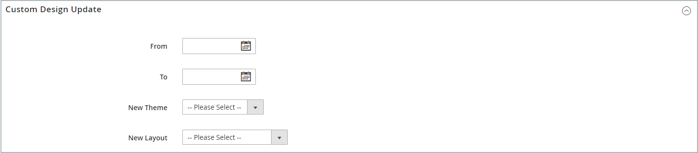
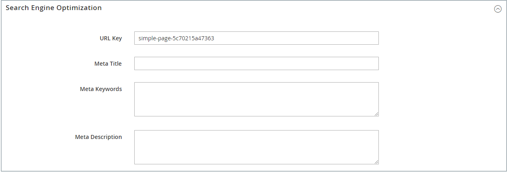

# 添加和删除页面

对于您可能要创建的任何类型的页面，将内容页面添加到商店的过程基本上相同。 您可以包含文本、图像、内容块、变量和小部件。 大多数内容页面都是先由搜索引擎设计，再由人设计，以供阅读。 在选择页面标题和URL，以及撰写元数据和内容时，请牢记这两个不同受众中每个受众的需求。 页面完成后，可将其添加到商店导航中、链接到其他页面、从商店页脚进行链接或用作新页面 [主页](page-home-new.md).

{width="700" zoomable="yes"}

## 添加页面

以下说明将指导您完成每个步骤以创建基本页面。 某些高级功能将被跳过，但将在其他主题中介绍。

### 第1步：创建页面

1. 在 _管理员_ 侧栏，转到 **[!UICONTROL Content]** > _[!UICONTROL Elements]_>**[!UICONTROL Pages]**.

1. 单击 **[!UICONTROL Add New Page]**.

   {width="600" zoomable="yes"}

1. 如果不希望立即发布页面，请设置 **[!UICONTROL Enable Page]** 到 `No`.

1. 输入 **[!UICONTROL Page Title]**.

   页面标题将显示在 [痕迹导航](../catalog/navigation-breadcrumb-trail.md) 导航。

### 第2步：完成内容

根据您的 [高级内容工具配置](../configuration-reference/general/content-management.md)，添加页面内容。

#### 使用页面生成器内容工具

1. 展开  **[!UICONTROL Content]**.

   {width="600" zoomable="yes"}

1. 在 **[!UICONTROL Content Heading]** 框中，输入要显示在页面顶部的标题。

   如果启用， [页面生成器](../page-builder/introduction.md) 暂存和面板显示在内容标题的下方。 有关更多信息，请参阅 [工作区](../page-builder/workspace.md). 如果 _页面生成器_ 未启用，编辑器将以所见即所得模式打开，工具栏位于顶部。

1. 填写内容，并根据需要设置文本格式。

#### 使用编辑器工具栏

1. 展开  **[!UICONTROL Content]**.

   {width="600" zoomable="yes"}

1. 在 **[!UICONTROL Content Heading]** 框中，输入要显示在页面顶部的标题。

1. 填写内容并根据需要设置文本格式。

   您可以添加 [图像](media-storage.md)， [变量](../systems/variables-predefined.md)、和 [构件](widgets.md) 根据需要。 有关更多信息，请参阅 [使用编辑器](editor.md).

### 步骤3：完成SEO信息

1. 展开  **[!UICONTROL Search Engine Optimization]**.

   {width="600" zoomable="yes"}

1. 接受默认值或输入其他值 **[!UICONTROL URL Key]** 包含全部小写字符，且使用连字符而不是空格。

   默认URL密钥是在保存页面时创建的，且基于内容标题。

1. 输入 **[!UICONTROL Meta Title]** 用于页面。

   元标题应包含少于70个字符，并显示在浏览器标题栏和选项卡中。

1. 输入您选择的高值 **[!UICONTROL Meta Keywords]** 搜索引擎可用于为页面编制索引的内容。

   用逗号分隔多个单词。 某些搜索引擎会忽略元关键字，但其他搜索引擎会使用元关键字。

1. 对象 **[!UICONTROL Meta Description]**，为搜索结果列表输入页面的简要说明。

   理想情况下，描述长度应为150-160个字符，最大限制为255个字符。

1. 单击 **[!UICONTROL Save]**.

### 步骤4：指定页面的范围

1. 展开  **[!UICONTROL Page in Websites]**.

   {width="600" zoomable="yes"}

1. 在 **[!UICONTROL Store View]** 列表中，选择页面可用的每个视图。

   如果安装有多个网站，请选择每个网站，然后在该页面可用的位置查看商店。

### 步骤5：标识父页面（如果适用）

{{ee-feature}}

1. 展开  **[!UICONTROL Hierarchy]**.

   {width="600" zoomable="yes"}

1. 如果此页面是其他页面的子页面，请选中 **[!UICONTROL Parent page]**.

### 步骤6：输入设计更改（可选）

1. 要更改页面布局，请展开  **[!UICONTROL Design]**.

   {width="600" zoomable="yes"}

1. 要更改页面的列布局，请设置 **[!UICONTROL Layout]** 更改为以下任一项：

   - `Empty`
   - `1 column`
   - `2 columns with left bar`
   - `2 columns with right bar`
   - `3 columns`
   - `Page -- Full Width` (需要 [页面生成器](../page-builder/introduction.md))
   - `Category -- Full Width` （需要页面生成器）
   - `Product -- Full Width` （需要页面生成器）

1. 要应用 **[!UICONTROL Custom Layout Update]**&#x200B;中，从列表中选择文件的名称。

   有关更多信息，请参阅 [布局更新](layout-updates.md).

1. 要更改页面主题，请设置 **[!UICONTROL New Theme]** 更改为以下任一项：

   - `Magento Black`
   - `Magento Luma`

1.  (仅限Magento Open Source)要计划设计更改，请展开  **[!UICONTROL Custom Design Update]** 并执行以下操作：

   {width="600" zoomable="yes"}

   - 使用日历()以选择 **[!UICONTROL From]** 和 **[!UICONTROL To]** 更改生效日期。

   - 要将其他主题应用到页面，请选择页面的名称 **[!UICONTROL New Theme]**.

   - 要更改页面的列布局，请选择 **[!UICONTROL Layout]** 您想要申请的。

### 步骤7：预览页面

1. 单击 **[!UICONTROL Save]** 箭头并选择 **[!UICONTROL Save & Close]** 以返回到“页面”网格。

1. 在网格中查找页面并选择 **[!UICONTROL View]** 在 _[!UICONTROL Action]_列。

1. 要返回到网格，请单击 **[!UICONTROL Back]** 浏览器窗口的左上角。

### 步骤8：发布页面

1. 选择 **[!UICONTROL Edit]** 在 _[!UICONTROL Action]_网格的列。

1. 设置 **[!UICONTROL Enable Page]** 到 `Yes`.

1. 单击 **[!UICONTROL Save]** 箭头并选择 **[!UICONTROL Save & Close]**.

## 复制页面

任何内容页面都可以用作模板，并另存为副本。 您可以使用此省时技术为整个网站中的内容页面创建一致的设计。 重复页面会保留原始页面的页面标题，但必须更新URL键和状态字段。

{width="600" zoomable="yes"}

1. 在 _管理员_ 侧栏，转到 **[!UICONTROL Content]** > _[!UICONTROL Elements]_>**[!UICONTROL Pages]**.

1. 在网格中，找到要复制的页面，然后单击 **[!UICONTROL Edit]** 在 _[!UICONTROL Action]_列。

1. 单击 **[!UICONTROL Save]** 箭头并选择 **[!UICONTROL Save & Duplicate]**.

1. 当您看到页面已保存并复制的消息时，请单击 **[!UICONTROL Back]** 以返回到网格。

1. 在网格中找到重复页面，并注意以下事项：

   - 页面标题与原始页面相同。
   - 分配了唯一但临时的URL密钥。
   - 页面的状态为 `Disabled`.

1. 在中打开重复页面 _编辑_ 模式，并执行以下操作：

   - 如果要立即发布页面，请设置 **[!UICONTROL Enable Page]** 到 `Yes`.

   - 更新 **[!UICONTROL Page Title]**（根据需要）。

   - 展开  该 **[!UICONTROL Search Engine Optimization]** 并输入唯一的 **[!UICONTROL URL Key]** 要用于重复页面的区段。

     {width="600" zoomable="yes"}

   - 根据需要更新其余页面内容。

1. 单击 **[!UICONTROL Save]** 箭头并选择 **[!UICONTROL Save & Close]**.

   网格中的重复页面反映了您所做的更改。

## 保存菜单

| 命令 | 描述 |
|--- |--- |
| [!UICONTROL Save] | 保存当前页面，然后继续工作。 |
| [!UICONTROL Save & New] | 保存并关闭当前页面，然后开始一个新页面。 |
| [!UICONTROL Save & Duplicate] | 保存并关闭当前页面，然后打开新的重复副本。 |
| [!UICONTROL Save & Close] | 保存并关闭当前页面，然后返回到“页面”网格。 |

{style="table-layout:auto"}

## 删除页面

有两种方法可删除已创建的页面。 您可以将其从 _[!UICONTROL Pages]_网格或从_[!UICONTROL Edit]_ 页面。

### 方法1：从“页面”网格中删除页面

1. 在 _管理员_ 侧栏，转到 **[!UICONTROL Content]** > _[!UICONTROL Elements]_>**[!UICONTROL Pages]**.

1. 使用网格上方的筛选器找到页面，然后选中要删除的一个或多个页面的复选框。

1. 在列表的左上角，设置 **[!UICONTROL Actions]** 到 `Delete`.

1. 要确认操作，请单击 **[!UICONTROL OK]**.

### 方法2：从编辑页面中删除页面

1. 在 _管理员_ 侧栏，转到 **[!UICONTROL Content]** > _[!UICONTROL Elements]_>**[!UICONTROL Pages]**.

1. 查找要删除的页面。

1. 在 _[!UICONTROL Actions]_列中，单击&#x200B;**[!UICONTROL Select]**并选择&#x200B;**[!UICONTROL Edit]**.

1. 在按钮栏中，单击 **[!UICONTROL Delete Page]**.

1. 要确认操作，请单击 **[!UICONTROL OK]**.
