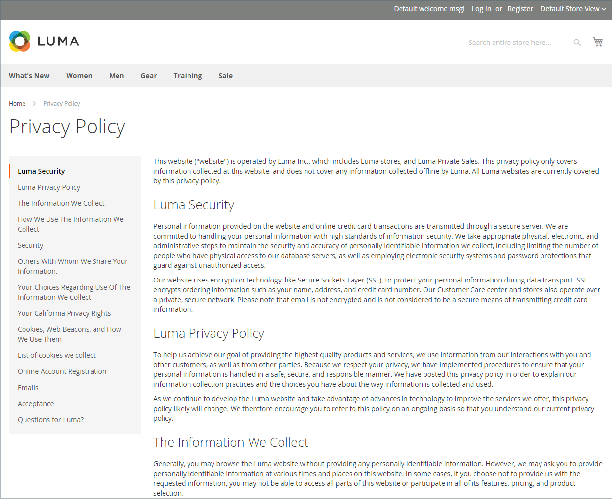
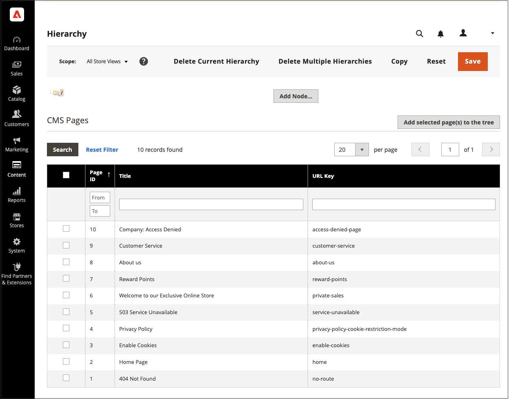
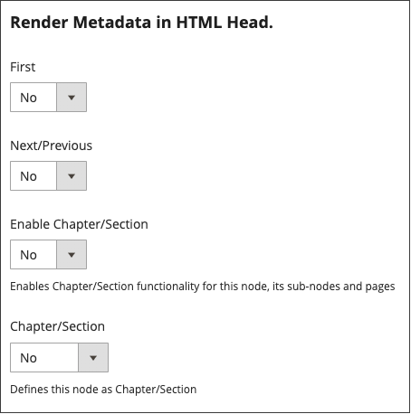
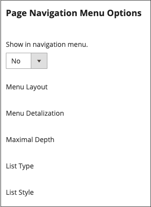
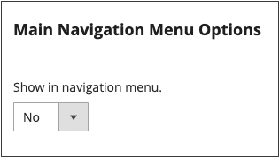

# 页面层次结构

{{ee-feature}}

利用商店页面层次结构系统，您可以组织内容页面并添加分页、导航和菜单。 示例数据中的“隐私策略”页面就是左侧带有菜单的页面的示例。 如果您定期发布大量内容，则可以使用页面层次结构来整理您的内容，以便人们轻松地查找感兴趣的文章。

页面层次结构系统使用节点来标识内容的相关片段，并将内容页面组织成父/子关系。 父节点类似于可能包含子节点和页面的文件夹。 层次结构中每个节点和页面的相对位置显示为 _树_ 结构。 一个节点可能包含其他节点和内容页面，单个内容页面可能与父/子或邻居关系中的多个节点和其他内容页面相关联。

{width="600" zoomable="yes"}

## 配置页面层次结构

配置设置可激活页面层次结构系统和元数据，并确定默认菜单布局。

{width="600" zoomable="yes"}

1. 在 _管理员_ 侧栏，转到 **[!UICONTROL Stores]** > _[!UICONTROL Settings]_>**[!UICONTROL Configuration]**.

1. 在左侧面板中的 _[!UICONTROL General]_，选择&#x200B;**[!UICONTROL Content Management]**.

1. 展开  **[!UICONTROL CMS Page Hierarchy]**  并做出任何必要的更改。

1. 完成后，单击 **[!UICONTROL Save Config]**.

| 字段 | 描述 |
|--- |--- |
| [!UICONTROL Enable Hierarchy Functionality] | 为您的内容页面激活使用页面层次结构。 选项： `Yes` / `No` |
| [!UICONTROL Enable Hierarchy Metadata] | 启用此选项后，可将元数据与层级中的页面相关联。 选项： `Yes` / `No` |
| [!UICONTROL Default Layout for Hierarchy Menu] | 确定默认菜单样式。 选项： `Content` / `Left Column` / `Right Column` |

{style="table-layout:auto"}

## 添加层次结构节点

以下示例显示如何创建节点，以便通过简单导航到相关内容页面。 尽管节点没有与其关联的内容页面，但它确实具有可在网站其他位置引用的URL密钥。

例如，您可以创建一个名为 _新闻发布_ 可以浏览到单独的新闻稿。 然后，您便可以将链接包含在 _关于我们_ 页面到节点。 或者，您可以为新闻稿的旧版集合创建一个节点。

要链接到节点，请使用 [构件](widgets.md) 创建CMS层级节点链接并将小组件放入内容块或页面中的工具。

{width="600" zoomable="yes"}

### 步骤1：创建节点

1. 在 _管理员_ 侧栏，转到 **[!UICONTROL Content]** > _[!UICONTROL Elements]_>**[!UICONTROL Hierarchy]**.

   {width="600" zoomable="yes"}

1. 在网格上方，单击 **[!UICONTROL Add Node...]**.

1. 下 _[!UICONTROL Page Properties]_，输入&#x200B;**[!UICONTROL Title]**用于节点和合适的&#x200B;**[!UICONTROL URL Key]**.

   URL键为节点提供唯一的Web地址。 必须全部为小写字符，使用连字符而不是空格来分隔单词。

   {width="500" zoomable="yes"}

1. 单击 **[!UICONTROL Save]**.

   该节点在页面左侧的树中显示为一个文件夹。

### 步骤2：将页面添加到节点

1. 在层次树中，单击以选择节点。

1. 单击 **[!UICONTROL Add Selected Pages(s) to Tree]**.

   您可以向上滚动查看每个选定的页面是否都显示在节点文件夹下的树中。

### 第3步：定义结构

1. 如有必要，请将页面拖动到适当位置以反映它们在菜单中的显示顺序。

   {width="500" zoomable="yes"}

1. 单击层次结构顶部的节点。

   此 _[!UICONTROL Page Properties]_部分现在显示有关节点的信息。

1. 下 **[!UICONTROL Render Metadata in HTML Head]**，请执行以下操作：

   {width="400" zoomable="yes"}

   - 要将节点标识为层次结构的顶部，请设置 **[!UICONTROL First]** 到 `Yes`.

   - 要显示分页控件，请设置 **[!UICONTROL Next/Previous]** 到 `Yes`.

   - 要将层次结构中的页面组织为帐簿，请设置 **[!UICONTROL Enable Chapter/Section]** 到 `Yes`.

     如果不想将节点包含在帐簿中，请保留默认值 `No`.

   - 要将节点分配给帐簿的特定部分，请设置 **[!UICONTROL Chapter/Section]** 更改为以下任一项：

      - `No`  — 不将节点定义为章节/节。
      - `Chapter`  — 将当前节点指定为章节。
      - `Section`  — 将当前节点指定为节。
      - `Both`  — 将当前节点同时指定为章节和章节。

### 步骤4：添加分页控件

1. 下 _嵌套页面的分页选项_，设置 **[!UICONTROL Enable Pagination]** 到 `Yes`.

1. 对象 **[!UICONTROL Frame]**&#x200B;中，输入要包含在分页控件中的页面链接数量。

   如果层次结构中有更多页面可包含在分页控件中。

1. 对象 **[!UICONTROL Frame Skip]**，输入要向前跳过（或向后跳过）的下一组分页链接的页数。

### 第5步：选择菜单布局

如果希望该节点显示在菜单中，请执行以下操作：

1. 下 _页面导航菜单选项_，设置 **[!UICONTROL Show in navigation menu]** 到 `Yes`.

   此设置确定是否为页面层次结构生成导航菜单。

   {width="300" zoomable="yes"}

1. 要指定菜单相对于内容的位置，请设置 **[!UICONTROL Menu Layout]**：

   - `Content`  — 菜单布局在内容中。
   - `Use Default`  — 使用 [配置](../configuration-reference/general/content-management.md).
   - `Left Column`  — 菜单显示在内容的左侧。
   - `Right Column`  — 菜单显示在内容的右侧。

1. 要指定菜单中包含的详细信息量，请设置 **[!UICONTROL Menu Detalization]** 更改为以下任一项：

   - `Only Children`  — 菜单仅包含子页面。
   - `Neighbours and Children`  — 包括层次结构中处于同一级别的子页面和其他页面。

1. 要确定菜单的深度，请输入 **[!UICONTROL Maximal Depth]** 可包含的最大级别数。

1. 要格式化菜单，请选择 **[!UICONTROL List Type]**：

   - `Unordered`  — 菜单选项未编号，可以带或不带项目符号进行格式设置。 无序列表类型的选项：默认/圆形/磁盘/方形
   - `Ordered`  — 菜单选项具有编号形式，可设置为大写或小写形式的数字、字母或罗马数字。

1. 设置 **[!UICONTROL List Style]** 更改为以下任一项：

   - `Circle`
   - `Disc`
   - `Square`

1. 如果您还希望节点在导航菜单中可见，请滚动到 _主导航菜单选项_ 并设置 **[!UICONTROL Show in Navigation menu]** 到 `Yes`.

   {width="250" zoomable="yes"}

1. 单击 **[!UICONTROL Save]**.
