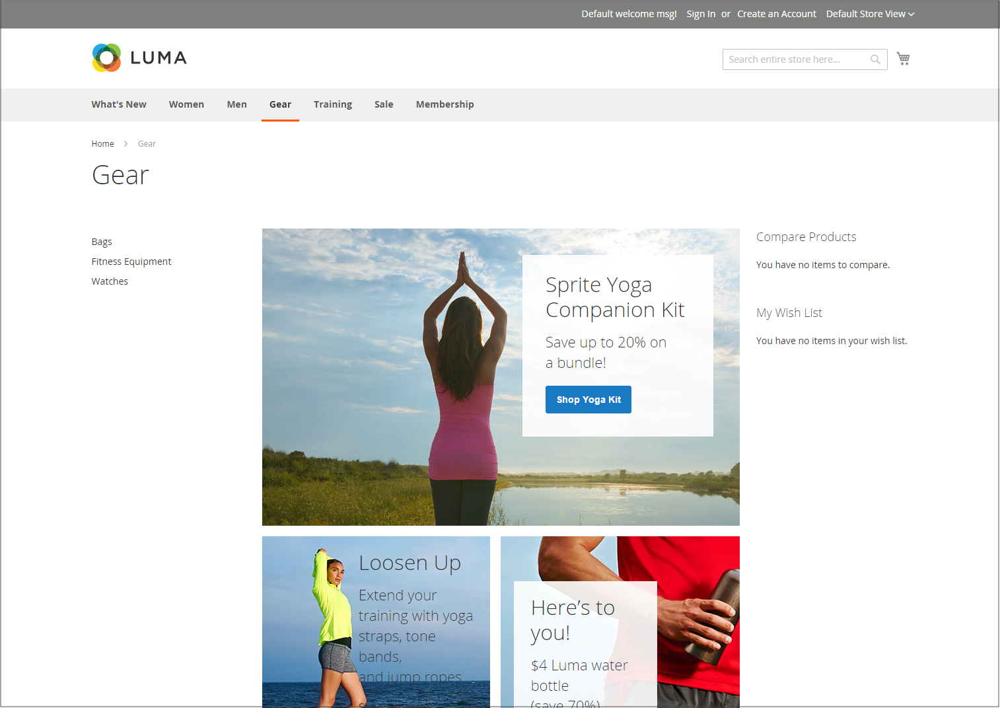

# 店面布局示例

列尺寸由主题的样式表确定。 某些主题将固定的像素宽度应用于页面布局，而其他主题则使用百分比来使页面响应窗口或设备的宽度。

大多数桌面主题的主列具有固定宽度，所有活动都发生在此封闭区域中。 根据屏幕分辨率，主列的每一边都留有空格。

## 一列

单列布局的内容区域横跨主列的全部宽度。 此布局通常用于具有大横幅或滑块的主页，或者无需导航的页面，例如登录页面、启动页面、视频或全页广告。

{width="700" zoomable="yes"}

## 带左栏的两列

此布局的内容区域分为两列。 主内容列向右浮动，侧栏向左浮动。

{width="700" zoomable="yes"}

## 带右栏的两列

此布局是另一个双列布局的镜像。 此时，侧栏向右浮动，主内容列向左浮动。

{width="700" zoomable="yes"}

## 三列

三列布局有一个主内容区域，其中包含两侧的列。 左侧栏和主内容列封装在一起，并以单位向左浮动。 另一边栏向右浮动。

{width="700" zoomable="yes"}
