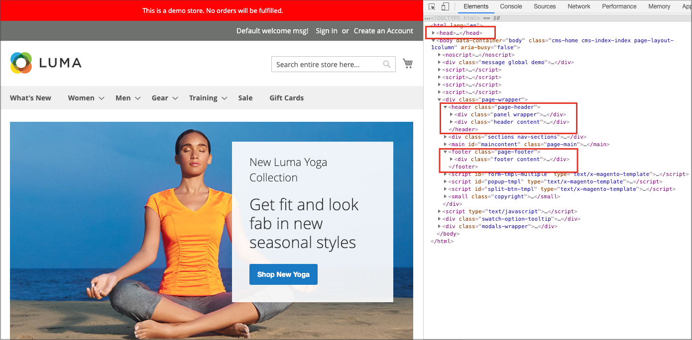
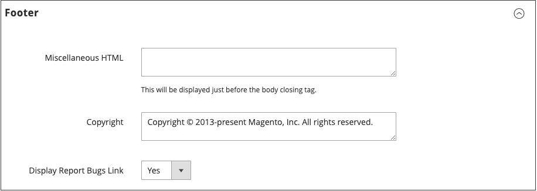

# 页面设置

页面的主要部分部分部分由一组标准HTML标签控制。 其中一些标记可用于确定在页面的每个部分中使用的字体、颜色、大小、背景颜色和图像的选择。 其他设置控制页面元素，如页眉中的徽标和页脚中的版权声明。 这些部分对应于HTML页面的底层结构，并且可以从管理员设置许多基本属性。

- [HTML头](#html-head)
- [页眉](#header)
- [页脚](#footer)

{width="700" zoomable="yes"}

## HTML头

HTML标题部分中的设置对应于HTML页的`<head>`标签，可以针对每个商店视图进行配置。 除了页面标题、描述和关键字的元数据之外，部分还包含指向网站图标的链接以及其他脚本。 本节中还配置了搜索引擎自动机的说明以及商店演示通知的显示。

### 配置HTML头

1. 在&#x200B;_管理员_&#x200B;侧边栏上，转到&#x200B;**[!UICONTROL Content]** > _[!UICONTROL Design]_>**[!UICONTROL Configuration]**。

1. 查找要配置的商店视图，然后单击&#x200B;_[!UICONTROL Action]_列中的&#x200B;**[!UICONTROL Edit]**。

1. 在&#x200B;_其他设置_&#x200B;下，展开&#x200B;**[!UICONTROL HTML Head]**&#x200B;部分的。

   {width="500" zoomable="yes"}

1. 根据需要更新[favicon](../getting-started/storefront-branding.md#add-a-favicon)。

1. 根据您的需要更新页面标题设置：

   - **[!UICONTROL Default Page Title]**
   - **[!UICONTROL Page Title Prefix]**
   - **[!UICONTROL Page Title Suffix]**

   您可以使用带有默认标题的后缀和/或前缀来创建由两部分或三部分组成的标题。 您可以添加垂直栏或冒号作为前缀或后缀与默认标题之间的分隔符。

1. 添加或修改支持搜索引擎优化(SEO)并帮助引导客户从搜索结果中前往您的商店的元数据：

   - **[!UICONTROL Default Meta Description]**
   - **[!UICONTROL Default Meta Keywords]**

1. 根据需要输入任意&#x200B;**[!UICONTROL Scripts and Style Sheets]**。

1. 根据需要启用或禁用[演示存储通知](../getting-started/storefront-branding.md#set-the-store-demo-notice)。

1. 完成后，单击&#x200B;**[!UICONTROL Save Configuration]**。

### HTML标题字段描述

| 字段 | 范围 | 描述 |
|--- |--- |--- |
| [!UICONTROL Favicon Icon] | 商店视图 | 上传浏览器地址栏和选项卡中显示的小图形图像。 允许的文件类型：ICO、PNG、APNG、GIF和JPG(JPEG)。 并非所有浏览器都支持这些格式。 |
| [!UICONTROL Default Page Title] | 商店视图 | 在浏览器中查看时，每个页面的标题栏上显示的标题。 默认标题用于所有页面，除非为单个页面指定其他标题。 |
| [!UICONTROL Page Title Prefix] | 商店视图 | 可以在标题之前添加前缀，以创建由两部分或三部分组成的标题。 垂直条或冒号可用作前缀末尾的分隔符，以将其与主标题的文本区分开。 |
| [!UICONTROL Page Title Suffix] | 商店视图 | 可以在标题之后添加后缀，以创建分为两部分或三部分的标题。 垂直条或冒号可用作前缀末尾的分隔符，以将其与主标题的文本区分开。 |
| [!UICONTROL Default Meta Description] | 商店视图 | 该描述提供了您网站的概要以供搜索引擎列表使用，长度不应超过160个字符。 |
| [!UICONTROL Default Meta Keywords] | 商店视图 | 描述您商店的一系列关键字，每个关键字之间用逗号分隔。 |
| [!UICONTROL Scripts and Style Sheets] | 商店视图 | 包含必须在结束`<head>`标记之前包含在HTML中的脚本。 例如，可以在此处输入任何必须放置在`<body>`标记之前的第三方JavaScript。 |
| [!UICONTROL Display Demo Store Notice] | 商店视图 | 控制演示存储通知在页面顶部的显示。 选项： `Yes` / `No` |

{style="table-layout:auto"}

## 页眉

标头配置标识商店徽标的路径，并指定徽标替换文本和欢迎消息。

{width="400" zoomable="yes"}

### 配置标头

1. 在&#x200B;_管理员_&#x200B;侧边栏上，转到&#x200B;**[!UICONTROL Content]** > _[!UICONTROL Design]_>**[!UICONTROL Configuration]**。

1. 查找要配置的商店视图，然后单击&#x200B;_[!UICONTROL Action]_列中的&#x200B;**[!UICONTROL Edit]**。

1. 在&#x200B;_其他设置_&#x200B;下，展开&#x200B;**[!UICONTROL Header]**&#x200B;部分的。

1. 进行存储视图所需的任何更改：

   - [徽标](../getting-started/storefront-branding.md#upload-your-logo)设置
   - [欢迎邮件](../getting-started/storefront-branding.md#change-the-welcome-message)设置

1. 完成后，单击&#x200B;**[!UICONTROL Save Configuration]**。

### 标题字段描述

| 字段 | 范围 | 描述 |
|--- |--- |--- |
| [!UICONTROL Logo Image] | 商店视图 | 标识标题中显示的徽标的路径。 支持的文件类型：PNG、GIF、JPG(JPEG) |
| [!UICONTROL Logo Attribute Width] | 商店视图 | 您的徽标图像的宽度（以像素为单位）。 |
| [!UICONTROL Logo Attribute Height] | 商店视图 | 您的徽标图像的高度（以像素为单位）。 |
| [!UICONTROL Welcome Text] | 商店视图 | 欢迎消息显示在页面的标题中，其中包括已登录的客户名称。 |
| [!UICONTROL Logo Image Alt] | 商店视图 | 与徽标关联的替换文本。 |
| [!UICONTROL Translate Title] | 商店视图 | 确定是否应翻译`Page Title`或`Meta Title`。 |

{style="table-layout:auto"}

## 页脚

页脚配置部分允许您更新出现在页面底部的[版权声明](../getting-started/storefront-branding.md#change-the-copyright-notice)，并输入必须在结束`<body>`标记之前放置的其他脚本。

{width="400" zoomable="yes"}

### 配置页脚

1. 在&#x200B;_管理员_&#x200B;侧边栏上，转到&#x200B;**[!UICONTROL Content]** > _[!UICONTROL Design]_>**[!UICONTROL Configuration]**。

1. 查找要配置的商店视图，然后单击&#x200B;_[!UICONTROL Action]_列中的&#x200B;**[!UICONTROL Edit]**。

1. 在&#x200B;_其他设置_&#x200B;下，展开&#x200B;**[!UICONTROL Footer]**&#x200B;部分的。

1. 对&#x200B;**[!UICONTROL Copyright]**&#x200B;和&#x200B;**[!UICONTROL Miscellaneous HTML]**&#x200B;设置进行任何必要的更改。

1. 完成后，单击&#x200B;**[!UICONTROL Save Configuration]**。

## 页脚字段描述

| 字段 | 范围 | 描述 |
|--- |--- |--- |
| [!UICONTROL Miscellaneous HTML] | 商店视图 | 一个输入框，可在其中将各种脚本上载到服务器，必须将其放在结束`<body>`标记之前。 |
| [!UICONTROL Copyright] | 商店视图 | 显示在每页底部的版权声明。 要包含版权符号，请使用HTML字符实体`\&copy;`，如下所示： `\&copy; 2021 Commerce Demo Store. All Rights Reserved.`请确保将示例版权声明替换为您自己的版权声明。 |
| [!UICONTROL Display Report Bugs Link] | 商店视图 | 确定是启用还是禁用Bug报告链接（某些主题支持）。 |

{style="table-layout:auto"}
