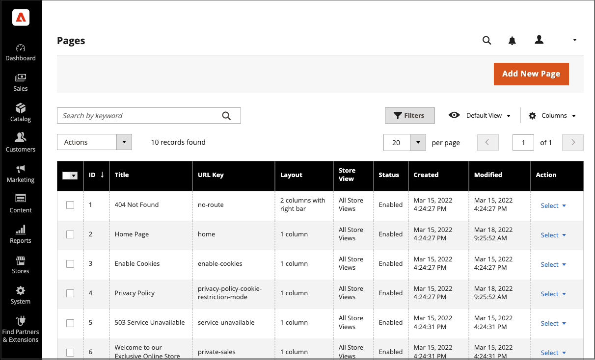
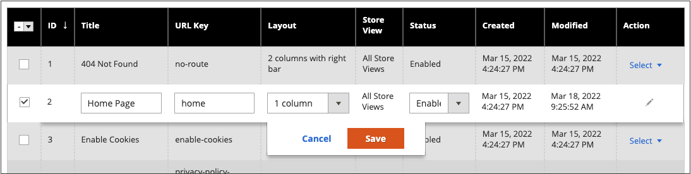
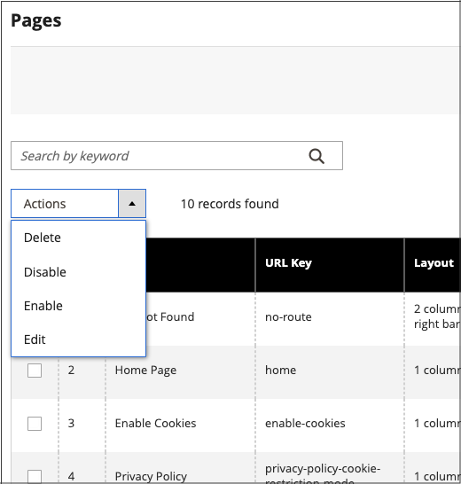
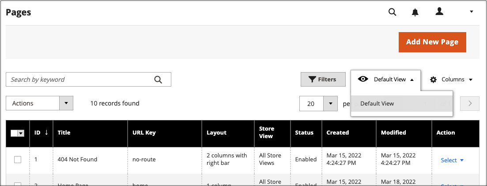

# 页面工作区控件

页面工作区包括帮助您快速找到所需页面的工具，以及在单个或多个页面上执行日常维护的命令。 您还可以从网格中快速更新页面属性。

{width="700" zoomable="yes"}

## 快速更新页面属性

1. 在&#x200B;_管理员_&#x200B;侧边栏上，转到&#x200B;**[!UICONTROL Content]** > _[!UICONTROL Elements]_>**[!UICONTROL Pages]**。
1. 单击网格中的任意行。

   {width="600" zoomable="yes"}

   要选择多个记录，请选中要更新的每一行的复选框。

1. 更新以下任意属性：

   - **[!UICONTROL Title]**
   - **[!UICONTROL URL Key]**
   - **[!UICONTROL Status]**
   - **[!UICONTROL Layout]**

1. 完成后，单击&#x200B;**[!UICONTROL Save]**。

## Workspace控件

| 控件 | 描述 |
|--- |--- |
| [!UICONTROL Add New Page] | 添加页面。 |
| [!UICONTROL Search] | 根据当前筛选器启动目录搜索。 |
| [!UICONTROL Actions] | 列出可应用于列表中选定项目的所有操作。 要将操作应用于一个页面或多个页面，请选中要执行该操作的每个记录的第一列中的复选框。 选项： `Delete` / `Disable` / `Enable` / `Edit` |
| [!UICONTROL Select] | 第一列标题中的控件可用于选择多个记录作为操作目标。 选中要选择的每个记录第一列中的复选框。 选项： `Select All` / `Deselect All` |
| [!UICONTROL Save Edits] | 将当前操作应用于所选记录。 |
| [!UICONTROL Edit] | 在编辑模式下打开记录。 通过单击行上的任意位置，可以实现相同的目标。 |

{style="table-layout:auto"}

## 列

| 列 | 描述 |
|--- |--- |
| [!UICONTROL Select] | 第一列中的复选框用于选择多个记录。 选项： `Select All` / `Deselect All` |
| [!UICONTROL ID] | ID是分配给每个页面的递增数字。 |
| [!UICONTROL Title] | 显示在页面顶部的标题。 |
| [!UICONTROL URL Key] | URL键与文件名类似，用于标识URL中的页面。 |
| [!UICONTROL Layout] | 确定在主内容区域的右侧还是左侧显示带侧栏的页面。 选项： `1 column` / `2 columns with left bar` / `2 columns with right bar` / `3 columns` / `Empty` |
| [!UICONTROL Store View] | 用于将页面与特定商店视图关联。 |
| [!UICONTROL Status] | 指示页面是在线还是离线。 选项： `Enabled` / `Disabled` |
| [!UICONTROL Created] | 创建页面的日期。 |
| [!UICONTROL Modified] | 上次修改页面的日期。 |
| [!UICONTROL Action] | 可以应用于单个记录的操作包括：  **[!UICONTROL Edit]**— 在编辑模式下打开页面。 **[!UICONTROL Delete]** — 删除页面。 **[!UICONTROL View]**— 在预览模式下显示页面。 |

{style="table-layout:auto"}

## 其他列

| 列 | 描述 |
|--- |--- |
| [!UICONTROL Custom design from/to] | 指定将所选设计应用于页面时的开始和结束日期。 (仅Magento Open Source)。 |
| [!UICONTROL Custom Theme] | 将自定义主题应用到页面 |
| [!UICONTROL Custom Layout] | 确定页面的自定义布局 |
| [!UICONTROL Meta Title] | 页面的元标题 |
| [!UICONTROL Meta Keywords] | 页面的元关键字 |
| [!UICONTROL Meta Description] | 页面的元描述 |

{style="table-layout:auto"}

## 页面搜索

_[!UICONTROL Pages]_&#x200B;网格左上角的搜索框可用于按关键字查找特定页面。 若要进行更高级的搜索，您可以[按多个参数](../getting-started/admin-grid-controls.md)筛选搜索。

### 按关键词搜索

1. 在页面搜索框中输入搜索词。

1. 要显示结果，请单击“搜索”（）图标。

   结果包括包含关键字的所有页面。

### 筛选搜索结果

1. 如有必要，请单击&#x200B;**[!UICONTROL Clear All]**&#x200B;以清除以前的搜索条件。

1. 要显示选择的搜索筛选器，请单击&#x200B;**[!UICONTROL Filters]**！（[漏斗图标](../assets/icon-filter-search.png)）选项卡。

1. 根据需要完成任意数量的过滤器，以描述您要查找的页面。

1. 单击&#x200B;**[!UICONTROL Apply Filters]**&#x200B;显示结果。

### 搜索筛选器

| 筛选 | 描述 |
|--- |--- |
| [!UICONTROL ID] | 按页面记录ID筛选搜索。 |
| [!UICONTROL Title] | 根据页面标题筛选搜索。 |
| [!UICONTROL URL Key] | 按URL键筛选搜索。 |
| [!UICONTROL Created] | 按创建页面的日期筛选搜索。 |
| [!UICONTROL Modified] | 根据上次修改页面的日期筛选搜索。 |
| [!UICONTROL Store View] | 根据商店视图筛选搜索。 选项： `All available` / `Store Views` |
| [!UICONTROL Layout] | 根据页面布局筛选搜索。 选项： `1 column` / `2 columns with left bar` / `2 columns with right bar` / `3 columns` / `Empty` |
| [!UICONTROL Status] | 筛选对页面状态的搜索。 选项： `Disabled` / `Published` |
| [!UICONTROL Custom design from / to] | 将所选设计应用于页面时，按开始和结束日期筛选搜索。 (仅Magento Open Source)。 |
| [!UICONTROL Asset] | 按页面标题资源筛选搜索 |
| [!UICONTROL Custom Layout] | 根据自定义布局筛选搜索。 选项： `1 column` / `2 columns with left bar` / `2 columns with right bar` / `3 columns` / `Empty` / `Page -- Full Width` / `Category -- Full Width` / `Product -- Full Width` |
| [!UICONTROL Custom Theme] | 根据自定义主题筛选搜索。 默认选项： `Magento Blank` / `Magento Luma` |
| [!UICONTROL Meta Keywords] | 根据页面的元关键字筛选搜索。 |
| [!UICONTROL Meta Title] | 根据页面的元标题筛选搜索。 |
| [!UICONTROL Meta Description] | 根据页面的元描述筛选搜索。 |

{style="table-layout:auto"}

### 搜索工具

| 工具 | 描述 |
|--- |--- |
| [!UICONTROL Apply Filters] | 将所有筛选器应用到搜索结果。 |
| [!UICONTROL Cancel] | 取消当前搜索。 |
| [!UICONTROL Clear All] | 清除所有搜索过滤器。 |

{style="table-layout:auto"}

## 页面操作

可以编辑、禁用、启用和删除页面。 要将操作应用于单个页面，请选中第一列中的复选框。 要选择或取消选择所有页面，请使用列顶部的选择控件。

{width="400" zoomable="yes"}

### 单个操作

使用最右侧的&#x200B;_[!UICONTROL Action]_&#x200B;列将以下任何操作应用于单个页面：

- [!UICONTROL Edit] — 在编辑模式下打开页面
- [!UICONTROL Delete] — 删除页面（需要确认）
- [!UICONTROL View] — 直接在店面打开页面

{width="600" zoomable="yes"}

### 成批活动

使用左上角的&#x200B;_[!UICONTROL Action]_&#x200B;选择器，将以下任意操作同时应用于多个选定页面：

- [!UICONTROL Delete] — 删除页面（需要确认）
- [!UICONTROL Disable] — 禁用店面中的页面
- [!UICONTROL Enable] — 启用店面中的页面
- [!UICONTROL Edit] — 在网格上以编辑模式（**[!UICONTROL Title]**、**[!UICONTROL URL Key]**、**[!UICONTROL Layout]**&#x200B;和&#x200B;**[!UICONTROL Status]**）打开列

## 页面网格布局

列的选择及其在网格中的顺序可以根据您的偏好进行更改。 要保持新的列排列，可将其另存为视图。

### 更改列的选择

单击右上角的&#x200B;_列_ （）控件并执行以下操作：

- 选中要添加到网格的任何列的复选框。

- 清除要从网格中删除的任何列的复选框。

### 移动列

1. 单击列的标题并按住。

1. 将列拖到新位置并释放。

### 保存视图

1. 单击&#x200B;_视图_ （）控件，然后单击&#x200B;**[!UICONTROL Save View As]**。

1. 输入视图的名称。

1. 要保存视图，请单击&#x200B;_箭头_ （）。

   视图名称现在显示为当前视图。

### 更改视图

单击&#x200B;_视图_ （）控件并执行以下操作之一：

- 选择要使用的视图。

- 单击“编辑”（）图标并更新名称，可更改视图的名称。

  {width="600" zoomable="yes"}

## 计划的更改

{{ee-feature}}

页面更改可以按计划应用，并与其他内容更改一起分组。 您可以基于对页面的计划更改创建营销活动，或将更改应用于现有营销活动。 有关详细信息，请参阅[内容暂存](content-staging.md)。

在配置页面更改和编辑营销活动的计划时，请牢记以下几点：

- 所有计划的更新都是连续应用的，这意味着任何实体一次只能有一个计划的更新。 任何计划的更新将应用于其时间范围内的所有存储视图。 因此，一个实体不能同时对不同存储视图进行不同的计划更新。 所有存储视图中的所有实体属性值（不受当前计划更新影响）均从默认值获取，而不是从上次计划更新获取。

- 如果营销活动链接到多个页面，则只能从[内容暂存仪表板](content-staging-dashboard.md)编辑营销活动。

- 如果活动营销活动最初创建时没有结束日期，则以后无法编辑活动以包含结束日期。 在这种情况下，需要创建一个重复的市场活动并输入所需的结束日期。

- 营销活动开始日期和结束日期必须使用&#x200B;**_default_**&#x200B;管理时区定义，该时区从每个网站的本地时区进行转换。 请考虑以下示例：您有多个位于不同时区的网站，但您希望基于美国时区启动营销活动。 在这种情况下，您必须为每个本地时区计划单独的更新，并将&#x200B;**[!UICONTROL Start Date]**&#x200B;和&#x200B;**[!UICONTROL End Date]**&#x200B;设置为从每个本地网站时区转换为默认管理时区。

- 您可以计划和预览产品更新的更改。 有关详细信息，请参阅[计划更新](content-staging-scheduled-update.md)。

>[!NOTE]
>
>[!UICONTROL Custom Design Update]选项卡已在 Adobe Commerce中移除，无法直接在页面上修改。 您必须为这些激活创建计划的更新。

{width="600" zoomable="yes"}显示计划的更改

