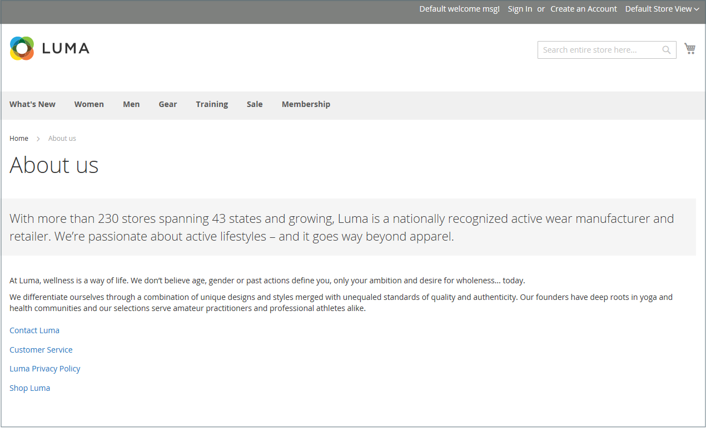
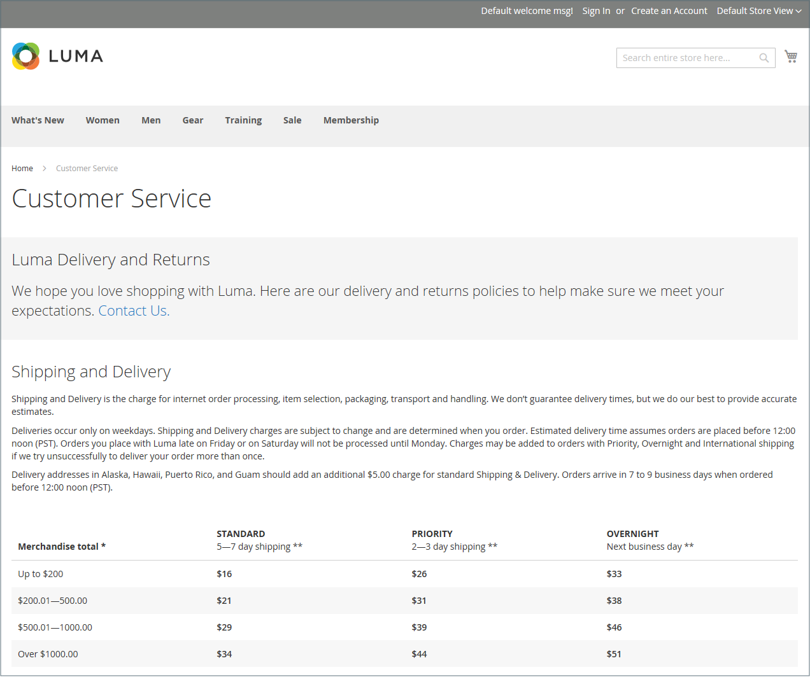

# 页面

内容可以按照货架期来查看，就像商店中的任何产品一样。 您知道社交媒体内容的保质期不到24小时吗？ 您创建的内容的潜在存储期限可以帮助您确定将资源投入到何处。

保质期长的内容有时称为 _常青内容_. 历久不衰的内容示例包括客户成功案例、 _方法_ 说明和常见问题解答(FAQ)。 相反，自然易腐的内容包括活动、行业新闻和新闻稿。

{width="700" zoomable="yes"}

## 核心内容页面

此 [!DNL Commerce] 演示存储提供了一些核心内容页面示例，可帮助您入门。 所有这些页面都可以修改以满足您的需求。 查看您商店中的以下页面，并确保内容传达您的消息、语音和品牌。

### 主页

演示 [主页](../getting-started/storefront.md#home-page) 页面包含横幅、图像轮播、多个带链接的静态块以及新产品列表。

### 隐私政策

商店 [隐私政策](../getting-started/privacy-policy.md) 页面应使用您自己的信息进行更新。 作为最佳实践，您的隐私政策应向您的客户说明贵公司收集的信息类型及其使用方式。

### 404未找到

“404页面未找到”页面的命名依据是找不到页面时返回的响应代码。 URL重定向可减少此页面的显示次数。 但是，在必要的时候，您最好利用这个机会提供一些客户可能感兴趣的产品的链接。

### 访问被拒绝

{{b2b-feature}}

此 [访问被拒绝](../b2b/account-company-roles-permissions.md) 当分配给公司用户的权限禁止访问该页面时，将显示该页面。

### 启用Cookie

此 [启用Cookie](../getting-started/compliance-cookie-law.md) 您网站的访客在其浏览器中未启用Cookie时，将会显示页面。 此页面提供了分步式的插图说明，用于为最受欢迎的浏览器启用Cookie。

### 服务不可用

此 [503服务不可用](../configuration-reference/general/general.md) 页面是以服务器不可用时返回的响应代码命名的。

### 关于我们

“关于我们”页面将从您商店的页脚链接。 您可以包括图像、视频、新闻稿链接和公告。 示例页面右侧有一个图像，和一个用于指示页面结束的装饰性图像。

### 客户服务

“客户服务”页是页面层次结构中的另一个节点。 页面上的两个标题包含的内容，只有在客户单击标题时才会显示。

{width="700" zoomable="yes"}

## 配置默认页面

此 _默认页面_ 配置确定与关联的登陆页面 [基本URL](../stores-purchase/store-urls.md) 和相应的主页。 它还可确定在出现以下情况时显示的页面 _页面未找到_ 发生错误，并且 [痕迹导航路径](../catalog/navigation-breadcrumb-trail.md) 显示在每页顶部。

1. 在 _管理员_ 侧栏，转到  **[!UICONTROL Stores]** > _[!UICONTROL Settings]_>**[!UICONTROL Configuration]**.

1. 在左侧面板中的 _[!UICONTROL General]_，选择&#x200B;**[!UICONTROL Web]**.

1. 展开  该 **[!UICONTROL Default Pages]** 部分。

   {width="500" zoomable="yes"}

   | 字段 | [范围](../getting-started/websites-stores-views.md#scope-settings) | 描述 |
   |--- |--- |--- |
   | [!UICONTROL Default Web URL] | 商店视图 | 指示与基本URL关联的登陆页面。 默认情况下，此字段设置为 `cms` 以指示来自 [!DNL Commerce] 内容管理系统。 您还可以使用其他类型的登陆页面，如博客。 例如，如果在服务器上安装了博客，则位于 `magento/blog`，则可以输入文件夹名称 `blog` 作为选定页面的相对路径。 |
   | [!UICONTROL CMS Home Page] | 商店视图 | 要选择商店的主页，只需从列表中选择CMS页面即可。 默认情况下，CMS主页会列出您商店可用的全部CMS页面选择。 |
   | [!UICONTROL Default No-route URL] | 商店视图 | 包含默认页面的URL，您要在 `404 Page not Found` 发生错误。 默认值为 `cms/noroute/index`. |
   | [!UICONTROL CMS No Route Page] | 商店视图 | 标识在出现“404页面未找到”错误时要显示的特定CMS页面。 默认页面为 `404 Not Found`. |
   | [!UICONTROL CMS No Cookies Page] | 商店视图 | 标识未为浏览器启用Cookie时显示的特定CMS页面。 本页介绍了为何使用Cookie，以及如何为每个浏览器启用它们。 默认页面为 `Enable Cookies`. |
   | [!UICONTROL Show Breadcrumbs for CMS Pages] | 商店视图 | 确定是否在目录中的所有CMS页面上显示痕迹导航路径。 选项： `Yes` / `No` |

   {style="table-layout:auto"}

1. 对象 **[!UICONTROL Default Web URL]**&#x200B;中，输入文件夹的相对路径 [!DNL Commerce] 包含登陆页面的安装。

   默认设置， `cms`，表示页面来自 [!DNL Commerce] 内容管理系统。

   >[!NOTE]
   >
   >对于特定的商店视图，清除 **[!UICONTROL Use Default]** 旁边的复选框 _[!UICONTROL Default Web URL]_，以及任何其他要更改的默认设置。

1. 设置 **[!UICONTROL CMS Home Page]** CMS页面用作主页。 其他创建的页面可用作主页，例如：

   - 欢迎使用独家在线商店
   - 奖励点数
   - 关于我们
   - 客户服务
   - 启用Cookie
   - 隐私政策
   - 公司：访问被拒绝

1. 对象 **[!UICONTROL Default No-route URL]**&#x200B;中，输入文件夹的相对路径 [!DNL Commerce] 安装，在此情况下，页面在 _404页面未找到_ 发生错误。

   默认值为 `cms/index/noRoute`.

1. 设置 **[!UICONTROL CMS No Route Page]** 至在出现以下情况时显示的CMS页面： _404页面未找到_ 发生错误。

1. 设置 **[!UICONTROL CMS No Cookies Page]** 转到在浏览器中禁用Cookie时显示的CMS页面。 本页介绍了为何使用Cookie，以及如何为每个浏览器启用它们。 默认页面为 `Enable Cookies`.

1. 如果希望痕迹导航跟踪显示在所有CMS页面的顶部，请设置 **[!UICONTROL Show Breadcrumbs for CMS Pages]** 到 `Yes`.

1. 完成后，单击 **[!UICONTROL Save Config]**.
