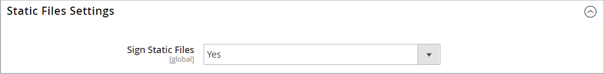
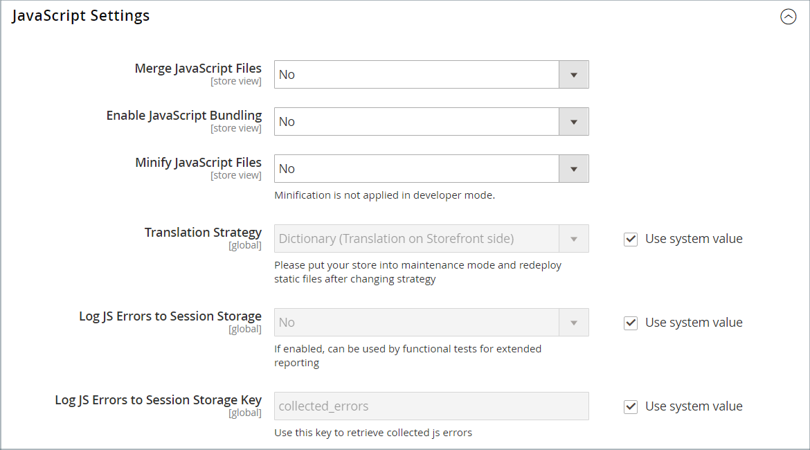

# 主题资产

_静态文件_&#x200B;是主题使用的资源(如CSS、字体、图像和JavaScript)的集合。 静态文件的位置在[基本URL](../stores-purchase/store-urls.md)配置中指定。 您可以向每个静态文件的URL添加数字签名，以便浏览器能够检测到较新版本何时可用。 如果签名与浏览器缓存中存储的签名不同，则使用较新版本的文件。

对于标准安装，与主题关联的资产将在[!DNL Commerce]根目录下以下位置的`web`文件夹中进行组织。

`[commerce_root]/app/design/frontend/Magento/[theme_name]/web`

## 向静态文件URL添加数字签名

1. 在&#x200B;_管理员_&#x200B;侧边栏上，转到&#x200B;**[!UICONTROL Stores]** > _[!UICONTROL Settings]_>**[!UICONTROL Configuration]**。

1. 在左侧面板中，展开&#x200B;**[!UICONTROL Advanced]**&#x200B;并选择&#x200B;**[!UICONTROL Developer]**。

1. 展开&#x200B;**[!UICONTROL Static Files Settings]**&#x200B;部分的。

   {width="500" zoomable="yes"}

1. 将&#x200B;**[!UICONTROL Sign Static Files]**&#x200B;设置为`Yes`。

1. 完成后，单击&#x200B;**[!UICONTROL Save Config]**。

| 文件类型 | 描述 |
|--- |--- |
| CSS | 控制与外观关联的视觉样式。 服务器上的示例位置： `[commerce]/app/design/frontend/Magento/[theme]/web/css` |
| 字体 | 提供主题可用的字体。 服务器上的位置： `[commerce]/app/design/frontend/Magento/[theme]/web/fonts` |
| 图像 | 提供主题使用的图形资源，包括按钮、背景纹理等。 服务器上的示例位置： `[commerce]/app/design/frontend/Magento/[theme]/web/images` |
| JS | 特定于主题的JavaScript例程和可调用函数。 服务器上的示例位置： `[commerce]/app/design/frontend/Magento/[theme]/web/js` |

{style="table-layout:auto"}

## 合并CSS文件

作为优化网站并减少页面加载时间努力的一部分，您可以通过将CSS文件合并到单个压缩文件来减少单独的CSS文件数量。 如果打开合并的CSS文件，您会看到一个连续的文本流，其中删除了换行符。 您无法编辑合并的文件，因此最好等到退出开发模式并且不再频繁更改CSS。

>[!NOTE]
>
>只有在[开发人员模式](../systems/developer-tools.md#operation-modes)下工作时，才能从&#x200B;_管理员_&#x200B;面板中合并CSS文件。

1. 在&#x200B;_管理员_&#x200B;侧边栏上，转到&#x200B;**[!UICONTROL Stores]** > _[!UICONTROL Settings]_>**[!UICONTROL Configuration]**。

1. 在左侧面板&#x200B;**[!UICONTROL Advanced]**&#x200B;中选择&#x200B;**[!UICONTROL Developer]**。

1. 展开&#x200B;**[!UICONTROL CSS Settings]**&#x200B;部分的。

   {width="500" zoomable="yes"}

   有关这些配置选项的详细说明，请参阅&#x200B;_配置引用_&#x200B;中的[CSS设置](../configuration-reference/advanced/developer.md#css-settings)。

1. 将&#x200B;**[!UICONTROL Merge CSS Files]**&#x200B;设置为`Yes`。

1. 完成后，单击&#x200B;**[!UICONTROL Save Config]**。

## 合并JavaScript文件

可以将多个JavaScript文件合并到单个压缩文件中，以缩短页面加载时间。 如果打开合并的JavaScript文件，您会看到一个连续的文本流，其中删除了换行符。 如果您已完成开发过程并且代码不含错误，则可以考虑合并文件。

>[!NOTE]
>
>只有在[开发人员模式](../systems/developer-tools.md#operation-modes)下工作时，才能从&#x200B;_管理员_&#x200B;面板中合并JavaScript文件。

1. 在&#x200B;_管理员_&#x200B;侧边栏上，转到&#x200B;**[!UICONTROL Stores]** > _[!UICONTROL Settings]_>**[!UICONTROL Configuration]**。

1. 在左侧面板&#x200B;**[!UICONTROL Advanced]**&#x200B;中选择&#x200B;**[!UICONTROL Developer]**。

1. 展开&#x200B;**[!UICONTROL JavaScript Settings]**&#x200B;部分的。

   {width="600" zoomable="yes"}

   有关这些配置选项的详细说明，请参阅&#x200B;_配置引用_&#x200B;中的[JavaScript设置](../configuration-reference/advanced/developer.md#javascript-settings)。

1. 将&#x200B;**[!UICONTROL Merge JavaScript Files]**&#x200B;设置为`Yes`。

1. 完成后，单击&#x200B;**[!UICONTROL Save Config]**。
