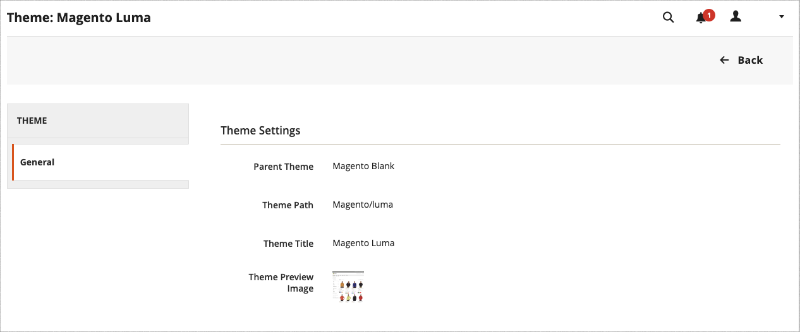

# 主题

主题是确定商店视觉呈现方式的文件集合。 首次安装[!DNL Commerce]时，存储的设计元素基于&#x200B;_Default_&#x200B;主题。 除了[!DNL Commerce]安装随附的初始默认主题之外，还有各种可用的主题，您可以将&#x200B;_作为_&#x200B;使用，或者根据需要进行修改。

响应式主题调整页面布局以适合设备的视图端口。 示例&#x200B;_Luma_&#x200B;主题具有灵活的响应式布局，可从桌面、平板电脑或移动设备查看。

[!DNL Commerce]主题包括布局文件、模板文件、翻译文件和外观。 外观是支持CSS、图像和JavaScript文件的集合，这些文件共同创建了客户在访问您的商店时体验的可视展示和交互。 理解Commerce主题设计且具有服务器访问权限的开发人员或设计专业人士可以修改和自定义主题和外观。 若要了解更多信息，请参阅&#x200B;[_前端开发人员指南_](https://developer.adobe.com/commerce/frontend-core/guide/themes/)。

{width="600" zoomable="yes"}

## 默认主题

`Magento Blank`响应式主题呈现不同设备的店面显示，并整合了桌面、表格和移动设备的最佳实践。 某些主题仅设计用于特定设备。 当[!DNL Commerce]检测到特定浏览器ID或用户代理时，它会使用为特定浏览器配置的主题。 搜索字符串还可以包含与Perl兼容的正则表达式(PCRE)。

{width="700" zoomable="yes"}

### 筛选主题网格

1. 在&#x200B;_管理员_&#x200B;侧边栏上，转到&#x200B;**[!UICONTROL Content]** > _[!UICONTROL Design]_>**[!UICONTROL Themes]**。

1. 单击&#x200B;**[!UICONTROL Filters]**。

1. 输入ID范围、主题名称（或标题）、文件夹路径或父主题。

1. 单击&#x200B;**[!UICONTROL Apply Filters]**&#x200B;以更新主题列表。

## 查看当前主题设置

1. 在&#x200B;_管理员_&#x200B;侧边栏上，转到&#x200B;**[!UICONTROL Content]** > _[!UICONTROL Design]_>**[!UICONTROL Themes]**。

1. 在已安装的主题列表中，找到要检查的主题，然后单击行以显示设置。

1. 要查看示例页面，请单击&#x200B;**[!UICONTROL Theme Preview Image]**。

{width="600" zoomable="yes"}

## 应用默认主题

1. 在&#x200B;_管理员_&#x200B;侧边栏上，转到&#x200B;**[!UICONTROL Content]** > _[!UICONTROL Design]_>**[!UICONTROL Configuration]**。

1. 查找要配置的商店视图，然后单击&#x200B;_[!UICONTROL Action]_&#x200B;列中的&#x200B;**[!UICONTROL Edit]**。

1. 在&#x200B;_[!UICONTROL Default Theme]_&#x200B;下，将&#x200B;**[!UICONTROL Applied Theme]**&#x200B;设置为要用于当前视图的。

   {width="600" zoomable="yes"}

1. 完成后，单击&#x200B;**[!UICONTROL Save Configuration]**。

## 添加用户代理规则

1. 在&#x200B;_管理员_&#x200B;侧边栏上，转到&#x200B;**[!UICONTROL Content]** > _[!UICONTROL Design]_>**[!UICONTROL Configuration]**。

1. 在&#x200B;_[!UICONTROL Design Rule]_&#x200B;下，单击&#x200B;**[!UICONTROL Add New User Agent Rule]**。

   {width="600" zoomable="yes"}

1. 对于&#x200B;**[!UICONTROL Search String]**，输入特定设备的浏览器ID。

   搜索字符串按输入顺序进行匹配。 例如，对于Firefox，输入：

   `/^mozilla/i`

1. 要输入其他设备，请重复此过程。

1. 完成后，单击&#x200B;**[!UICONTROL Save Configuration]**。
