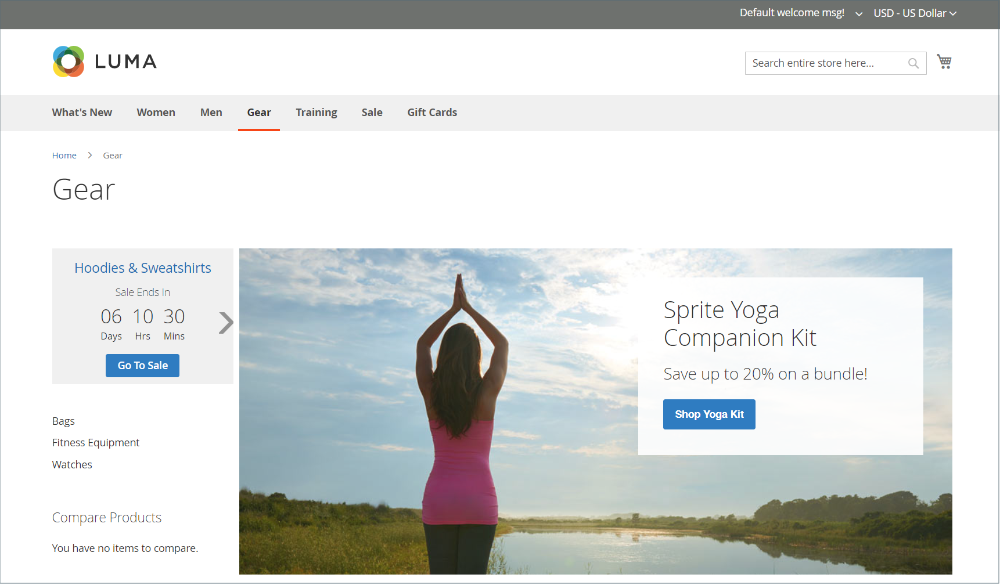

# 目录事件轮播小组件

{{ee-feature}}

目录事件轮播小组件显示即将发生的事件的滑块，其中每个事件都有一个倒计时滚动条。 您可以选择您希望轮播显示的页面布局的页面和区域，并控制同时显示的事件的宽度和数量。 您得到的结果取决于您的主题、主题在页面上出现的位置以及您选择的选项。

{width="700" zoomable="yes"}

## 步骤1：启用目录轮播小组件

在开始之前，请遵循 [说明](../merchandising-promotions/event-configure.md) 配置 _目录事件_ 构件，以便为店面启用。

{width="500" zoomable="yes"}

## 第2步：创建构件

1. 在 _管理员_ 侧栏，转到 **[!UICONTROL Content]** > _[!UICONTROL Elements]_>**[!UICONTROL Widgets]**.

1. 在右上角，单击 **[!UICONTROL Add Widget]**.

1. 在 _[!UICONTROL Settings]_部分，执行以下操作：

   - 设置 **[!UICONTROL Type]** 到 `Catalog Events Carousel`.

   - 选择 **[!UICONTROL Design Theme]** 店里用的那个。

1. 单击 **[!UICONTROL Continue]**.

   {width="500" zoomable="yes"}

1. 在 _[!UICONTROL Storefront Properties]_部分，执行以下操作：

   - 对象 **[!UICONTROL Widget Title]**，为构件输入描述性标题。

     此标题仅在 _管理员_.

   - 对象 **[!UICONTROL Assign to Store Views]**，选择您希望构件可见的存储区视图。

     您可以选择特定的商店视图，或者 `All Store Views`. 要选择多个视图，请按住Ctrl键(PC)或Command键(Mac)并单击每个选项。

   - （可选）对于 **[!UICONTROL Sort Order]**，请输入一个数字以确定此项目在页面同一部分中与其他项目一起显示的顺序。 (`0` =第一个， `1` =秒， `3` =第三，依此类推。)

     {width="600" zoomable="yes"}

## 步骤3：选择位置

1. 在 _布局更新_ 部分，单击 **[!UICONTROL Add Layout Update]**.

1. 设置 **[!UICONTROL Display On]** 到 `Specified Page`.

1. 设置 **[!UICONTROL Page]** 到 `CMS Home Page`.

1. 设置 **[!UICONTROL Container]** 下列选项之一：

   - `Main Content Area`
   - `Sidebar Additional`
   - `Sidebar Main`

   >[!NOTE]
   >
   >结果因主题和页面布局而异。 您还必须指定 _[!UICONTROL Catalog Events Carousel Default Template]_在类别配置中。

1. 如果您希望事件轮播显示在店面的其他位置，请单击 **[!UICONTROL Add Layout Update]** 并对该位置重复这些步骤。

   {width="600" zoomable="yes"}

1. 单击 **[!UICONTROL Save and Continue Edit]**.

   现在，您可以忽略消息以刷新缓存。

## 步骤4：配置选项

1. 在左侧面板中，选择 **[!UICONTROL Widget Options]**.

1. 对象 **[!UICONTROL Frame Size]**，输入要在滑块中同时列出的事件数。

   要一次只查看一个事件，请输入 `1`.

1. 对象 **[!UICONTROL Scroll]**，输入每次单击要滚动的事件列表数量。

   要滚动到下一个事件，请输入 `1`.

1. 对于自定义宽度，输入 **[!UICONTROL Block Custom Width]**.

   在以下示例页面上，自定义宽度设置为250像素。

   {width="400" zoomable="yes"}

1. 完成后，单击 **[!UICONTROL Save]**.

1. 提示刷新缓存时，单击页面顶部消息中的链接，然后按照说明操作。
