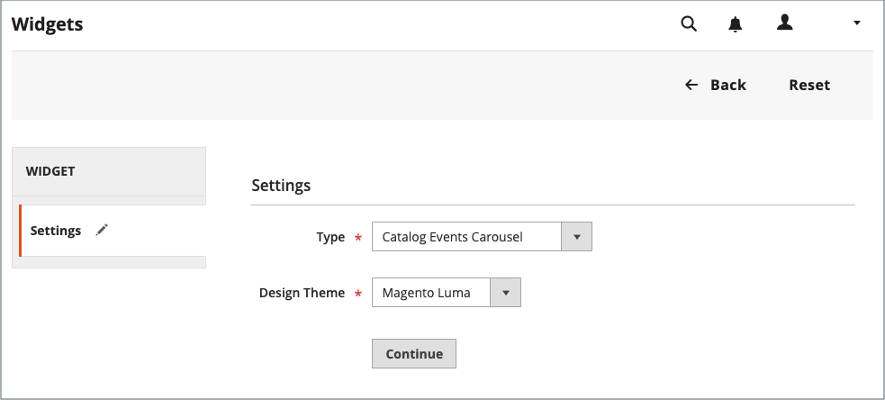
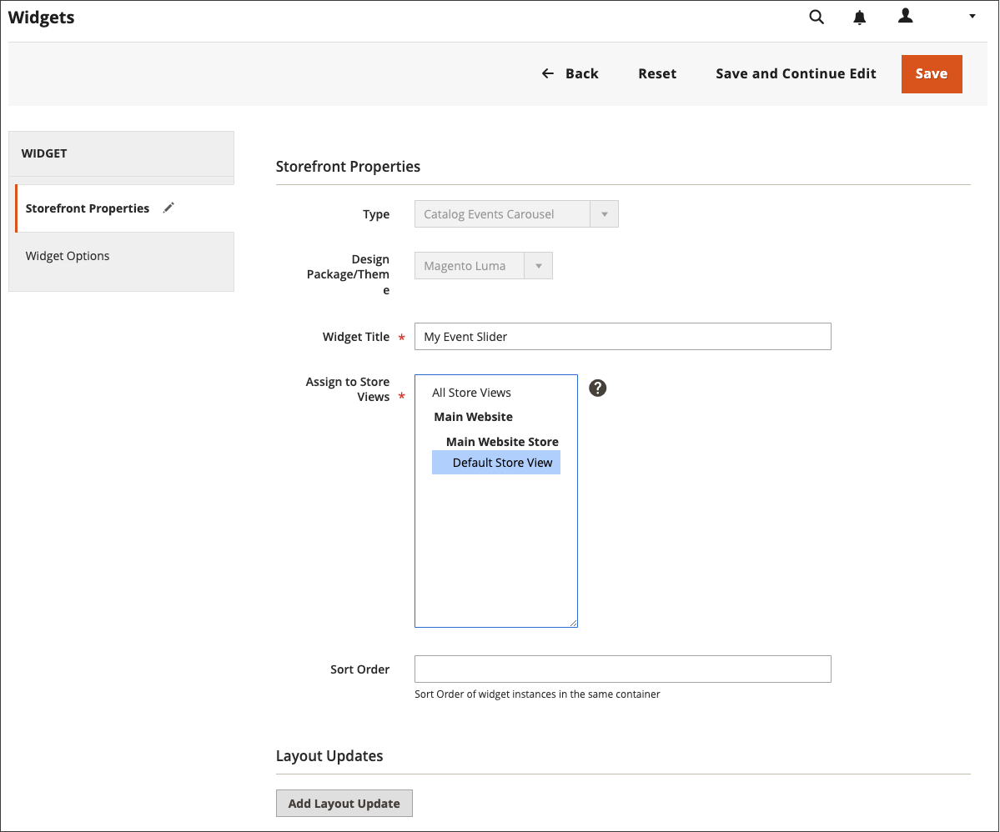

# 目录事件轮播小组件

{{ee-feature}}

目录事件轮播小组件显示即将发生的事件的滑块，其中每个事件都有一个倒计时滚动条。 您可以选择您希望轮播显示的页面布局的页面和区域，并控制同时显示的事件的宽度和数量。 您得到的结果取决于您的主题、主题在页面上出现的位置以及您选择的选项。

在左侧边栏中{width="700" zoomable="yes"}

## 步骤1：启用目录轮播小组件

在开始之前，请按照[说明](../merchandising-promotions/event-configure.md)配置&#x200B;_目录事件_&#x200B;构件，使其为店面启用。

{width="500" zoomable="yes"}

## 第2步：创建构件

1. 在&#x200B;_管理员_&#x200B;侧边栏上，转到&#x200B;**[!UICONTROL Content]** > _[!UICONTROL Elements]_>**[!UICONTROL Widgets]**。

1. 单击右上角的&#x200B;**[!UICONTROL Add Widget]**。

1. 在&#x200B;_[!UICONTROL Settings]_&#x200B;部分中，执行以下操作：

   - 将&#x200B;**[!UICONTROL Type]**&#x200B;设置为`Catalog Events Carousel`。

   - 选择商店使用的&#x200B;**[!UICONTROL Design Theme]**。

1. 单击&#x200B;**[!UICONTROL Continue]**。

   {width="500" zoomable="yes"}

1. 在&#x200B;_[!UICONTROL Storefront Properties]_&#x200B;部分中，执行以下操作：

   - 对于&#x200B;**[!UICONTROL Widget Title]**，输入小部件的描述性标题。

     此标题仅在&#x200B;_管理员_&#x200B;中可见。

   - 对于&#x200B;**[!UICONTROL Assign to Store Views]**，选择您希望小组件可见的存储区视图。

     您可以选择特定的商店视图，或`All Store Views`。 要选择多个视图，请按住Ctrl键(PC)或Command键(Mac)并单击每个选项。

   - （可选）为&#x200B;**[!UICONTROL Sort Order]**&#x200B;输入一个数字，以确定该项在页面的同一部分中与其他项一起出现的顺序。 （`0` =第一，`1` =第二，`3` =第三，依此类推。）

     {width="600" zoomable="yes"}

## 步骤3：选择位置

1. 在&#x200B;_布局更新_&#x200B;分区中，单击&#x200B;**[!UICONTROL Add Layout Update]**。

1. 将&#x200B;**[!UICONTROL Display On]**&#x200B;设置为`Specified Page`。

1. 将&#x200B;**[!UICONTROL Page]**&#x200B;设置为`CMS Home Page`。

1. 将&#x200B;**[!UICONTROL Container]**&#x200B;设置为以下项之一：

   - `Main Content Area`
   - `Sidebar Additional`
   - `Sidebar Main`

   >[!NOTE]
   >
   >结果因主题和页面布局而异。 您还必须在类别配置中指定&#x200B;_[!UICONTROL Catalog Events Carousel Default Template]_。

1. 如果您希望事件轮播显示在店面的其他位置，请单击&#x200B;**[!UICONTROL Add Layout Update]**，然后对该位置重复这些步骤。

   {width="600" zoomable="yes"}

1. 单击&#x200B;**[!UICONTROL Save and Continue Edit]**。

   现在，您可以忽略消息以刷新缓存。

## 步骤4：配置选项

1. 在左侧面板中，选择&#x200B;**[!UICONTROL Widget Options]**。

1. 对于&#x200B;**[!UICONTROL Frame Size]**，输入要在滑块中同时列出的事件数。

   要一次只查看一个事件，请输入`1`。

1. 对于&#x200B;**[!UICONTROL Scroll]**，输入每次点击要滚动的事件列表数量。

   要滚动到下一个事件，请输入`1`。

1. 对于自定义宽度，输入&#x200B;**[!UICONTROL Block Custom Width]**&#x200B;的像素数。

   在以下示例页面上，自定义宽度设置为250像素。

   {width="400" zoomable="yes"}

1. 完成后，单击&#x200B;**[!UICONTROL Save]**。

1. 提示刷新缓存时，单击页面顶部消息中的链接，然后按照说明操作。
