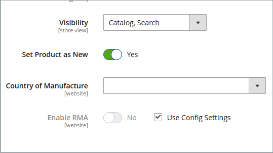
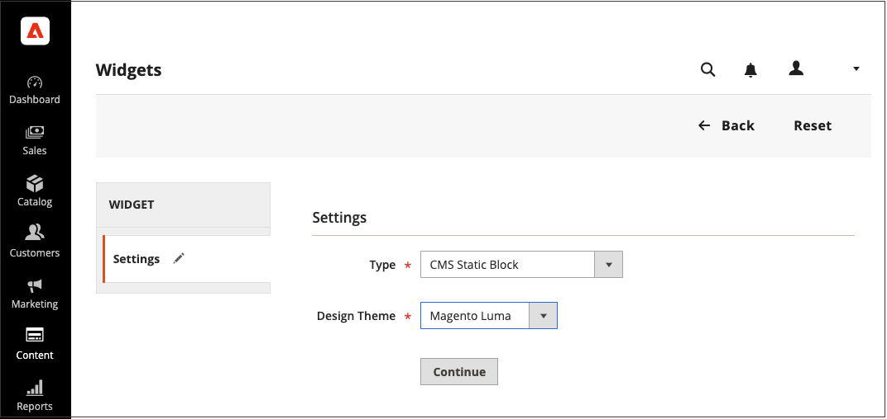

# 新产品列表构件

新产品列表是动态内容的一个示例，由从产品目录中提取的实时数据组成。 默认情况下，_新产品_&#x200B;列表包括最近添加的前8个产品。 但是，也可以将其配置为仅包含指定日期范围内的产品。

{width="700" zoomable="yes"}

## 步骤1：将每个产品设置为新产品

此步骤仅适用于Magento Open Source。

对于Adobe Commerce商店，请参阅[计划更新](content-staging-scheduled-update.md)，然后继续此页面上的步骤2。

只能在计划的更新中配置&#x200B;_[!UICONTROL Set Product as New]_&#x200B;日期范围设置。

将产品设置为新会将产品添加到&#x200B;_新产品_&#x200B;列表。 当您不再希望将设置包含在列表中时，可以随时将其更改回。

1. 在&#x200B;_管理员_&#x200B;侧边栏上，转到&#x200B;**[!UICONTROL Catalog]** > **[!UICONTROL Products]**。

1. 查找要功能的每个产品，并在编辑模式下打开。

1. 对于&#x200B;**[!UICONTROL Set Product as New]**，切换是否将产品设置为新产品的选项。

   {width="400" zoomable="yes"}

1. 完成后，单击&#x200B;**[!UICONTROL Save]**。

1. 当系统提示您重新索引并刷新页面缓存时，请单击页面顶部的链接并按照说明操作。

## 第2步：创建构件

确定新产品列表内容及其在您商店中的版面的代码由小组件工具生成。

1. 在&#x200B;_管理员_&#x200B;侧边栏上，转到&#x200B;**[!UICONTROL Content]** > _[!UICONTROL Elements]_>**[!UICONTROL Widgets]**。

1. 单击右上角的&#x200B;**[!UICONTROL Add Widget]**。

1. 在&#x200B;_[!UICONTROL Settings]_&#x200B;部分中，执行以下操作：

   - 将&#x200B;**[!UICONTROL Type]**&#x200B;设置为`Catalog New Products List`。

   - 选择商店使用的&#x200B;**[!UICONTROL Design Theme]**。

1. 单击&#x200B;**[!UICONTROL Continue]**。

   {width="600" zoomable="yes"}

1. 在&#x200B;_[!UICONTROL Storefront Properties]_&#x200B;部分中，执行以下操作：

   - 对于&#x200B;**[!UICONTROL Widget Title]**，输入小部件的描述性标题。 （此标题仅在&#x200B;_管理员_&#x200B;中可见。）

   - 对于&#x200B;**[!UICONTROL Assign to Store Views]**，选择显示小组件的存储视图。

     您可以选择特定的商店视图，或`All Store Views`。 要选择多个视图，请按住Ctrl键(PC)或Command键(Mac)并单击每个选项。

   - （可选）为&#x200B;**[!UICONTROL Sort Order]**&#x200B;输入一个数字，以确定该项在页面的同一部分中与其他项一起出现的顺序。 （`0` =第一，`1` =第二，`3` =第三，依此类推。）

   {width="600" zoomable="yes"}

## 步骤3：选择位置

1. 在&#x200B;_[!UICONTROL Layout Updates]_&#x200B;部分中，单击&#x200B;**[!UICONTROL Add Layout Update]**。

1. 将&#x200B;**[!UICONTROL Display On]**&#x200B;设置为`Specified Page.`

1. 将&#x200B;**[!UICONTROL Page]**&#x200B;设置为`CMS Home Page`。

1. 将&#x200B;**[!UICONTROL Block Reference]**&#x200B;设置为`Main Content Area`。

1. 将&#x200B;**[!UICONTROL Template]**&#x200B;设置为以下项之一：

   - `New Product List Template`
   - `New Products Grid Template`

     {width="600" zoomable="yes"}

1. 单击&#x200B;**[!UICONTROL Save and Continue Edit]**。

   现在，您可以忽略消息以刷新缓存。

## 步骤4：配置列表

1. 在左侧面板中，选择&#x200B;**[!UICONTROL Widget Options]**。

1. 将&#x200B;**[!UICONTROL Display Products]**&#x200B;设置为以下项之一：

   - `All Products` — 按顺序列出产品，从最近添加的产品开始。
   - `New Products` — 仅列出标识为&#x200B;_new_&#x200B;的产品。 在&#x200B;_[!UICONTROL Set Product As New From/To]_&#x200B;中指定的日期范围内将产品视为新产品。 如果日期范围到期，但未定义任何新产品，则列表为空。

1. 要为具有多个页面的列表提供导航控制，请将&#x200B;**[!UICONTROL Display Page Control]**&#x200B;设置为`Yes`。

   对于&#x200B;**[!UICONTROL Number of Products per Page]**，请输入要在每个页面上显示的产品数。

1. 将&#x200B;**[!UICONTROL Number of Products to Display]**&#x200B;选项设置为要包含在列表中的新产品数。

   默认设置为`10`。

1. 对于&#x200B;**[!UICONTROL Cache Lifetime (Seconds)]**，选择刷新新产品列表的频率。

   默认情况下，缓存设置为86,400秒（24小时）。

   {width="600" zoomable="yes"}

1. 完成后，单击&#x200B;**[!UICONTROL Save]**。

1. 提示刷新缓存时，单击页面顶部消息中的链接，然后按照说明操作。

## 步骤5：预览您的工作

1. 在&#x200B;_管理员_&#x200B;侧边栏上，转到&#x200B;**[!UICONTROL Content]** > _[!UICONTROL Elements]_>**[!UICONTROL Pages]**。

1. 在网格中查找将显示&#x200B;_新产品_&#x200B;列表的页面，然后单击&#x200B;_[!UICONTROL Action]_&#x200B;列中的&#x200B;**[!UICONTROL Preview]**&#x200B;链接。
