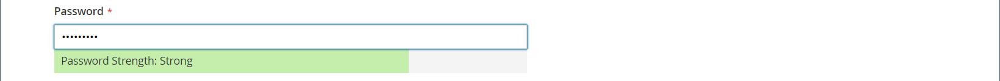
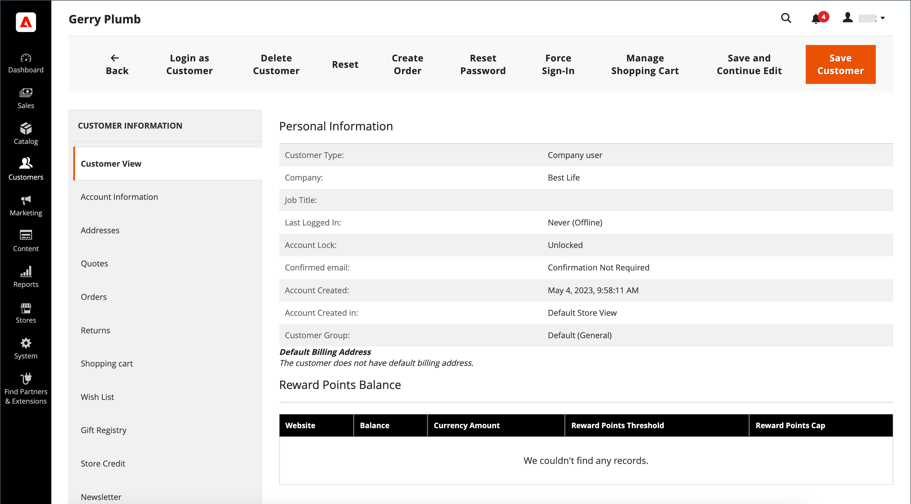
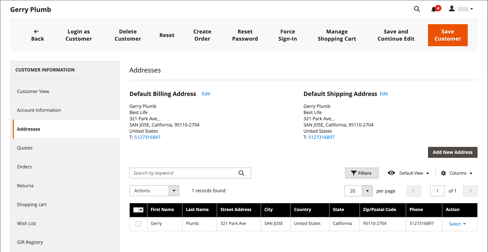

# 创建单个客户帐户

您商店的访客可以开立帐户来管理其购买和活动。 客户通常从您的商店创建自己的帐户。 但是，您也可以直接从管理员创建客户帐户，这对于通过电话帮助客户非常有用。

以下说明代表默认的客户帐户配置。 要更改表单中某些字段的选择和行为，请参阅[配置客户帐户](../customers/customer-account-scope.md)。

作为商店管理员，您还可以设置[新帐户选项](../customers/account-options-new.md)以向新注册的客户发送确认电子邮件，这有助于确保注册的帐户有效。

>[!NOTE]
>
>从版本2.4.7开始，客户必须重新输入其电子邮件和密码，以在电子邮件确认后登录到其帐户，而不考虑浏览器。

## 从店面创建帐户

店铺客户在店面上创建帐户。

1. 从店面，单击标题右上角的&#x200B;**[!UICONTROL Create an Account]**。

   {width="700" zoomable="yes"}

1. 在&#x200B;**[!UICONTROL Personal Information]**&#x200B;下，输入他们的&#x200B;**[!UICONTROL First Name]**&#x200B;和&#x200B;**[!UICONTROL Last Name]**。

   {width="600" zoomable="yes"}

1. 如果他们想要将其姓名和电子邮件地址添加到新闻稿订阅者的列表，客户将选中&#x200B;**[!UICONTROL Sign Up for Newsletter]**&#x200B;复选框。

   >[!INFO]
   >
   > 即使商店未发布新闻稿，也会出现此选项。

1. 如果他们希望商店支持人员[查看他们看到的内容](../customers/login-as-customer.md)并提供远程协助，客户将选中&#x200B;**[!UICONTROL Allow remote shopping assistance]**&#x200B;复选框。

1. 在&#x200B;**[!UICONTROL Sign-in Information]**&#x200B;下，输入其&#x200B;**[!UICONTROL Email]**&#x200B;地址。

   >[!INFO]
   >
   > 此电子邮件地址将成为其登录凭据的一部分，且无法与任何其他客户帐户关联。

   {width="600" zoomable="yes"}

1. 输入包含下列三种信息类型的&#x200B;**[!UICONTROL Password]**：

   - 小写字符
   - 大写字符
   - 数字
   - 特殊字符

   按&#x200B;**[!UICONTROL Enter]**&#x200B;后，将评估密码的强度，并显示在字段下方。 如果密码被认为是&#x200B;_弱_，请尝试其他密码，直到评估为&#x200B;_强_。

   {width="600" zoomable="yes"}

1. 然后，客户再次输入到&#x200B;**[!UICONTROL Confirm Password]**。

1. 如果需要，请单击&#x200B;**[!UICONTROL Show Password]**&#x200B;查看您输入的密码。

1. 完成后，单击&#x200B;**创建帐户**。

然后，客户可以使用他们的电子邮件地址和密码[登录其帐户](../customers/customer-sign-in.md)并完成地址信息。

## 从管理员创建帐户

作为贸易商，您可以从管理员创建客户帐户。

1. 在&#x200B;_管理员_&#x200B;侧边栏上，转到&#x200B;**[!UICONTROL Customers]** > **[!UICONTROL All Customers]**。

1. 单击&#x200B;**[!UICONTROL Add New Customer]**。

### 第1步：填写帐户信息

{width="700" zoomable="yes"}

1. 在&#x200B;**[!UICONTROL Account Information]**&#x200B;部分中，执行以下操作：

   - 对于多站点安装，请将&#x200B;**[!UICONTROL Associate to Website]**&#x200B;设置为客户帐户适用的网站。
   - 如果适用，将客户分配给其他&#x200B;**[!UICONTROL Customer Group]**。
   - 如果您使用[VAT ID验证](../stores-purchase/vat.md)并希望&#x200B;**[!UICONTROL Disable Automatic Group Change Based on VAT ID]**，请选中复选框。

1. 填写必填字段：

   - **[!UICONTROL First Name]**
   - **[!UICONTROL Last Name]**
   - **[!UICONTROL Email]**

1. 根据需要填写可选字段：

   - **[!UICONTROL Name Prefix]**
   - **[!UICONTROL Middle Name/Initial]**
   - **[!UICONTROL Name Suffix]**
   - **[!UICONTROL Date of Birth]**
   - **[!UICONTROL Tax/VAT Number]**
   - **[!UICONTROL Gender]**

   >[!WARNING]
   >
   >按照最新的安全和隐私最佳实践，了解将客户的完整出生日期（月、日、年）与其他个人标识符一起存储可能会带来的任何法律和安全风险。 建议您限制存储客户的完整出生日期，并建议使用客户出生年份作为替代方法。

1. 将&#x200B;**[!UICONTROL Send Welcome Email From]**&#x200B;设置为要从中发送&#x200B;_欢迎_&#x200B;电子邮件的商店视图。

   >[!INFO]
   >
   > 如果该商店有不同[语言](../stores-purchase/store-localize.md)的视图，则此设置将确定欢迎电子邮件的语言。

1. 单击页面顶部的&#x200B;**[!UICONTROL Save and Continue Edit]**。

   >[!INFO]
   >
   >保存客户帐户后，整套选项将显示在左侧面板和页面顶部的菜单中。 _[!UICONTROL Customer View]_&#x200B;选项卡显示帐户的摘要。

   {width="600" zoomable="yes"}

### 第2步：填写地址信息

1. 在左侧面板中，选择&#x200B;**[!UICONTROL Addresses]**&#x200B;并单击&#x200B;**[!UICONTROL Add New Addresses]**。

1. 如果帐单和送货使用相同的地址，则切换两个选项。

   - **[!UICONTROL Default Billing Address]**
   - **[!UICONTROL Default Shipping Address]**

   {width="600" zoomable="yes"}

1. 向下滚动并填写第二列中的必填地址字段。

   - **[!UICONTROL Street Address]**
   - **[!UICONTROL City]**
   - **[!UICONTROL Country]**
   - **[!UICONTROL State/Province]**
   - **[!UICONTROL ZIP/Postal Code]**

1. 输入此地址的&#x200B;**[!UICONTROL Phone Number]**。

1. 如果适用，请输入与客户关联的&#x200B;**[!UICONTROL VAT Number]**。

1. 如果此地址是该帐户所需的唯一地址，请单击&#x200B;**[!UICONTROL Save]**。

   否则，请单击&#x200B;**[!UICONTROL Save and Continue Edit]**&#x200B;并重复上述步骤以添加其他地址。

   新地址显示在完整列表上方具有选定&#x200B;_[!UICONTROL Default Billing]_&#x200B;和_[!UICONTROL Default Shipping]_&#x200B;地址的[!UICONTROL Addresses]页面中。

   {width="600" zoomable="yes"}

### 步骤3：重置密码

从管理员创建的客户帐户最初不会分配密码。

1. 在网格中查找新的客户帐户。

1. 单击&#x200B;_[!UICONTROL Action]_&#x200B;列中的&#x200B;**[!UICONTROL Edit]**。

1. 在页面顶部的菜单栏中，单击&#x200B;**[!UICONTROL Reset Password]**。

1. 通知将发送给帐户所有者，其中包含设置密码的说明。

## 按钮栏

首次保存配置文件时，其他按钮将变为可用。 若要了解详细信息，请参阅[更新客户个人资料](../customers/update-account.md)。

| 按钮 | 描述 |
|--- |--- |
| **[!UICONTROL Back]** | 返回到&#x200B;_[!UICONTROL Customers]_&#x200B;页而不保存更改。 |
| **[!UICONTROL Delete Customer]** | 删除当前客户。 不会删除与客户关联的已完成订单。 |
| **[!UICONTROL Reset]** | 将客户表单中未保存的任何更改重置为其以前的值。 |
| **[!UICONTROL Create Order]** | 为客户创建订单。 |
| **[!UICONTROL Reset Password]** | 通过电子邮件向客户发送[重置密码](../customers/password-reset.md)链接。 |
| **[!UICONTROL Force Sign-in]** | 撤销与客户帐户关联的OAuth访问令牌。 此函数只能用于已作为Web API [集成](../systems/integrations.md)的一部分分配OAuth令牌的客户帐户。 要了解更多信息，请参阅开发人员文档中的[基于OAuth的身份验证](https://developer.adobe.com/commerce/webapi/get-started/authentication/gs-authentication-oauth/)。 |
| **[!UICONTROL Manage Shopping Cart]** | 允许管理员管理客户的购物车。 |
| **[!UICONTROL Save and Continue Edit]** | 保存更改并保持客户个人资料处于打开状态。 |
| **[!UICONTROL Save Customer]** | 保存更改并关闭客户配置文件。 |

{style="table-layout:auto"}

## 字段描述

### [!UICONTROL Account Information]

| 字段 | 描述 |
|--- |--- |
| **[!UICONTROL Associate to Website]** | 标识与客户帐户关联的网站。 |
| **[!UICONTROL Group]** | 标识客户为成员的[客户组](../customers/customer-groups.md)。 如果适用，请选中此复选框以禁用基于增值税的自动组更改。 |
| **[!UICONTROL Name Prefix]** | 如果使用，则为与客户名称关联的前缀（例如Mr、Ms.或Dr）。 前缀值由[配置](../configuration-reference/customers/customer-configuration.md)决定。 根据配置，输入控件可以是文本字段或选项列表。 |
| **[!UICONTROL First Name]** | 客户的名字。 |
| **[!UICONTROL Middle Name / Initial]** | 客户的中间名或首字母。 只有在[配置](../configuration-reference/customers/customer-configuration.md)主题中指定时，才会包含此字段。 |
| **[!UICONTROL Last Name]** | 客户的姓氏。 |
| **[!UICONTROL Name Suffix]** | 如果使用后缀，则为与客户名称关联的后缀（如Jr.、Sr.或III）。 后缀值由[配置](../configuration-reference/customers/customer-configuration.md)确定。 根据配置，输入控件可以是文本字段或选项的下拉列表。 |
| **[!UICONTROL Email]** | 客户的电子邮件地址。 |
| **[!UICONTROL Date of Birth]** | 客户的出生日期。 如果在[配置](../configuration-reference/customers/customer-configuration.md)主题中指定，则包含出生日期。   为遵循当前安全和隐私最佳实践，请注意将客户的完整出生日期（月、日、年）与其他个人标识符一起存储可能会带来的任何法律和安全风险。 建议限制存储客户的完整出生日期，并建议使用客户出生年份作为替代方法。 |
| **[!UICONTROL Tax / VAT Number]** | 客户的税务或增值税编号（如果适用）。 |
| **[!UICONTROL Gender]** | 确定客户的性别。 如果在[配置](../configuration-reference/customers/customer-configuration.md)中指定该性别，则包含该性别。 选项： `Male` / `Female` / `Not Specified` |
| **[!UICONTROL Send Welcome Email From]** | 如果您有多个存储视图，此设置将标识从中发送欢迎消息的存储视图。 如果商店视图用于不同的语言，则此设置将确定欢迎电子邮件的语言。 |

### [!UICONTROL Addresses]

| 字段 | 描述 |
|--- |--- |
| **[!UICONTROL New Addresses]** | 标识新地址的类型。 选项： `Default Billing Address` / `Default Shipping Address` |
| **[!UICONTROL Add New Addresses]** | 显示另一个“新建地址”部分，以标识要输入的地址的类型。 |
| **[!UICONTROL Company]** | 公司名称（如果适用于此地址）。 |
| **[!UICONTROL Street Address]** | 客户的街道地址。 如果在[配置](../configuration-reference/customers/customer-configuration.md)主题中指定，街道地址的第二行将可用。 |
| **[!UICONTROL City]** | 客户地址所在的城市。 |
| **[!UICONTROL Country]** | 客户地址所在的国家/地区。 |
| **[!UICONTROL State/Province]** | 客户地址所在的省/市/自治区。 |
| **[!UICONTROL Zip/Postal Code]** | 客户地址所在的邮政编码。 |
| **[!UICONTROL Phone Number]** | 客户与地址关联的电话号码。 |
| **[!UICONTROL VAT Number]** | 适用于此地址客户的增值税编号（如果适用）。 |
