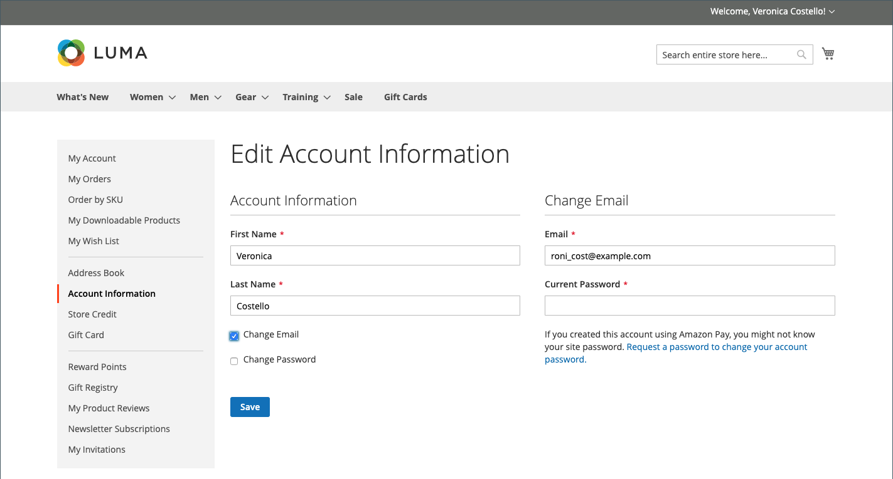

# 客户帐户信息

基本的客户帐户信息包括您的姓名、电子邮件地址和密码，可通过店面的客户帐户仪表板进行维护。

{width="700" zoomable="yes"}

在帐户的侧边栏中，客户可以选择&#x200B;**[!UICONTROL Account Information]**&#x200B;并执行以下任一操作来更新其帐户信息。

## 更新帐户名称的名称

要更新帐户的名称，客户会根据需要更改&#x200B;**[!UICONTROL First Name]**&#x200B;和&#x200B;**[!UICONTROL Last Name]**&#x200B;字段中的值。

>[!INFO]
>
>如果[客户配置](../configuration-reference/customers/customer-configuration.md)包含前缀、中间首字母和后缀，则其他字段将显示为名称的一部分。

## 更改电子邮件地址

1. 客户选择&#x200B;**[!UICONTROL Change Email]**&#x200B;复选框。

1. 输入他们的新&#x200B;**[!UICONTROL Email]**&#x200B;地址。

1. 输入他们的&#x200B;**[!UICONTROL Current Password]**。

   {width="700" zoomable="yes"}

1. 单击&#x200B;**[!UICONTROL Save]**。

## 更改密码

1. 客户选择&#x200B;**[!UICONTROL Change Password]**&#x200B;复选框。

1. 输入他们的&#x200B;**[!UICONTROL Current Password]**。

1. 输入他们的&#x200B;**[!UICONTROL New Password]**。

   >[!INFO]
   >
   >密码长度应至少为8个字符，并且可以包含大写和小写字母、数字和符号的组合。 密码强度指示器可帮助客户选择最佳密码。

   {width="700" zoomable="yes"}

1. 再次输入以进行确认。
