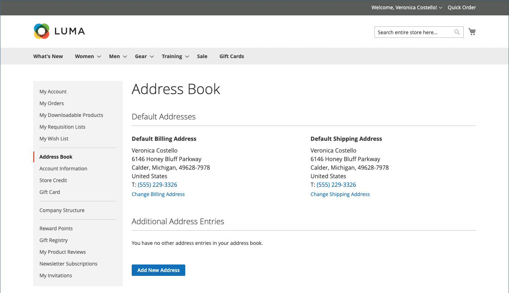
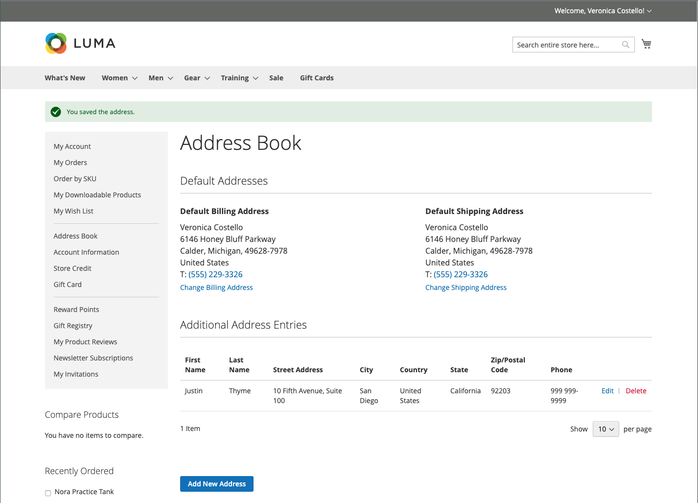

# 客户通讯簿

保持地址簿为最新状态的客户可以加快结账过程。 通讯簿包含客户的默认帐单地址和送货地址，以及他们经常使用的任何其他地址。 从网格中访问和维护其他地址条目很容易。 每个客户通讯簿可以管理3,000多个通讯簿条目，而不会影响性能。

{width="700" zoomable="yes"}

## 添加地址

1. 在其客户帐户的左侧导航中，客户选择&#x200B;**[!UICONTROL Address Book]**。

1. 在&#x200B;_其他地址条目_&#x200B;下的&#x200B;_[!UICONTROL Address Book]_页面上，单击&#x200B;**[!UICONTROL Add New Address]**。

   {width="600" zoomable="yes"}

1. 定义新地址项。

1. 填写联系人和地址信息。

   >[!INFO]
   >
   >默认情况下，客户的名字和姓氏最初会显示在表单中。

1. 选中以下复选框以指示地址的使用方式。

   如果帐单和送货使用相同地址，则选中这两个复选框。

   * [!UICONTROL Use as my default billing address]
   * [!UICONTROL Use as my default shipping address]

1. 完成后，单击&#x200B;**[!UICONTROL Save Address]**。

   >[!INFO]
   >
   >新地址列在[!UICONTROL Additional Address Entries]下。

   {width="700" zoomable="yes"}

## 编辑地址

1. 在其客户帐户的左侧导航中，客户选择&#x200B;**[!UICONTROL Address Book]**。

1. 查找要编辑的地址条目。

1. 单击&#x200B;**[!UICONTROL Edit]**。

1. 进行任何所需的更改。

   >[!INFO]
   >
   >客户可以通过选中&#x200B;_使用作为我的默认帐单地址_&#x200B;复选框，将此地址设置为默认&#x200B;**[!UICONTROL Shipping or Billing]**&#x200B;地址。

1. 更改完成后，单击&#x200B;**[!UICONTROL Save Address]**。

## 更改默认地址

1. 在其客户帐户的左侧导航中，客户选择&#x200B;**[!UICONTROL Address Book]**。

1. 选择下列编辑方法之一：

   * 单击&#x200B;_[!UICONTROL Default Addresses]_部分中的&#x200B;**[!UICONTROL Change Billing/Shipping Address]**。

   * 在&#x200B;_[!UICONTROL Additional Address Entries]_网格中单击&#x200B;**[!UICONTROL Edit]**。

1. 进行必要的更改，然后单击&#x200B;**[!UICONTROL Save Address]**。

## 删除地址

1. 在其客户帐户的左侧导航中，客户选择&#x200B;**[!UICONTROL Address Book]**。

1. 查找要删除的地址条目。

1. 在&#x200B;_[!UICONTROL Additional Address Entries]_网格中单击&#x200B;**[!UICONTROL Delete]**。

1. 要确认操作，请单击&#x200B;**[!UICONTROL OK]**。

   >[!IMPORTANT]
   >
   >无法删除默认帐单和送货地址。
