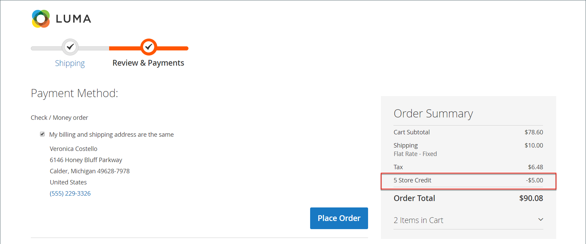

# 在客户帐户仪表板中存储贷项

{{ee-feature}}

此 _[!UICONTROL Store Credit]_客户帐户控制面板页列出了可用于将来采购的退货和退款金额。 客户还可以从礼品卡中兑换价值。

{width="700" zoomable="yes"}

## 在结账期间应用商店积分

1. 客户确定可用商店贷项的金额。

   时段 _审核与支付_ 步骤，可用数量显示在 **[!UICONTROL Store Credit]**.

1. 要将金额应用于订单，客户单击 **[!UICONTROL Use Store Credit]**.

   {width="600" zoomable="yes"}

1. 系统将重新计算订单合计，并且应用的商店贷记金额将显示在“订单汇总”中。

   {width="600" zoomable="yes"}

1. 准备就绪后，单击 **[!UICONTROL Place Order]**.

## 查看商店贷方余额和历史记录

查看信用余额和历史记录的方法有两种：

方法1： **从客户帐户信息板**

1. 客户从店面登录帐户。

1. 选择 **[!UICONTROL Store Credit]** 在左侧面板中。

方法2： **从 _审核与支付_ 页面**

1. 客户将产品添加到购物车。

1. 进入结账页面。

1. 传递 **[!UICONTROL Shipping]** 步骤。

1. 如果商店积分可用，则客户单击 **使用商店点数**.

1. 如果客户改变了对使用商店信贷的想法，请单击 **[!UICONTROL Remove]** 在 _[!UICONTROL Order Summary]_部分。
