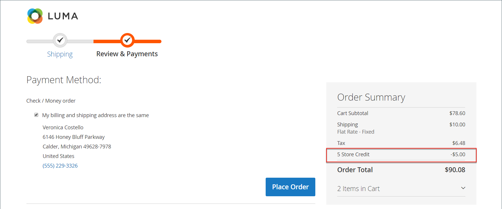

# 在客户帐户仪表板中存储贷项

{{ee-feature}}

客户帐户仪表板的&#x200B;_[!UICONTROL Store Credit]_页列出了可用于将来购买的退货和退款的金额。 客户还可以从礼品卡中兑换价值。

{width="700" zoomable="yes"}

## 在结账期间应用商店积分

1. 客户确定可用商店贷项的金额。

   在&#x200B;_审核和付款_&#x200B;步骤中，可用金额显示在&#x200B;**[!UICONTROL Store Credit]**&#x200B;下。

1. 要将金额应用于订单，客户单击&#x200B;**[!UICONTROL Use Store Credit]**。

   {width="600" zoomable="yes"}

1. 系统将重新计算订单合计，并且应用的商店贷记金额将显示在“订单汇总”中。

   {width="600" zoomable="yes"}

1. 准备就绪后，单击&#x200B;**[!UICONTROL Place Order]**。

## 查看商店贷方余额和历史记录

查看信用余额和历史记录的方法有两种：

方法1：从客户帐户仪表板&#x200B;**中**

1. 客户从店面登录帐户。

1. 在左侧面板中选择&#x200B;**[!UICONTROL Store Credit]**。

方法2：从&#x200B;_复查和付款_&#x200B;页面&#x200B;**中的**

1. 客户将产品添加到购物车。

1. 进入结账页面。

1. 通过&#x200B;**[!UICONTROL Shipping]**&#x200B;步骤。

1. 如果商店积分可用，则客户单击&#x200B;**使用商店积分**。

1. 如果客户改变了对使用商店积分的想法，请单击&#x200B;_[!UICONTROL Order Summary]_部分中的&#x200B;**[!UICONTROL Remove]**。
