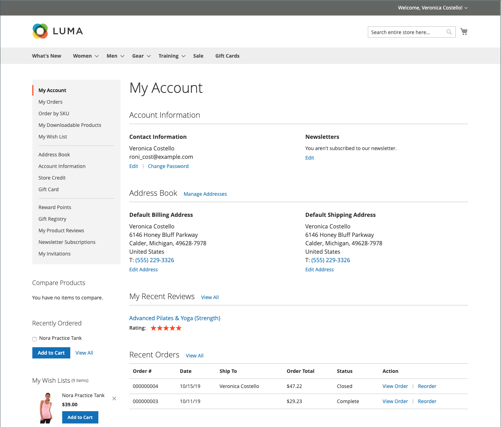
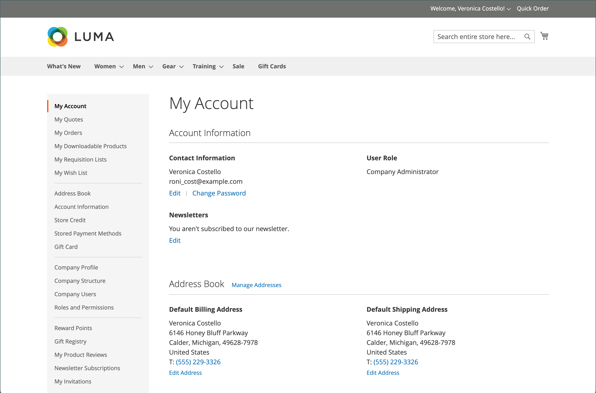

# 客户帐户信息板

客户可以从其帐户仪表板管理并监视其自己的信息和活动。 客户可以重新排序、跟踪订单、管理送货地址和支付方式、产品审查、新闻稿订阅等。

{width="700" zoomable="yes"}

>[!NOTE]
>
> 通过安装和启用Adobe Commerce B2B，您可以利用公司的特定功能个性化购买体验。 可以为与公司关联的客户启用所有的B2B帐户控制面板选项（采购订单、申请列表和协议报价）。 有关B2B功能的详细信息，请参见 [Adobe Commerce B2B用户指南](../b2b/introduction.md).

{width="700" zoomable="yes"}

## 帐户仪表板侧导航

下表包含有关客户帐户仪表板左侧导航中所有可用部分的信息。

| 部分 | 描述 |
|------------------------------------------------------------------------------------------------------------------------------------------------------|----------------------------------------------------------------------------------------------------------------------------------------------------------------------------------------------------------------------------------------------------------------------------------------------------------------------------------------------------------------|
| [**[!UICONTROL My Account]**](../customers/account-dashboard-my-account.md) | 显示帐户的汇总信息，包括联系人信息、通讯簿中的默认地址和最近订单。 |
| [**[!UICONTROL My Orders]**](../stores-purchase/orders-storefront.md#view-recently-ordered-products) | 显示所有客户订单的列表，每个订单均有一个链接。 如果在配置中启用了，则只需单击“重新排序”链接即可对任意顺序重新排序。 |
| [**[!UICONTROL My Downloadable Products]**](../catalog/product-create-downloadable.md#storefront-experience) | 列出客户已购买的所有可下载产品，并提供每个产品的链接。 |
| [**[!UICONTROL My Wish List]**](../stores-purchase/wishlist-storefront.md) | 管理您的愿望清单，并从愿望清单项目下订单。 |
| [**[!UICONTROL Address Book]**](../customers/account-dashboard-address-book.md) | 客户通讯簿包括默认帐单和送货地址以及附加地址条目。 |
| [**[!UICONTROL Account Information]**](../customers/account-dashboard-account-information.md) | 客户可以更新其帐户信息，并根据需要更改密码。 商店管理员还可以更新客户帐户并访问信息以提供购物帮助。 |
| [**[!UICONTROL Billing Agreements]**](../stores-purchase/paypal-billing-agreements.md#storefront-experience) | 显示任何客户开单协议的列表。 |
| [**[!UICONTROL My Product Reviews]**](../merchandising-promotions/product-reviews.md#product-reviews-on-the-storefront) | 显示客户提交的所有产品审阅的列表，其中包含每个产品审阅的链接。 |
| [**[!UICONTROL Newsletter Subscriptions]**](../merchandising-promotions/newsletters.md) | 列出所有可用的新闻稿，在客户订阅的项目旁有一个复选标记。 |
|  [**[!UICONTROL Order by SKU]**](../stores-purchase/order-by-sku.md#order-by-sku-from-a-customer-account) | 使您能够按SKU将单个项目添加到购物车，或导入要从CSV文件订购的产品列表。 |
|  [**[!UICONTROL Store Credit]**](../customers/account-dashboard-store-credit.md) | 显示可用于购买的退货、退款和兑换礼品卡的商店当前贷记金额。 |
| [**[!UICONTROL Stored Payment Methods]**](../stores-purchase/stored-payment-methods.md) | 列出客户用来存储信用卡信息的具有安全电子仓库的任何付款方法。 |
|  [**[!UICONTROL Gift Card]**](../catalog/product-gift-card-create.md) | 允许客户检查现有礼品卡上的当前余额并兑换礼品卡以换取商店信贷。 |
|  [**[!UICONTROL Reward Points]**](../merchandising-promotions/rewards-loyalty.md) | 列出客户获得的所有奖励积分，这些积分可用于购买。 |
|  [**[!UICONTROL Gift Registry]**](../merchandising-promotions/gift-registries.md) | 用于列出和维护礼品登记册，以及添加新的礼品登记册。 |
|  [**[!UICONTROL My Invitations]**](../merchandising-promotions/invitations.md) | 列出客户为计划活动创建和发送的所有邀请。 |
|  [**[!UICONTROL My Purchase Orders]**](../b2b/account-dashboard-my-purchase-orders.md) | （仅限公司）列出客户提交或控制的所有采购订单，并带有指向详细信息的链接。 |
|  [**[!UICONTROL My Quotes]**](../b2b/account-dashboard-my-quotes.md) | （仅限公司）列出客户提交的所有报价，并带有指向详细信息的链接。 |
|  [**[!UICONTROL My Requisition Lists]**](../b2b/account-dashboard-requisition-lists-manage.md) | （仅限公司）维护客户创建的所有申请列表。 |
|  [**[!UICONTROL Company Profile]**](../b2b/account-company-manage.md#update-a-company-profile) | （仅限公司）指定的公司管理员可以管理公司信息，包括公司名称和地址、公司管理员联系信息和付款信息。 |
|  [**[!UICONTROL Company Credit]**](../b2b/credit-company.md#storefront-credit-information) | （仅限公司）显示当前未清余额、可用贷项和分配给帐户的贷项限额，后面是未清发票的列表。 仅当出现以下情况时，“公司业绩”部分才会显示在仪表板中 [分期付款](../b2b/enable-basic-features.md#configure-payment-on-account) 会在配置中启用。 |
|  [**[!UICONTROL Company Structure]**](../b2b/account-company-structure.md) | （仅限公司）由公司管理员用于定义公司的业务结构。 |
|  [**[!UICONTROL Company Users]**](../b2b/account-company-users.md) | （仅限公司）由公司管理员用于为公司购买者创建用户帐户。 |
|  [**[!UICONTROL Roles and Permissions]**](../b2b/account-company-roles-permissions.md) | （仅限公司）由公司管理员用于为具有各种级别权限的公司用户定义角色。 |
|  [**[!UICONTROL Approval Rules]**](../b2b/account-dashboard-approval-rules.md) | （仅限公司）用于定义采购订单的审批规则。 |

{style="table-layout:auto"}
