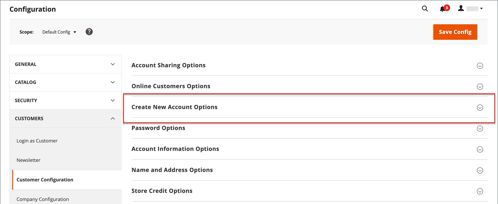

# 新的客户帐户选项

在配置的&#x200B;_[!UICONTROL Create New Account Options]_&#x200B;部分中，基本帐户选项与与VAT ID验证和自定义集成相关的更多高级选项组合在一起。 以下说明仅涵盖最常用的选项。 若要了解自动客户组分配，请参阅[增值税验证](../stores-purchase/vat.md)。

{width="600" zoomable="yes"}

## 设置基本客户帐户选项

1. 在&#x200B;_管理员_&#x200B;侧边栏上，转到&#x200B;**[!UICONTROL Stores]** > _[!UICONTROL Settings]_>**[!UICONTROL Configuration]**。

1. 在左侧面板中，展开&#x200B;**[!UICONTROL Customers]**&#x200B;并选择&#x200B;**[!UICONTROL Customer Configuration]**。

1. 展开&#x200B;**[!UICONTROL Create New Account Options]**&#x200B;部分：

   {width="600" zoomable="yes"}

1. 根据您在店面需要支持的客户体验设置每个选项：

   - 将&#x200B;**[!UICONTROL Default Group]**&#x200B;设置为在创建帐户时分配给新客户的客户组。

   - 如果您有&#x200B;_增值税_&#x200B;编号，并且希望对客户可见，请将&#x200B;**[!UICONTROL Show VAT Number on Storefront]**&#x200B;设置为`Yes`。

   - 要在客户管理员订单创建过程中需要客户的电子邮件，请将&#x200B;**[!UICONTROL Email is required field for Admin order creation]**&#x200B;设置为`Yes`。

   - 输入存储的&#x200B;**[!UICONTROL Default Email Domain]**，如`mystore.com`

   - 将&#x200B;**[!UICONTROL Default Welcome Email]**&#x200B;设置为用于发送给新客户的欢迎电子邮件的模板。

   - 若要要求客户确认其使用您的商店开立帐户的请求，请将&#x200B;**[!UICONTROL Require Emails Confirmation]**&#x200B;设置为`Yes`。 然后，将&#x200B;**[!UICONTROL Confirmation Link Email]**&#x200B;设置为用于确认电子邮件的模板。

     >[!NOTE]
     >
     >从版本2.4.7开始，客户必须重新输入其电子邮件和密码，以在电子邮件确认后登录到其帐户，而不考虑浏览器。

   - 将&#x200B;**[!UICONTROL Welcome Email]**&#x200B;设置为用于在确认帐户后发送的欢迎消息的模板。

   - 将&#x200B;**[!UICONTROL Default Welcome Email without Password]**&#x200B;设置为创建尚未密码的客户帐户时使用的模板。 例如，从管理员创建的客户帐户尚未分配密码。

   - 将&#x200B;**[!UICONTROL Email Sender]**&#x200B;设置为显示为欢迎电子邮件发件人的商店联系人。

   - 若要要求客户确认其使用您的商店开立帐户的请求，请将&#x200B;**[!UICONTROL Require Emails Confirmation]**&#x200B;设置为`Yes`。 然后，将&#x200B;**[!UICONTROL Confirmation Link Email]**&#x200B;设置为用于确认电子邮件的模板。

   {width="600" zoomable="yes"}

   有关此配置选项集中每个可用选项的详细信息，请参阅&#x200B;_新建帐户选项_ [配置引用](../configuration-reference/customers/customer-configuration.md)。

1. 完成后，单击&#x200B;**[!UICONTROL Save Config]**。
