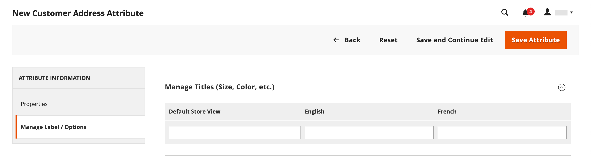

# 客户地址属性

{{ee-feature}}

“客户地址”属性集确定输入到 [通讯簿](account-dashboard-address-book.md) 从客户账户或在客户账户 [结账](../stores-purchase/checkout-process.md).

可以设置自定义地址属性以提供其他信息，例如可选电子邮件地址、Skype帐户、备用电话号码、建筑物或县/市。 然后，可以将自定义属性合并到 [地址模板](address-templates.md) 用于生成销售文档。 创建自定义地址属性的过程与创建几乎相同 [客户属性](attribute-properties.md).

客户地址属性在以下表单中使用：

- [客户地址注册](account-create.md)
- [客户帐户地址](account-dashboard-address-book.md)

{width="700" zoomable="yes"}

## 步骤1：完成属性属性

1. 在 _管理员_ 侧栏，转到 **[!UICONTROL Stores]** > _[!UICONTROL Attributes]_>**[!UICONTROL Customer Address]**.

1. 在右上角，单击 **[!UICONTROL Add New Attribute]**.

   {width="600" zoomable="yes"}

1. 在 **[!UICONTROL Attribute Properties]** 部分，执行以下操作：

   - 输入 **[!UICONTROL Default Label]** 在数据输入期间标识该属性。

   - 输入 **[!UICONTROL Attribute Code]** 标识系统中的属性。

     属性代码必须以字母开头，并且可以包含小写字母(a-z)和数字(0-9)的任意组合。 该代码的长度必须少于30个字符，并且不能包含特殊字符或空格。 下划线字符(_)可用于表示空格。

     >[!TIP]
     >
     >**_快捷方式：_** 要仅完成必填字段，请向下滚动到 [!UICONTROL Storefront Properties]，输入 [!UICONTROL Sort Order]，并保存。

1. 要确定用于数据输入的输入控件的类型，请设置 **[!UICONTROL Input Type]** 更改为以下任一项：

   - `Text Field`  — 单行文本字段。
   - `Text Area`  — 多行文本区域。
   - `Multiple Line`  — 为属性创建多个文本行，类似于多行街道地址。 单独的数据输入行的数量可以是2到20。 使用 `Default Value` 以指定字段的初始值。
   - `Date`  — 显示带有弹出日历的日期字段。 其他属性：使用 `Default Value` 以指定字段的初始值。  使用 `Minimal Value` 以指定可以输入的最早日期。  使用 `Maximum Value` 指定可以输入的最新日期。
   - `Dropdown`  — 一个下拉列表，只接受选择一个值。
   - `Multiple Select`  — 一个下拉列表，接受多个要选择的值。
   - `Yes/No`  — 仅提供以下选项的字段 `Yes` 或 `No` 值。
   - `File (attachment)`  — 允许上传文件并将其作为附件与客户属性关联的字段。
   - `Image File`  — 允许将图像上传到库并与客户属性关联的字段。

1. 如果客户必须在字段中输入值，请设置 **[!UICONTROL Values Required]** 到 `Yes`.

1. 要为字段分配初始值，请输入 **[!UICONTROL Default Value]**.

1. 要在保存记录之前检查输入到字段中的数据是否准确，请设置 **[!UICONTROL Input Validation]** 到字段中允许的数据类型。 可用的值取决于 _[!UICONTROL Input Type]_已指定。

   - `None`  — 字段在数据输入期间没有输入验证。
   - `Alphanumeric`  — 在数据输入期间接受数字(0-9)和字母字符(a-z、A-Z)的任意组合。 要包含特殊字符，请参阅 [!UICONTROL Escape HTML Entities] 在下一步中。
   - `Alphanumeric with Space`  — 在数据输入期间接受数字(0-9)、字母字符(a-z、A-Z)和空格的任意组合。
   - `Numeric Only`  — 在数据输入期间仅接受数字(0-9)。
   - `Alpha Only`  — 在数据输入期间仅接受字母字符(a-z、A-Z)。
   - `URL`  — 在数据输入期间仅接受URL。
   - `Email`  — 在数据输入期间仅接受电子邮件地址。
   - `Length Only`  — 根据在字段中输入的数据的长度验证输入。

1. 要对文本字段、文本区域或多行输入类型中输入的值应用预处理过滤器，请设置 **[!UICONTROL Input/Output Filter]** 更改为以下任一项：

   - `None`  — 不对在字段中输入的文本应用过滤器。
   - `Strip HTML Tags`  — 从文本中删除HTML标签。 此过滤器可帮助清理从包含HTML标签的其他源粘贴到字段中的数据。
   - `Escape  HTML Entities`   — 将文本中的特殊字符转换为有效的HTML转义序列，例如 `&;`. 转义序列在&amp;符号和分号之间括起来，通常用于印刷商的智能引号、版权和商标符号。 转义序列还用于标识字符，例如小于(`<`)和大于(`>`)符号，以及同样在代码中使用的&amp;字符。 此过滤器有助于清理有时会从字处理程序粘贴到数据库字段中的特殊字符。

1. 完成客户网格和区段属性：

   - 要在客户网格中包含列，请设置 **[!UICONTROL Add to Column Options]** 到 `Yes`.

   - 要按此属性筛选“客户”网格，请设置 **[!UICONTROL Use in Filter Options]** 到 `Yes`.

   - 要按具有不同过滤匹配条件的文本属性过滤客户网格，请设置 **[!UICONTROL Grid Filter Condition Type]** 到 `Partial Match`， `Prefix Match`，或 `Full Match`. 它不会影响 _按关键词搜索_ 网格的字段。

   - 要按此属性搜索“客户”网格，请设置 **[!UICONTROL Use in Search Options]** 到 `Yes`.

   - 要使此属性可用于 [客户区段](customer-segments.md)，设置 **[!UICONTROL Use in Customer Segment]** 到 `Yes`.

## 步骤2：完成店面属性

1. 向下滚动到 **[!UICONTROL Storefront Properties]** 部分。

   {width="600" zoomable="yes"}

1. 要使客户能够看到属性，请设置 **[!UICONTROL Show on Storefront]** 到 `Yes`.

1. 在 **[!UICONTROL Sort Order]** 字段，该字段确定与其他属性一起列出时的外观顺序。

1. 设置 **[!UICONTROL Forms to Use]** 每个要包含属性的表单。

   要选择这两个选项，请在单击每个表单时按住Ctrl键(PC)或Command键(Mac)。

   - [客户地址注册](account-create.md)
   - [客户帐户地址](account-dashboard-address-book.md)

## 第3步：完成标签并保存

1. 在左侧的面板中，选择 **[!UICONTROL Manage Labels/Options]**.

1. 下 **[!UICONTROL Manage Titles]**，输入标签以标识每个的属性 [商店视图](../getting-started/websites-stores-views.md).

1. 完成后，单击 **[!UICONTROL Save Attribute]**.

   {width="600" zoomable="yes"}

## 字段描述

### [!UICONTROL Attribute Properties]

| 字段 | 描述 |
|--- |--- |
| [!UICONTROL Default Label] | 在管理员和店面中标识属性的默认标签。 |
| [!UICONTROL Attribute Code] | 标识系统内属性的唯一代码。 该代码的长度最多可为21个字符，并且不能包含空格或特殊字符。 可以使用下划线符号代替空格。 |
| [!UICONTROL Input Type] | 确定 [输入控制](../catalog/attributes-input-types.md) 用于数据输入。 选项：  **`Text Field`**— 单行文本字段。 **`Text Area`**  — 多行文本区域。  **`Multiple Line`**— 为属性创建多个文本行，类似于多行街道地址。 单独的数据输入行的数量可以是2到20。 **`Date`**  — 显示带有弹出日历的日期字段。 **`Dropdown`**— 一个下拉列表，只接受选择一个值。 **`Multiple Select`**  — 一个下拉列表，接受多个要选择的值。  **`Yes/No`**— 仅提供以下选项的字段 `Yes` 或 `No` 值。 **`File (attachment)`**  — 允许上传文件并将其作为附件与客户属性关联的字段。  **`Image File`**— 允许将图像上传到库并与客户属性关联的字段。 |
| [!UICONTROL Values Required] | 确定是否必须在字段中输入值。 选项： `Yes` / `No` |
| [!UICONTROL Default Value] | 指定属性的初始值。 |
| [!UICONTROL Input Validation] | 选项的选择由输入类型决定。 选项：  **`None`**— 字段在数据输入期间没有输入验证。 **`Alphanumeric`**  — 在数据输入期间接受数字(0-9)和字母字符(a-z、A-Z)的任意组合。  **`Alphanumeric with Space`**— 允许街道地址中的空格符合运营商的最大长度要求。 在结账过程中，客户可以在收件人和发件人的街道地址中输入数字(0-9)、字母字符(a-z、A-Z)和空格的任意组合。 保存地址时，会修剪所有多余的空格。 **`Numeric Only`**  — 在数据输入期间仅接受数字(0-9)。  **`Alpha Only`**— 在数据输入期间仅接受字母字符(a-z、A-Z)。 ** URL **— 在数据输入期间仅接受URL。 **`Email`**  — 在数据输入期间仅接受电子邮件地址。  **`Length Only`**— 根据在字段中输入的数据的长度验证输入。 |
| [!UICONTROL Input/Output Filter] | 在保存记录之前，将预处理筛选器应用于在文本字段、文本区域或多行输入类型中输入的值。 选项：  **`None`**— 不对在字段中输入的文本应用过滤器。 **`Strip HTML Tags`**  — 从文本中删除HTML标签。 此过滤器可帮助清理从包含HTML标签的其他源粘贴到字段中的数据。  **`Escape HTML Entities`**— 将文本中的特殊字符转换为有效的HTML转义序列，例如 `amp;`. 转义序列在&amp;符号和分号之间括起来，通常用于印刷商的智能引号、版权符号和商标符号。 转义序列还用于标识字符，例如小于(`<`)和大于(`>`)符号，以及同样在代码中使用的&amp;字符。 此过滤器有助于清理有时会从字处理程序粘贴到数据库字段中的特殊字符。 |
| [!UICONTROL Add to Column Options] | 指定是否将该属性作为列包含在 [客户](./customers-all.md) 网格。 选项： `Yes` / `No` |
| 在筛选器选项中使用 | 指定属性是否可用作网格中搜索操作的过滤器。 选项： `Yes` / `No` |
| [!UICONTROL Grid Filter Condition Type] | 为网格搜索操作中的属性指定筛选匹配条件。 它不会影响 _[!UICONTROL Search by keyword]_网格的字段。 选项： `Partial Match` / `Prefix Match` / `Full Match` |
| [!UICONTROL Use in Search Options] | 指定属性值是否可用作搜索操作中的关键字。 选项： `Yes` / `No` |
| [!UICONTROL Use in Customer Segment] | 确定属性是否包含在中 [客户区段](./customer-segments.md) 条件。 选项： `Yes` / `No` |

### [!UICONTROL Storefront Properties]

| 字段 | 描述 |
|--- |--- |
| [!UICONTROL Show on Storefront] | 确定该属性在店面的客户信息中是否显示为字段。 选项： `Yes` / `No` |
| [!UICONTROL Sort Order] | 指定此属性相对于其他客户属性的排序顺序。 排序顺序确定在使用键盘导航时，字段在数据输入期间接收焦点的顺序。 |
| [!UICONTROL Forms to Use in] | 确定包含数据输入表单的页面，其中属性会显示。 选项：  [`Customer Address Registration`](account-create.md)  [`Customer Account Address`](account-dashboard-address-book.md) |
