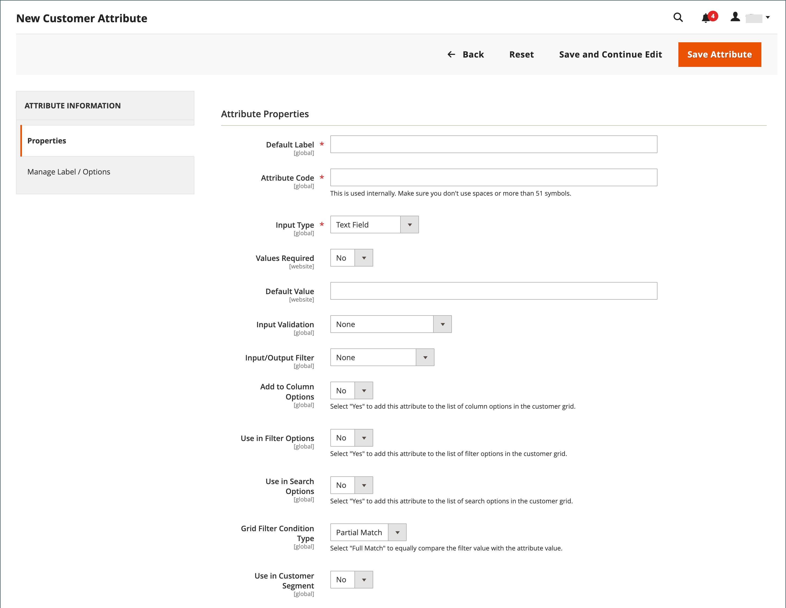

# 客户属性属性

{{ee-feature}}

客户属性提供了支持订单、履行和客户管理流程所需的信息。 由于您的业务是唯一的，因此除了系统提供的默认项目外，您可能还需要字段。 您可以将自定义属性添加到客户帐户的“帐户信息”、“通讯簿”和“帐单信息”部分。 客户 [地址属性](address-attributes.md) 也可以用在 _帐单信息_ 部分，或者当来宾注册帐户时。

{width="700" zoomable="yes"}

## 步骤1：完成属性属性

1. 在 _管理员_ 侧栏，转到 **[!UICONTROL Stores]** > _[!UICONTROL Attributes]_>**[!UICONTROL Customer]**.

1. 在右上角，单击 **[!UICONTROL Add New Attribute]**.

   {width="600" zoomable="yes"}

1. 在 **[!UICONTROL Attribute Properties]** 部分，执行以下操作：

   - 输入 **[!UICONTROL Default Label]** 在数据输入期间标识该属性。

   - 输入 **[!UICONTROL Attribute Code]** 标识系统中的属性。

   属性代码必须以字母开头，并且可以包含小写字母(a-z)和数字(0-9)的任意组合。 该代码的长度必须少于30个字符，并且不能包含特殊字符或空格。 下划线字符(`_`)来表示空格。

   >[!TIP]
   >
   >**快捷方式：** 要仅完成必填字段，请向下滚动到 _[!UICONTROL Storefront Properties]_，输入_[!UICONTROL Sort Order]_，并保存。

1. 完成数据输入属性：

   - 要确定用于数据输入的输入控件的类型，请设置 **[!UICONTROL Input Type]** 更改为以下任一项：

     | 类型 | 描述 |
     |----|-----------|
     | `Text Field` | 单行文本字段。 |
     | `Text Area` | 用于输入文本段落（如产品说明）的多行输入字段。 您可以使用WYSIWYG编辑器设置带有HTML标记的文本格式，或者直接在文本中输入标记。 |
     | `Multiple Line` | 为属性创建多个文本行，类似于多行街道地址。 单独的数据输入行的数量可以是2到20。 使用 `Default Value` 以指定字段的初始值。 |
     | `Date` | 以首选的日期格式和时区显示日期值。 可以从列表或日历中选择日期值(  )。   **_注意：_**根据您的系统配置，_管理员&#x200B;_用户可以直接在字段中输入日期，或从日历或列表中选择日期。 有关指定日期和时间值的信息，请参见 [日期和时间选项](../catalog/attributes-input-types.md#date-and-time-options). |
     | `Yes/No` | 显示一个预定义选项的下拉列表 `Yes` 和 `No`. |
     | `Dropdown` | 显示仅接受单个选择的值的下拉列表。 下拉列表输入类型是的关键组件 [可配置产品](../catalog/product-create-configurable.md). |
     | `Multiple Select` | 接受多个待选值的下拉列表。 |
     | `File (attachment)` | 一个字段，允许上传文件并将其作为附件与客户属性关联。 |
     | `Image File` | 允许将图像上传到库并与客户属性关联的字段。 |

   - 如果客户必须在字段中输入值，请设置 **[!UICONTROL Values Required]** 到 `Yes`.

   - 要为字段分配初始值，请输入 **[!UICONTROL Default Value]**.

   - 要在保存记录之前检查输入到字段中的数据是否准确，请设置 **[!UICONTROL Input Validation]** 到字段中允许的数据类型。 可用的值取决于 [!UICONTROL Input Type] 已指定。

     | 值 | 描述 |
     |-----|-----------|
     | `None` | 字段在数据输入期间没有输入验证。 |
     | `Alphanumeric` | 在数据输入期间接受数字(0-9)和字母字符(a-z、A-Z)的任意组合。 要包含特殊字符，请参阅 _转义HTML实体_. |
     | `Alphanumeric with Space` | 在数据输入期间接受数字(0-9)、字母字符(a-z、A-Z)和空格的任意组合。 |
     | `Numeric Only` | 数据输入期间仅接受数字(0-9)。 |
     | `Alpha Only` | 在数据输入期间仅接受字母字符(a-z、A-Z)。 |
     | `URL` | 在数据输入期间只接受URL。 |
     | `Email` | 在数据输入期间仅接受电子邮件地址。 |
     | `Length Only` | 根据在字段中输入的数据长度验证输入。 |

   - 要限制文本字段和文本区域输入类型的大小，请输入 **[!UICONTROL Minimum Text Length]** 和 **[!UICONTROL Maximum Text Length]**.

   - 要对文本字段、文本区域或多行输入类型中输入的值应用预处理过滤器，请设置 **[!UICONTROL Input/Output Filter]** 更改为以下任一项：

     | 值 | 描述 |
     |-----|-----------|
     | `None` | 不对输入到字段中的文本应用过滤器。 |
     | `Strip HTML Tags` | 从文本中删除HTML标签。 此过滤器可帮助清理从包含HTML标签的其他源粘贴到字段中的数据。 |
     | `Escape  HTML Entities` | 将文本中的特殊字符转换为有效的HTML转义序列，例如 `&;`. 转义序列在&amp;符号和分号之间括起来，通常用于印刷商的智能引号、版权和商标符号。 转义序列还用于标识字符，例如小于(`<`)和大于(`>`)符号，以及同样在代码中使用的&amp;字符。 此过滤器有助于清理有时会从字处理程序粘贴到数据库字段中的特殊字符。 |

1. 完成客户网格和区段属性：

   - 要在客户网格中包含列，请设置 **[!UICONTROL Add to Column Options]** 到 `Yes`.

   - 要按此属性筛选“客户”网格，请设置 **[!UICONTROL Use in Filter Options]** 到 `Yes`.

   - 要按具有不同过滤匹配条件的文本属性过滤客户网格，请设置 **[!UICONTROL Grid Filter Condition Type]** 到 `Partial Match`， `Prefix Match`，或 `Full Match`. 它不会影响 _按关键词搜索_  网格的字段。

   - 要按此属性搜索“客户”网格，请设置 **[!UICONTROL Use in Search Options]** 到 `Yes`.

   - 要使此属性可用于 [客户区段](customer-segments.md)，设置 **[!UICONTROL Use in Customer Segment]** 到 `Yes`.

## 步骤2：完成店面属性

1. 向下滚动到 **[!UICONTROL Storefront Properties]** 部分。

   {width="600" zoomable="yes"}

1. 要使客户能够看到属性，请设置 **[!UICONTROL Show on Storefront]** 到 `Yes`.

1. 在 **[!UICONTROL Sort Order]** 字段，该字段确定与其他属性一起列出时的外观顺序。

1. 设置 **[!UICONTROL Forms to Use]** 每个要包含属性的表单。 要选择多个选项，请按住Ctrl键并单击每个表单。

   - [&#39;客户注册&#39;](customer-sign-in.md)
   - [&#39;客户帐户编辑&#39;](account-create.md)
   - [&#39;管理员结帐&#39;](../stores-purchase/checkout-process.md)

## 第3步：完成标签并保存

1. 在左侧面板中，选择 **[!UICONTROL Manage Labels/Options]**.

1. 下 **[!UICONTROL Manage Titles]**，输入标签以标识每个的属性 [商店视图](../getting-started/websites-stores-views.md).

1. 完成后，单击 **[!UICONTROL Save Attribute]**.

   {width="600" zoomable="yes"}

## 字段描述

### [!UICONTROL Attribute Properties]

| 字段 | 描述 |
|--- |--- |
| [!UICONTROL Default Label] | 在管理员和店面中标识属性的默认标签。 |
| [!UICONTROL Attribute Code] | 标识系统内属性的唯一代码。 该代码的长度最多可为60个字符，并且不能包含空格或特殊字符。 可以使用下划线符号代替空格。 |
| [!UICONTROL Input Type] | 确定用于数据输入的输入控件。 选项：  **`Text Field`**— 单行文本字段。 **`Text Area`**  — 多行文本区域。  **`Multiple Line`**— 为属性创建多个文本行，类似于多行街道地址。 单独的数据输入行的数量可以是2到20。 **`Date`**  — 显示带有弹出日历的日期字段。 **`Dropdown`**— 一个下拉列表，只接受选择一个值。 **`Multiple Select`**  — 一个下拉列表，接受多个要选择的值。  **`Yes/No`**— 仅提供以下选项的字段 `Yes` 或 `No` 值。 **`File (attachment)`**  — 允许上传文件并将其作为附件与客户属性关联的字段。  **`Image File`**— 允许将图像上传到库并与客户属性关联的字段。 |
| [!UICONTROL Values Required] | 确定是否必须在字段中输入值。 选项： `Yes` / `No` |
| [!UICONTROL Default Value] | 指定属性的初始值。 |
| [!UICONTROL Input Validation] | 选项的选择由输入类型决定。 选项：  **`None`**— 字段在数据输入期间没有输入验证。 **`Alphanumeric`**  — 在数据输入期间接受数字(0-9)和字母字符(a-z、A-Z)的任意组合。  **`Alphanumeric with Space`**— 允许街道地址中的空格符合运营商的最大长度要求。 在结账过程中，客户可以在收件人和发件人的街道地址中输入数字(0-9)、字母字符(a-z、A-Z)和空格的任意组合。 保存地址时，会修剪所有多余的空格。 **`Numeric Only`**  — 在数据输入期间仅接受数字(0-9)。  **`Alpha Only`**— 在数据输入期间仅接受字母字符(a-z、A-Z)。 **`URL`**  — 在数据输入期间仅接受URL。  **`Email`**— 在数据输入期间仅接受电子邮件地址。 **`Length Only`**  — 根据在字段中输入的数据的长度验证输入。 |
| [!UICONTROL Input/Output Filter] | 在保存记录之前，将预处理筛选器应用于在文本字段、文本区域或多行输入类型中输入的值。 选项：  **`None`**— 不对在字段中输入的文本应用过滤器。 **`Strip HTML Tags`**  — 从文本中删除HTML标签。 此过滤器可帮助清理从包含HTML标签的其他源粘贴到字段中的数据。  **`Escape HTML Entities`**— 将文本中的特殊字符转换为有效的HTML转义序列，例如 `amp;`. 转义序列在&amp;符号和分号之间括起来，通常用于印刷商的智能引号、版权符号和商标符号。 转义序列还用于标识字符，例如小于(`<`)和大于(`>`)符号，以及同样在代码中使用的&amp;字符。 此过滤器有助于清理有时会从字处理程序粘贴到数据库字段中的特殊字符。 |
| [!UICONTROL Add to Column Options] | 指定是否将该属性作为列包含在 [客户](customers-all.md) 网格。 选项： `Yes` / `No` |
| [!UICONTROL Use in Filter Options] | 指定属性是否可用作网格中搜索操作的过滤器。 选项： `Yes` / `No` |
| [!UICONTROL Grid Filter Condition Type] | 为网格中搜索操作的属性指定过滤器匹配条件。 它不会影响 _按关键词搜索_ 网格的字段。 选项： `Partial Match` / `Prefix Match` / `Full Match` |
| [!UICONTROL Use in Search Options] | 指定属性值是否可用作搜索操作中的关键字。 选项： `Yes` / `No` |
| [!UICONTROL Use in Customer Segment] | 确定属性是否包含在中 [客户区段](customer-segments.md) 条件。 选项： `Yes` / `No` |

### [!UICONTROL Storefront Properties]

| 字段 | 描述 |
|--- |--- |
| [!UICONTROL Show on Storefront] | 确定该属性在店面的客户信息中是否显示为字段。 选项： `Yes` / `No` |
| [!UICONTROL Sort Order] | 指定此属性相对于其他客户属性的排序顺序。 排序顺序确定在使用键盘导航时，字段在数据输入期间接收焦点的顺序。 |
| [!UICONTROL Forms to Use in] | 确定包含数据输入表单的页面，其中属性会显示。 选项：  [`Customer Registration`](account-dashboard-account-information.md)  [`Customer Account Edit`](account-create.md)  [`Admin Checkout`](../stores-purchase/checkout-process.md) |

## 默认客户属性

| 属性代码 | 描述 |
| --------------- | ------------------ |
| `created_at` | 创建客户帐户的日期。 |
| `updated_at` | 上次更新客户帐户的日期。 |
| `website_id` | 创建客户帐户的网站的网站ID。 |
| `store_id` | 创建客户帐户的站点的商店ID。 |
| `created_in` | 创建帐户的存储区视图。 |
| `group_id` | 分配客户的客户组的ID。 |
| `disable_auto_group_change` | 确定是否可以在以下期间动态分配客户组 [VAT ID验证](../stores-purchase/vat.md#configure-vat-id-validation). |
| `prefix` | 与客户名称一起使用的任何前缀（例如Mr、Ms.或Dr）。 |
| `firstname` | 客户的名字。 |
| `middlename` | 客户的中间名或中间首字母。 |
| `lastname` | 客户的姓氏。 |
| `suffix` | 与客户名称一起使用的任何后缀。 （例如Jr.、Sr.或Esquire） |
| `email` | 客户的电子邮件地址。 |
| `dob` | 客户的出生日期。    **_重要提示：_**按照最新的安全和隐私最佳实践，了解将客户的完整出生日期（月、日、年）与其他个人标识符一起存储可能会带来的任何法律和安全风险。 建议限制存储客户的完整出生日期，并建议使用客户出生年份作为替代方法。 |
| `taxvat` | 分配给客户的增值税ID。 此属性的默认标签为 `VAT Number`. 从管理员处查看时，“VAT编号”字段始终存在于所有送货和帐单客户地址中，但不是必填字段。 |
| `gender` | 客户性别。 |

## 客户属性演示

有关创建客户属性的演示，请观看此视频：

>[!VIDEO](https://video.tv.adobe.com/v/343661?quality=12)
