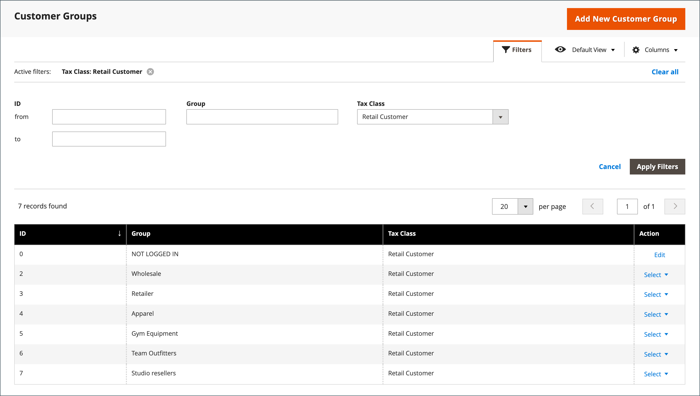
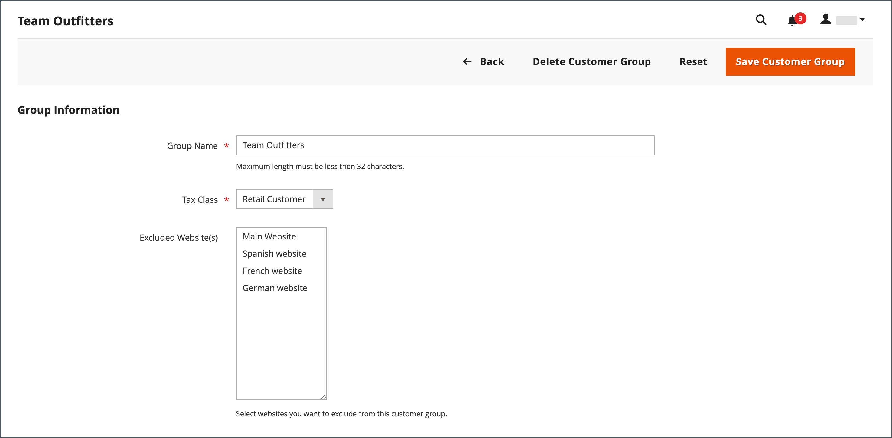
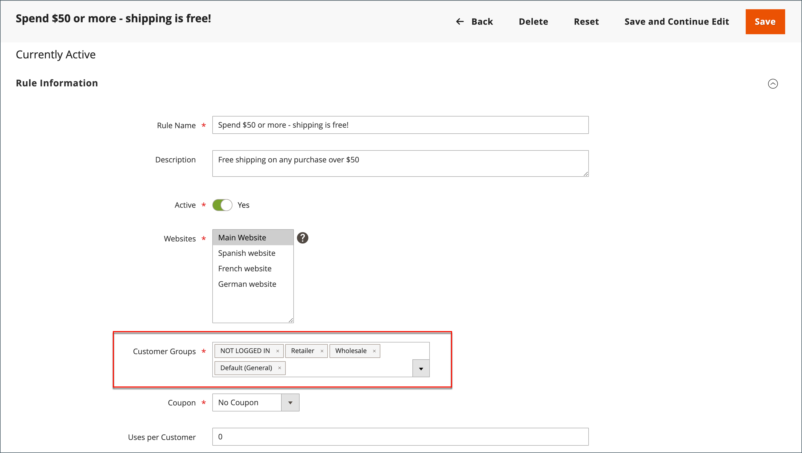

# 客户组

客户组确定哪些折扣可用，以及与组关联的税分类。 默认客户组为`General`、`Not Logged In`和`Wholesale`。

{width="700" zoomable="yes"}

## 筛选[!UICONTROL Customer Groups]列表

1. 在&#x200B;_管理员_&#x200B;侧边栏上，转到&#x200B;**[!UICONTROL Customers]** > **[!UICONTROL Customer Groups]**。

1. 单击&#x200B;**[!UICONTROL Filters]**。

1. 输入用于搜索组的标准，包括ID、组或税分类的范围。

   {width="600" zoomable="yes"}

1. 完成后，单击&#x200B;**[!UICONTROL Apply Filters]**。

## 创建客户组

>[!NOTE]
>
>无权访问所有网站的管理员用户（分配了具有“自定义”[!UICONTROL Role Scope]的角色）无法创建、修改或删除客户组。

1. 在&#x200B;_管理员_&#x200B;侧边栏上，转到&#x200B;**[!UICONTROL Customers]** > **[!UICONTROL Customer Groups]**。

1. 单击&#x200B;**[!UICONTROL Add New Customer Group]**。

1. 对于[!DNL **Group Name]**，请输入少于32个字符的唯一名称以标识该组。

1. 选择应用于组的&#x200B;**[!UICONTROL Tax Class]**。

   {width="600" zoomable="yes"}

1. 选择要从组中排除的&#x200B;**[!UICONTROL Excluded Website(s)]**。

   >[!IMPORTANT]
   >
   >排除网站可能会降低产品价格和目录规则索引时间，因为排除的网站不会索引。 在保存客户组时添加了网站排除项，则产品价格、目录规则和目录搜索索引将失效。 如果您拥有许多产品、网站和客户组，建议您暂停重新索引过程，直到您将网站从客户组中排除为止。

   默认情况下，不会排除任何网站。 要选择多个值，请按住&#x200B;_Ctrl_&#x200B;键（电脑）或&#x200B;_Command_&#x200B;键(Mac)，然后单击每个选项。

1. 完成后，单击&#x200B;**[!UICONTROL Save Customer Group]**。

## 编辑客户组

1. 在&#x200B;_管理员_&#x200B;侧边栏上，转到&#x200B;**[!UICONTROL Customers]** > **[!UICONTROL Customer Groups]**。

1. 在编辑模式下打开记录。

1. 进行必要的更改。

1. 完成后，单击&#x200B;**[!UICONTROL Save Customer Group]**。

## 将客户分配给其他组

>[!NOTE]
>
>更改公司组后，公司用户必须注销并登录店面才能在目录中查看新价格。

1. 在&#x200B;_管理员_&#x200B;侧边栏上，转到&#x200B;**[!UICONTROL Customers]** > **[!UICONTROL All Customers]**。

1. 在列表中查找客户，然后选中第一列中的复选框。

1. 将&#x200B;**Actions**&#x200B;控件设置为`Assign a Customer Group`并从菜单中选择组。

   {width="600" zoomable="yes"}

1. 提示确认时，单击&#x200B;**确定**。

## 将一组客户与特定折扣关联

1. 在&#x200B;_管理员_&#x200B;侧边栏上，转到&#x200B;**[!UICONTROL Marketing]** > _促销活动_ > **[!UICONTROL Cart Price Rules]**。

1. 选择要为应用的折扣关联组的购物车价格规则，或[创建价格规则](../merchandising-promotions/price-rules-catalog.md)。

1. 选择规则适用的客户组。

   {width="600" zoomable="yes"}

1. 单击&#x200B;**[!UICONTROL Save]**。

>[!NOTE]
>
> 您还可以使用高级定价将产品折扣应用到客户组。 请参阅[高级定价](../catalog/product-price-group.md)。

## 删除客户组

1. 在&#x200B;_管理员_&#x200B;侧边栏上，转到&#x200B;**[!UICONTROL Customers]** > **[!UICONTROL Customer Groups]**。

1. 在编辑模式下打开记录。

1. 在按钮栏中，单击&#x200B;**[!UICONTROL Delete Customer Group]**。

1. 提示确认时，单击&#x200B;**确定**。

## 客户组演示

通过观看此演示了解如何创建客户组：

>[!VIDEO](https://video.tv.adobe.com/v/343660/?quality=12)
