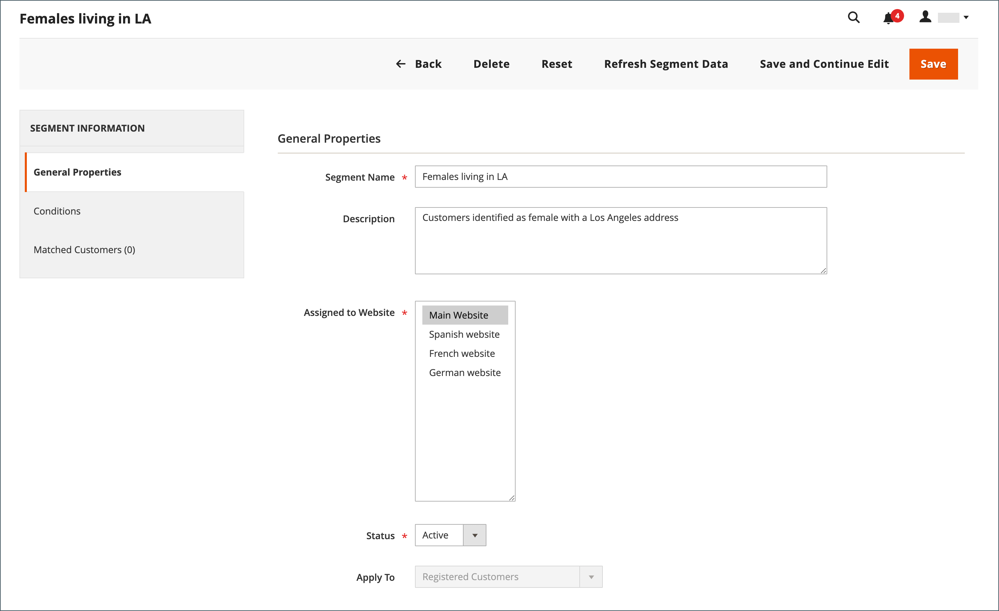
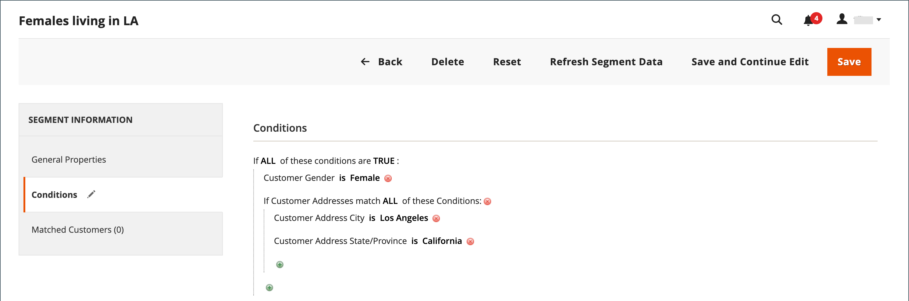

# 创建和删除客户区段

{{ee-feature}}

创建客户区段与构建[购物车价格规则](../merchandising-promotions/price-rules-cart.md)类似，不同之处在于这些选项包括[特定于客户区段的属性](../customers/customer-segments.md)。

{width="700" zoomable="yes"}

_&#x200B;**[!UICONTROL Customer Segments]网格&#x200B;**&#x200B;_

| 列 | 描述 |
|--- |--- |
| **[!UICONTROL ID]** | 客户区段的唯一ID。 |
| **[!UICONTROL Segment]** | 客户区段的名称。 |
| **[!UICONTROL Status]** | 指示客户区段是&#x200B;_[!UICONTROL Active]_&#x200B;还是&#x200B;_[!UICONTROL Inactive]_。 |
| **[!UICONTROL Website]** | 指示客户区段所属的网站。 |

{style="table-layout:auto"}

## 先决条件：启用客户区段

1. 在&#x200B;_管理员_&#x200B;侧边栏上，转到&#x200B;**[!UICONTROL Stores]** > _[!UICONTROL Settings]_>**[!UICONTROL Configuration]**。

1. 在左侧面板中，展开&#x200B;**[!UICONTROL Customers]**&#x200B;并选择&#x200B;**[!UICONTROL Customer Configuration]**。

1. 展开&#x200B;**[!UICONTROL Customer Segments]**&#x200B;部分。

1. 验证&#x200B;**[!UICONTROL Enable Customer Segment Functionality]**&#x200B;是否设置为`Yes`。

   {width="600" zoomable="yes"}

1. （可选）要禁用客户区段的实时验证，请将&#x200B;**[!UICONTROL Real-time Check if Customer is Matched by Segment]**&#x200B;设置为`No`。

   禁用实时验证时，客户区段将通过单个组合条件SQL查询进行验证。 如果系统中有许多客户区段，则禁用此函数可以提高区段验证的性能。 但是，当拆分数据库或没有注册客户时，验证将不起作用。

1. 完成后，单击&#x200B;**[!UICONTROL Save Config]**。

## 创建区段

以下步骤使用了一个示例来创建以洛杉矶的女性客户为目标的客户区段。

### 步骤1：添加客户区段

1. 在&#x200B;_管理员_&#x200B;侧边栏上，转到&#x200B;**[!UICONTROL Customers]** > **[!UICONTROL Segments]**。

1. 单击右上角的&#x200B;**[!UICONTROL Add Segment]**。

1. 输入在管理员中工作时标识客户区段的&#x200B;**[!UICONTROL Segment Name]**。

1. 输入说明区段用途的简短&#x200B;**[!UICONTROL Description]**。

1. 将&#x200B;**[!UICONTROL Assigned to Website]**&#x200B;设置为可使用客户区段的网站。

1. 将&#x200B;**[!UICONTROL Status]**&#x200B;设置为&#x200B;_活动_&#x200B;或&#x200B;_非活动_。

1. 要识别要用于应用区段的客户类型，请将&#x200B;**[!UICONTROL Apply to]**&#x200B;设置为以下项之一：

   - `Visitors and Registered Customers` — 包括所有购物者，无论他们是否已登录到帐户。
   - `Registered Customers` — 仅包括登录到帐户的购物者。
   - `Visitors` — 仅包括未登录到帐户的购物者。

   >[!TIP]
   >
   >如果您根据存储在客户帐户中的客户属性创建区段，最佳做法是仅将该区段应用于注册客户。

   >[!NOTE]
   >
   > 如果区段应用于`Visitors and Registered Customers`，则[!UICONTROL Matched Customers]仅显示`Registered Customers`。 即使可以根据适用于访客的条件来定位访客，情况也是如此。 对于仅`Visitors`区段，不显示`Matched Customers`选项卡。

1. 单击&#x200B;**[!UICONTROL Save and Continue Edit]**。

   保存区段&#x200B;_[!UICONTROL General Properties]_&#x200B;后，左侧面板中会显示其他选项。

   {width="600" zoomable="yes"}

**_[!UICONTROL General Properties]_**

| 字段 | 描述 |
|--- |---|
| **[!UICONTROL Segment Name]** | 标识段以供内部引用的名称。 |
| **[!UICONTROL Description]** | 简要说明，说明区段的用途以供内部参考。 |
| **[!UICONTROL Assigned to Website]** | 可在其中使用区段的单个网站。 |
| **[!UICONTROL Status]** | 激活和停用区段。 禁用该区段后，将停用任何关联的价格规则和横幅。 选项： `Active` / `Inactive` |
| **[!UICONTROL Apply to]** | 定义将应用区段的客户类型。 选择会影响可用于创建区段的条件集。 保存区段后，无法更改设置。 |

{style="table-layout:auto"}

### 第2步：定义条件

>[!NOTE]
>
> 对于访客，仅适用以下条件：购物车条件（购物车小计金额、购物车行项目和购物车产品数量）、产品规则（在购物车和产品历史记录中找到的产品）以及这些项目的组合。 如果区段应同时应用于访客和注册客户，则仅根据列出的条件跟踪访客。

可能的条件分组如下：

| 组 | 描述 |
|--- |--- |
| **[!UICONTROL Customer]** | 基于客户帐户属性的条件。 仅于分部适用于注册客户时方会提供。 |
| **[!UICONTROL Shopping Cart]** | 基于购物车内容的条件。 这些条件适用于所有区段类型。 |
| **[!UICONTROL Products]** | 基于购物车中的产品或产品浏览历史记录的条件。 这些条件适用于所有区段类型。 |
| **[!UICONTROL **Sales]** | 基于已完成订单的条件。 仅于分部适用于注册客户时方会提供。 |

1. 在左窗格中，单击&#x200B;**[!UICONTROL Conditions]**。

   页面上的默认条件以&#x200B;_[!UICONTROL If ALL of these conditions are TRUE:]_&#x200B;开头。

   {width="600" zoomable="yes"}

1. 创建以女性客户为目标的条件：

   - 单击&#x200B;**[!UICONTROL Add]**&#x200B;图标以显示条件列表并选择`Gender`。

   - 保留默认&#x200B;**为**&#x200B;条件控制选项。

   - 单击&#x200B;**...**&#x200B;并选择`female`。

   {width="600" zoomable="yes"}

1. 创建另一个以洛杉矶居民为目标的条件：

   - 在下一行，单击&#x200B;**[!UICONTROL Add]**&#x200B;图标并选择`Customer Address`。

     此操作创建一个父条件，您可以在其中定义一个或多个要匹配的地址字段。

   - 单击&#x200B;**[!UICONTROL Add]**&#x200B;图标以显示地址字段列表，然后选择`City`。

   - 单击&#x200B;**是**&#x200B;以显示条件控制选项并选择`contains`。

   - 单击&#x200B;**...**&#x200B;并输入`Los Angeles`。

   - 在下一行，单击&#x200B;**[!UICONTROL Add]**&#x200B;图标并选择`State/Province`。

   - 保留默认&#x200B;**为**&#x200B;条件控制选项。

   - 单击&#x200B;**...**&#x200B;并选择`United States > California`。

   {width="600" zoomable="yes"}

1. 单击&#x200B;**[!UICONTROL Save and Continue Edit]**。

### 步骤3：查看匹配的客户列表

1. 在左窗格中，单击&#x200B;**[!UICONTROL Matched Customers]**&#x200B;以显示符合条件的所有客户。

   {width="600" zoomable="yes"}

1. 如果客户列表符合您的目标，请单击&#x200B;**[!UICONTROL Save]**&#x200B;以完成客户区段。

1. 客户区段现在可用于定位促销活动、内容和邮件。

_&#x200B;**[!UICONTROL Matched Customers]网格&#x200B;**&#x200B;_

| 列 | 描述 |
|--- |--- |
| **[!UICONTROL ID]** | 已注册客户的客户ID。 |
| **[!UICONTROL Name]** | 注册客户的名称。 |
| **[!UICONTROL Email]** | 注册客户的电子邮件地址。 |
| **[!UICONTROL Group]** | 客户分配到的客户组。 |
| **[!UICONTROL Phone]** | 客户的电话号码。 |
| **[!UICONTROL ZIP]** | 客户的邮政编码。 |
| **[!UICONTROL Country]** | 客户所在的国家/地区。 |
| **[!UICONTROL State / Province]** | 客户所在的省/市/自治区。 |
| **[!UICONTROL Customer Since]** | 客户帐户的创建日期和时间。 |

{style="table-layout:auto"}

## 删除客户区段

1. 在&#x200B;_管理员_&#x200B;侧边栏上，转到&#x200B;**[!UICONTROL Customers]** > **[!UICONTROL Segments]**。

1. 找到要删除的区段并将其选定。

1. 在菜单栏中，单击&#x200B;**[!UICONTROL Delete]**&#x200B;按钮。

1. 要确认操作，请单击&#x200B;**[!UICONTROL OK]**。

## 按钮栏

| 按钮 | 描述 |
|--- |--- |
| **[!UICONTROL Back]** | 返回到&#x200B;_[!UICONTROL Customer Segments]_&#x200B;页而不保存更改。 |
| **[!UICONTROL Delete]** | 删除当前客户区段。 不会移除分部中与客户关联的客户或已完成的订单。 |
| **[!UICONTROL Reset]** | 将客户区段表单中未保存的任何更改重置为其以前的值。 |
| **[!UICONTROL Refresh Segment Data]** | 将区段数据刷新为最近保存的值。 如果任何区段数据不可用或已过期，则此项相关。 |
| **[!UICONTROL Save and Continue Edit]** | 保存更改并保持客户区段开放。 |
| **[!UICONTROL Save]** | 保存更改并关闭客户区段。 |

{style="table-layout:auto"}

## 客户区段演示

观看本视频，了解如何创建客户区段：

>[!VIDEO](https://video.tv.adobe.com/v/3410188/?quality=12&learn=on&captions=chi_hans)
