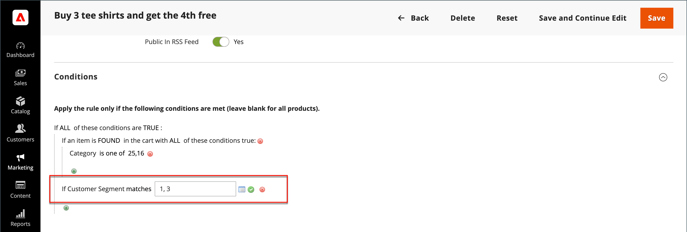
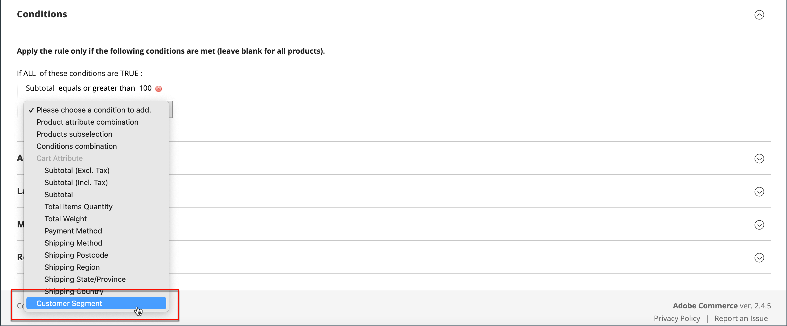

# 价格规则中的客户区段

{{ee-feature}}

通过将客户区段与关联，该客户区段可用于目标促销 [购物车价格规则](../merchandising-promotions/price-rules-cart.md).

{width="700" zoomable="yes"}

_**要将区段与购物车价格规则关联，请执行以下操作：**_

1. 在 _管理员_ 侧栏，转到 **[!UICONTROL Marketing]** > _促销活动_ > **[!UICONTROL Cart Price Rules]**.

1. 打开新规则或现有规则：

   * 要使用新规则，请单击 **[!UICONTROL Add New Rule]** 在右上角。
   * 要使用现有规则，请单击列表中的规则以在编辑模式下将其打开。

1. 向下滚动并展开 **[!UICONTROL Conditions]** 部分。

1. 添加条件。

   * 单击 _添加_ ()图标，显示条件的列表。 然后，选择 **[!UICONTROL Customer Segment]**.

   {width="600" zoomable="yes"}

   默认情况下，该条件设置为查找匹配条件。 如果需要，请单击 **[!UICONTROL matches]** 链接并将运算符更改为以下任一项：

   * `does not match`
   * `is one of`
   * `is not one of`

   {width="600" zoomable="yes"}

1. 要定位特定区段，请单击更多 **...** 用于显示其他选项的链接。 然后，单击 _选择器_ ()图标，以显示客户区段的列表。

1. 在列表中，选中要以条件定位的每个区段的复选框。

   {width="600" zoomable="yes"}

1. 单击 **[!UICONTROL Select]** 将选定的客户区段置于条件中。

1. 根据需要完成价格规则的其余部分。

1. 完成后，单击 **[!UICONTROL Save]**.
