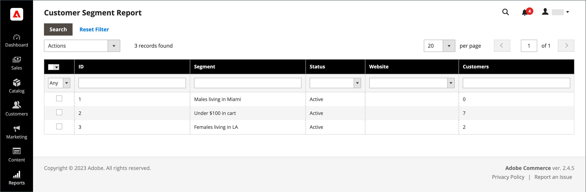

# 客户区段报表

{{ee-feature}}

客户分部报告提供有关每个分部客户人数的资料。

{width="700" zoomable="yes"}

| 列 | 描述 |
|--- |--- |
| **[!UICONTROL Select]** | 选中要执行操作的每个区段的复选框，或使用列标题中的选择控件。 选项： `Select All` / `Deselect All` / `Select Visible` / `Unselect Visible` |
| **[!UICONTROL ID]** | 分配给每个区段的唯一数字标识符 |
| **[!UICONTROL Segment]** | 区段名称 |
| **[!UICONTROL Status]** | 区段状态。 选项： `Active` / `Inactive` |
| **[!UICONTROL Website]** | 区段分配到的网站 |
| **[!UICONTROL Customers]** | 分配给区段的客户数 |

{style="table-layout:auto"}

您可以向下钻取到区段中的客户列表，并导出数据。

{width="600" zoomable="yes"}

为确保您拥有最新数据，必须刷新区段数据。 如果区段数据不可用或已过期，请单击按钮栏中的&#x200B;**[!UICONTROL Refresh Segment Data]**&#x200B;进行更新。

1. 对于&#x200B;**[!UICONTROL Export to]**，请选择导出格式：

   * CSV — 包含纯文本数据的逗号分隔值文件。
   * Excel XML — 一种基于XML的电子表格数据格式。

1. 单击&#x200B;**[!UICONTROL Export]**。

   | 列 | 描述 |
   |--- |--- |
   | **[!UICONTROL ID]** | 分配给每个用户的唯一数字标识符 |
   | **[!UICONTROL Name]** | 客户名称 |
   | **[!UICONTROL Email]** | 注册客户的电子邮件地址 |
   | **[!UICONTROL Group]** | 客户分配到的客户组 |
   | **[!UICONTROL Phone]** | 客户的电话号码 |
   | **[!UICONTROL ZIP]** | 客户所在位置的邮政编码 |
   | **[!UICONTROL Country]** | 客户所在的国家/地区 |
   | **[!UICONTROL State/Province]** | 客户所在的省/市/自治区 |
   | **[!UICONTROL Customer Since]** | 客户帐户的创建日期和时间 |

   {style="table-layout:auto"}

1. 生成的文件将自动保存到本地计算机。
