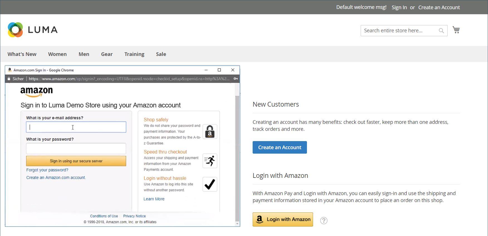

# 客户登录

客户可以从您商店的每个页面轻松访问其帐户。 根据[配置](../customers/account-options-new.md)，客户可能会被重定向到其帐户信息板，或在登录到其帐户后继续购物。

如果在配置中启用了[CAPTCHA](../systems/security-captcha.md)，则用户必须先正确完成验证其是否为人工的测试，然后才能访问其帐户。

当客户忘记密码时，会向与该帐户关联的电子邮件地址发送重置链接。 [密码选项](../customers/password-options.md)配置控制客户尝试登录的体验：

- 客户可以尝试输入密码的次数
- 两次尝试之间的分钟数
- 帐户锁定前的总尝试次数
- 锁定的长度

{width="700" zoomable="yes"}

## 登录到客户帐户

1. 在商店的标题中，客户单击&#x200B;**[!UICONTROL Sign in]**。

   {width="700" zoomable="yes"}

1. 输入他们的&#x200B;**[!UICONTROL Email]**&#x200B;地址和&#x200B;**[!UICONTROL Password]**。

1. 单击&#x200B;**[!UICONTROL Sign in]**。

   >[!IMPORTANT]
   >
   >如果他们忘记了自己的密码，客户可以单击&#x200B;**[!UICONTROL Forgot Your Password?]**&#x200B;并按照[说明](../customers/password-reset.md)重置密码。

## 在客户登录后将重定向设置为帐户仪表板

您可以将商店配置为在客户登录后将其重定向到帐户信息板，或让他们继续购物。

1. 在&#x200B;_管理员_&#x200B;侧边栏上，转到&#x200B;**[!UICONTROL Stores]** > _[!UICONTROL Settings]_>**[!UICONTROL Configuration]**。

1. 在左侧面板中，展开&#x200B;**[!UICONTROL Customers]**&#x200B;并选择&#x200B;**[!UICONTROL Customer Configuration]**。

1. 展开&#x200B;**[!UICONTROL Login Options]**&#x200B;部分。

1. 将&#x200B;**[!UICONTROL Redirect Customer to Account Dashboard after Logging in]**&#x200B;设置为以下项之一：

   - `Yes` — 客户登录其帐户时将显示帐户仪表板。
   - `No` — 客户在登录到其帐户后可以继续购物。

1. 完成后，单击&#x200B;**[!UICONTROL Save Config]**。

## 使用Amazon登录

对于已配置[!DNL Amazon Pay]和[!DNL Login with Amazon]集成的商店，客户可以登录到其Amazon购买者帐户。

1. 在商店的标题中，客户单击&#x200B;**[!UICONTROL Sign in]**。

1. 单击&#x200B;**[!UICONTROL Login with Amazon]**。

   {width="700" zoomable="yes"}

1. 提示登录时，客户为其Amazon购买者帐户输入&#x200B;**[!UICONTROL email address]**&#x200B;和&#x200B;**[!UICONTROL password]**。

   {width="700" zoomable="yes"}

1. 要授予Amazon在处理购买时从其帐户与应用商店共享以下信息的权限，请单击&#x200B;**确定**。

   - 名称
   - 电子邮件地址
   - 配送地址

   {width="700" zoomable="yes"}

## 注销客户帐户

1. 在&#x200B;_[!UICONTROL Welcome, Customer Name!]_旁边的右上角，客户单击&#x200B;**[!UICONTROL v]**菜单选择器。

1. 选择&#x200B;**[!UICONTROL Sign Out]**。

注销后，客户将被重定向到主页。
