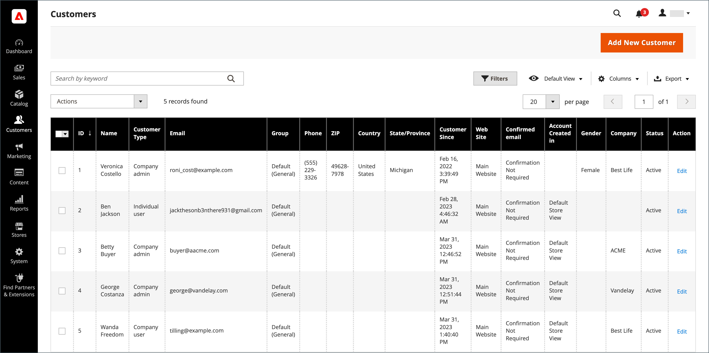

# 客户列表

在“管理员”中，[!UICONTROL Customers]网格列出了已向您的商店注册帐户或由管理员添加的所有客户。 使用标准[网格控件](../getting-started/admin-grid-controls.md)筛选列表并调整列布局。 若要了解详细信息，请参阅[管理客户帐户](../customers/manage-account.md)。

{width="700" zoomable="yes"}

## 更新客户信息

1. 在&#x200B;_管理员_&#x200B;侧边栏上，转到&#x200B;**[!UICONTROL Customers]** > **[!UICONTROL All Customers]**。

1. 找到客户记录，然后单击&#x200B;_[!UICONTROL Action]_&#x200B;列中的&#x200B;[!UICONTROL **编辑**]。

1. 在左侧面板中，选择要编辑的信息并进行必要的更改。

   >[!NOTE]
   >
   >若要了解详细信息，请参阅[更新客户帐户](../customers/update-account.md)。

1. 完成后，单击&#x200B;**[!UICONTROL Save Customer]**。

## Workspace控件

| 控件 | 描述 |
| --- | --- |
| **[!UICONTROL Add New Customer]** | 创建客户帐户。 |
| **[!UICONTROL Search]** | 根据当前筛选器启动客户搜索。 |
| **[!UICONTROL Filters]** | 定义一组搜索参数，用于筛选[网格](../getting-started/admin-grid-controls.md)中显示的记录。 |
| **[!UICONTROL Default View]** | 确定网格的默认列[布局](../getting-started/admin-grid-controls.md)。 |
| **[!UICONTROL Columns]** | 确定网格中[列](../getting-started/admin-grid-controls.md)及其帐户的选择。 列布局可更改并另存为&#x200B;_视图_。 默认情况下，网格中只包含某些列。 |
| **[!UICONTROL Export]** | 将选定的记录导出为CSV或Excel XML文件。 |

{style="table-layout:auto"}

## 列

| 列 | 描述 |
| --- | --- |
| **[!UICONTROL Select]** | 管理用于应用操作的客户记录的复选框选择。 您还可以使用列标题中的选择控件来选择/取消选择全部。 |
| **[!UICONTROL ID]** | 创建客户帐户时分配的唯一数字标识符。 |
| **[!UICONTROL Name]** | 客户的名字和姓氏。 |
| **[!UICONTROL Email]** | 客户的电子邮件地址。 |
| **[!UICONTROL Group]** | 客户分配到的客户组。 |
| **[!UICONTROL Phone]** | 客户的电话号码。 |
| **[!UICONTROL ZIP]** | 客户的邮政编码。 |
| **[!UICONTROL Country]** | 客户所在的国家/地区。 |
| **[!UICONTROL State/Province]** | 客户所在的省/市/自治区。 |
| **[!UICONTROL Customer Since]** | 客户帐户的创建日期和时间。 |
| **[!UICONTROL Web Site]** | 商店层次结构中与客户帐户关联的网站。 |
| **[!UICONTROL Confirmed Email]** | 指示是否需要确认电子邮件。 |
| **[!UICONTROL Account Created In]** | 指示从中创建客户帐户的商店视图。 |
| **[!UICONTROL Date of Birth]** | 客户的出生日期。   **_重要提示：_**&#x200B;要遵循当前安全和隐私最佳实践，请注意将客户的完整出生日期（月、日、年）与其他个人标识符一起存储可能会带来的任何法律和安全风险。 建议您限制存储客户的完整出生日期，并建议使用客户出生年份作为替代方法。 |
| **[!UICONTROL Tax / VAT Number]** | 如果适用，为客户分配的税号或[增值税](../stores-purchase/vat.md)编号。   此字段与增值税号不同。 |
| **[!UICONTROL Gender]** | 客户的性别。 |
| **[!UICONTROL Action]** | 编辑 — 在编辑模式下打开公司帐户。 |

{style="table-layout:auto"}

### 其他列

可通过更改网格的[列布局](../getting-started/admin-grid-controls.md)使用这些列。

| 列 | 描述 |
| --- | --- |
| **[!UICONTROL Company]** | 客户的公司名称。 |
| **[!UICONTROL Street Address]** | 客户的街道地址。 |
| **[!UICONTROL City]** | 客户所在的城市。 |
| **[!UICONTROL Fax]** | 客户的传真号码（如果适用）。 |
| **[!UICONTROL Billing Firstname]** | 客户帐单地址中的名字。 |
| **[!UICONTROL Billing Lastname]** | 客户帐单地址中的姓氏。 |
| **[!UICONTROL Billing Address]** | 将发送账单信息的地址。 |
| **[!UICONTROL Shipping Address]** | 将发送订单的地址。 |
| **[!UICONTROL VAT Number]** | 与客户地址关联的增值税编号。 对于在欧盟销售的[数字商品](../stores-purchase/taxes.md)，增值税基于客户的帐单地址。   此字段与税务/增值税编号不同。 |
| **[!UICONTROL Account Lock]** | 指示帐户的状态。 作为安全措施，如果登录尝试次数过多，则客户帐户可能被[锁定](../customers/password-options.md)。 值： `Locked` / `Unlocked` |

{style="table-layout:auto"}
